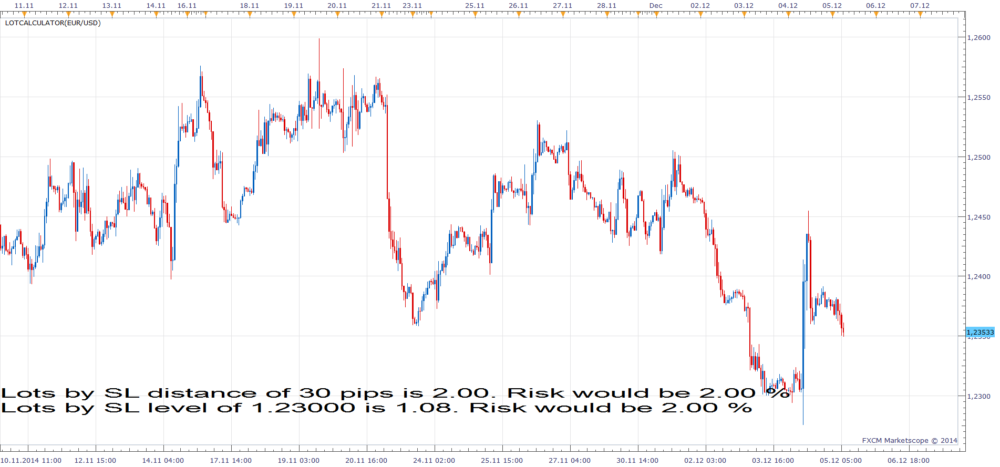

# LotCalculator

> Source: https://fxcodebase.com/code/viewtopic.php?f=17&t=61576  
> Forum: 17 · Topic 61576 · 3 post(s)

---

## LotCalculator

**Apprentice** · Fri Dec 05, 2014 6:27 am

Based on the request.
[viewtopic.php?f=27&t=61570&p=97532#p97532](https://fxcodebase.com/code/viewtopic.php?f=27&t=61570&p=97532#p97532)

 [LotCalculator.lua](files/97534/LotCalculator.lua)

Advanced version can be found here.
[viewtopic.php?f=17&t=689&p=89629&hilit=risk+r#p89629](https://fxcodebase.com/code/viewtopic.php?f=17&t=689&p=89629&hilit=risk+r#p89629)

The indicator was revised and updated

---

## Re: LotCalculator

**red bull** · Sat Dec 06, 2014 10:19 am

Thank you

---

## Re: LotCalculator

**Apprentice** · Mon Jun 26, 2017 10:14 am

The indicator was revised and updated.
