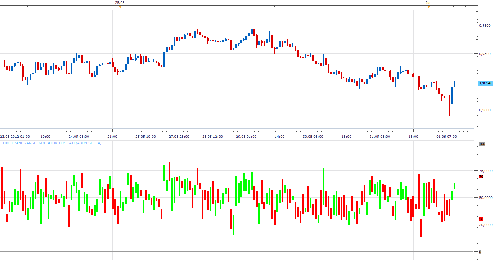
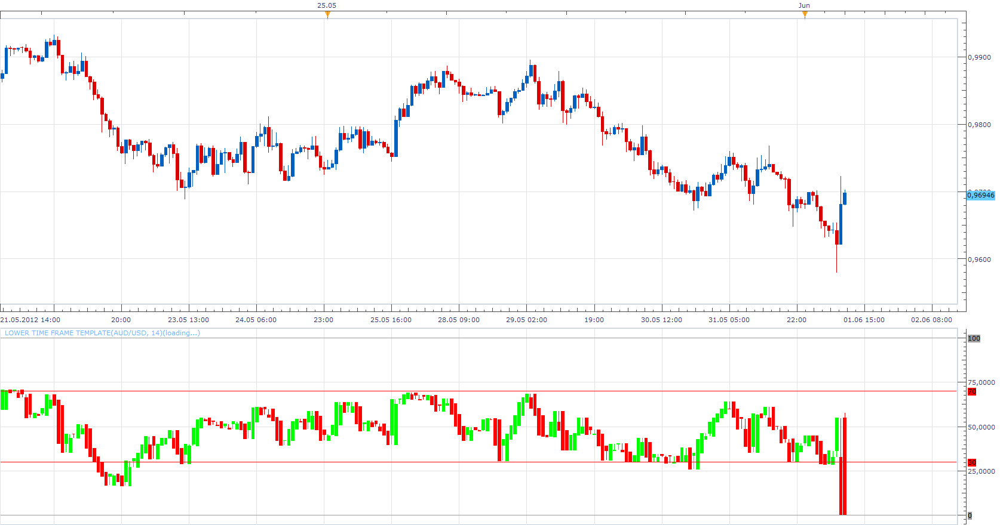

# Lower Time Frame RSI

> Source: https://fxcodebase.com/code/viewtopic.php?f=17&t=19743  
> Forum: 17 · Topic 19743 · 7 post(s)

---

## Lower Time Frame RSI

**Apprentice** · Sun Jun 03, 2012 9:05 am

This is my attempt to offer an alternative method of data presentation for smaller time frames.
I hope you will like it, suggestions are appreciated.
As a bonus, I have added, Higher / All time frames option. Further improvements are possible.

 [Lower Time Frame RSI.lua](files/34856/Lower%20Time%20Frame%20RSI.lua)

 

The second version, it does not show range.
Rather the values ​​for only one time frame.

 [Lower Time Frame RSI.lua](files/34856/Lower%20Time%20Frame%20RSI%20%282%29.lua)

---

## Re: Lower Time Frame RSI

**Hailkayy** · Sun Jun 03, 2012 9:53 am

Pretty useful , could you make it as well for a stochastichs ?
Thanks.

---

## Re: Lower Time Frame RSI

**Apprentice** · Mon Jun 04, 2012 1:45 am

Your request is added to the development list.

---

## Re: Lower Time Frame RSI

**Apprentice** · Tue Jun 05, 2012 5:48 am

 [Lower Time Frame Stochastic.lua](files/35069/Lower%20Time%20Frame%20Stochastic.lua)

---

## Re: Lower Time Frame RSI

**Hailkayy** · Wed Jun 06, 2012 11:50 am

Thank you Apprentice.

---

## Re: Lower Time Frame RSI

**Apprentice** · Mon Aug 08, 2016 3:38 am

Minor update.

---

## Re: Lower Time Frame RSI

**Apprentice** · Tue Aug 07, 2018 5:11 am

The indicator was revised and updated.
