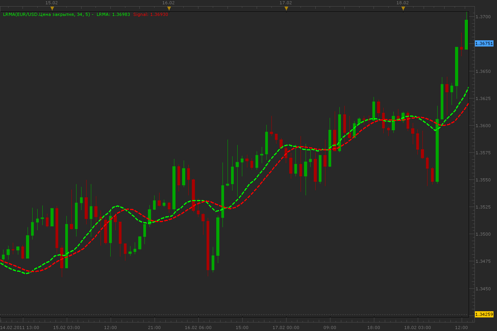

# LRMA

> Source: https://fxcodebase.com/code/viewtopic.php?f=17&t=3479  
> Forum: 17 · Topic 3479 · 5 post(s)

---

## LRMA

**Alexander.Gettinger** · Mon Feb 21, 2011 12:25 am

Smoothing algorithm of this moving averages based on linear regression.

LRMA=3*LWMA-2*MVA, where
LWMA - linear weighted moving average,
MVA - simple moving averages.

Signal line is a MVA(LRMA).

 

Download:

 [LRMA.lua](files/8286/LRMA.lua)

 [BTF_LRMA.lua](files/8286/BTF_LRMA.lua)

MQ4/MT4 version.
[viewtopic.php?f=38&t=64491](https://fxcodebase.com/code/viewtopic.php?f=38&t=64491)

The indicator was revised and updated

---

## Re: LRMA

**Apprentice** · Fri Feb 17, 2017 10:22 am

Indicator was revised and updated.

---

## Re: LRMA

**blackrhino** · Mon Mar 06, 2017 5:31 pm

In the Mt4 version there is an option for step mode, I was wondering if we can get that incorporated here thanks.

---

## Re: LRMA

**Apprentice** · Tue Mar 07, 2017 6:53 am

Your request is added to the development list, Under Id Number 3762
 If someone is interested to do this task, please contact me.

---

## Re: LRMA

**Apprentice** · Wed Mar 08, 2017 6:14 pm

BTF_LRMA.lua added.
