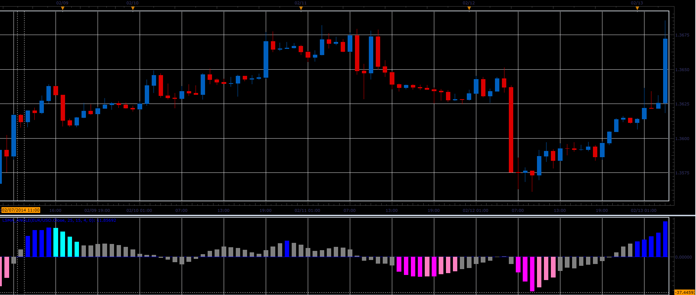

# LSMA Angle oscillator

> Source: https://fxcodebase.com/code/viewtopic.php?f=17&t=60373  
> Forum: 17 · Topic 60373 · 3 post(s)

---

## LSMA Angle oscillator

**Alexander.Gettinger** · Thu Feb 27, 2014 2:45 pm

This indicator is a ported MQL5 indicator from [http://www.mql5.com/ru/code/2174](http://www.mql5.com/ru/code/2174).

Formulas:
LSMA Angle = mFactor*(fEnd-fStart)/2, where
fEnd[i] = LSMA[i-EndShift],
fStart[i] = LSMA[i-StartShift],
mFactor = 100000/(StartShift-EndShift).

 

Download:

 [LSMA_Angle.lua](files/92938/LSMA_Angle.lua)

The indicator was revised and updated

---

## Re: LSMA Angle oscillator

**Alexander.Gettinger** · Thu Feb 27, 2014 2:47 pm

MQL4 version of LSMA Angle oscillator: [viewtopic.php?f=38&t=60374](https://fxcodebase.com/code/viewtopic.php?f=38&t=60374).

---

## Re: LSMA Angle oscillator

**Apprentice** · Fri Jun 02, 2017 7:05 am

Indicator was revised and updated.
