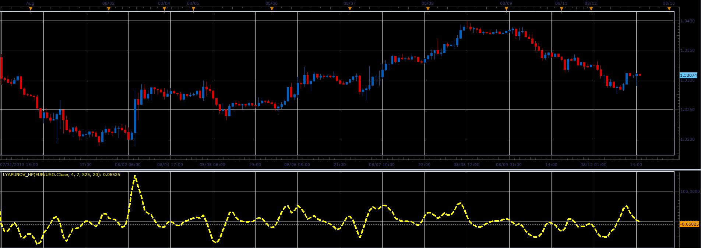

# Lyapunov HP oscillator

> Source: https://fxcodebase.com/code/viewtopic.php?f=17&t=59063  
> Forum: 17 · Topic 59063 · 7 post(s)

---

## Lyapunov HP oscillator

**Alexander.Gettinger** · Tue Aug 13, 2013 9:14 am

This indicator is a ported MQL4 indicator from request [viewtopic.php?f=27&t=48567](https://fxcodebase.com/code/viewtopic.php?f=27&t=48567).

 

Download:

 [Lyapunov_HP.lua](files/88481/Lyapunov_HP.lua)

The indicator was revised and updated

---

## Re: Lyapunov HP oscillator

**yccharlie** · Tue Aug 13, 2013 2:50 pm

Hi,
could you please provide an MQL4 version of this indicator.

Thanks in advance,
Ycc

---

## Re: Lyapunov HP oscillator

**Apprentice** · Wed Aug 14, 2013 1:39 am

Your request is added to the development list.

---

## Re: Lyapunov HP oscillator

**RunVert** · Wed Aug 14, 2013 1:11 pm

Anyway this indicator could be overlayed on top of the candlestick/line charts?

---

## Re: Lyapunov HP oscillator

**Alexander.Gettinger** · Thu Aug 29, 2013 9:57 am

> **yccharlie wrote:**
> Hi,
> could you please provide an MQL4 version of this indicator.

See this indicator: [http://www.fxcodebase.com/code/viewtopi ... 38&t=59344](http://www.fxcodebase.com/code/viewtopic.php?f=38&t=59344)

---

## Re: Lyapunov HP oscillator

**yccharlie** · Thu Aug 29, 2013 2:12 pm

Thanks, it looks great.

---

## Re: Lyapunov HP oscillator

**Apprentice** · Sun Jun 04, 2017 6:16 am

The indicator was revised and updated.
