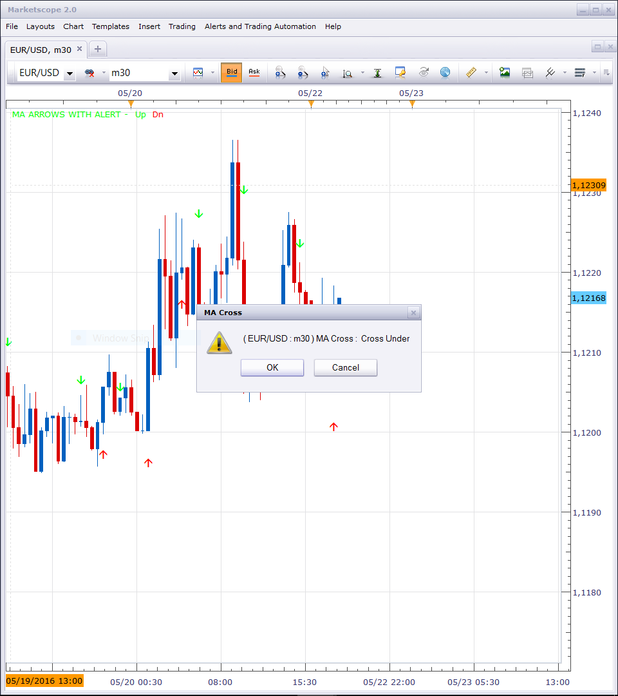

# MA ARROWS

> Source: https://fxcodebase.com/code/viewtopic.php?f=17&t=62872  
> Forum: 17 · Topic 62872 · 12 post(s)

---

## MA ARROWS

**Apprentice** · Tue Nov 10, 2015 4:23 pm

Based on the request.
[viewtopic.php?f=27&t=62764](https://fxcodebase.com/code/viewtopic.php?f=27&t=62764)

Up Arrow
Fast MA > Slow MA
Fast MA < Slow MA (-1)
Fast MA > Slow MA (+1)
Down Arrow
Fast MA < Slow MA
Fast MA > Slow MA (-1)
Fast MA < Slow MA (+1)

 [MA ARROWS.lua](files/103305/MA%20ARROWS.lua)

 [MA ARROWS with Alert.lua](files/103305/MA%20ARROWS%20with%20Alert.lua)

The indicator was revised and updated

---

## Re: MA ARROWS

**gezisLV** · Tue Nov 10, 2015 8:03 pm

Thank you:)

---

## Re: MA ARROWS

**MC. Trend Trader** · Mon Nov 16, 2015 2:32 am

Hi,

Can we have a Strategy on this indicator?

Long at Up Arrow
Short at Down Arrow

Best Regards

---

## Re: MA ARROWS

**Apprentice** · Mon Nov 16, 2015 3:59 am

Requested can be found here.
[viewtopic.php?f=31&t=62887](https://fxcodebase.com/code/viewtopic.php?f=31&t=62887)

---

## Re: MA ARROWS

**Apprentice** · Wed May 11, 2016 4:28 am

Minor update.

---

## Re: MA ARROWS

**Apprentice** · Wed Jul 20, 2016 7:42 am

MA ARROWS with Alert.lua added.

---

## Re: MA ARROWS

**Paquito** · Wed Nov 23, 2016 11:01 am

Hello everyone.
My first post with you, I hope to put many more.
Just one thing ... as having activated visual and sound warnings do not work for me? But in none of the charts!

Maybe, misconfiguration ??

I would appreciate the help.

Greetings to all.

P.S. Sorry for the English, I use a translator.

---

## Re: MA ARROWS

**Apprentice** · Fri Nov 25, 2016 5:55 am

Try it now.

---

## Re: MA ARROWS

**Paquito** · Fri Nov 25, 2016 8:15 am

Hi, Apprentice!

Thanks for your answer, I also see that almost always you are the one that solves the inconveniences, you are a real machine ...

But I'm sorry to say that it does not leave any alert, neither visual nor sound, in any of the graphs.

In case it works for you, the graphics are set to time frame of 30 min.

Thanks again, a big greeting !!

PS I still use a translator. I am sorry.

---

## Re: MA ARROWS

**Apprentice** · Sat Nov 26, 2016 5:55 am

I could not repeat this issue.
Make sure to re-download, re-install your indicator.

---

## Re: MA ARROWS

**Paquito** · Mon Nov 28, 2016 1:49 pm

Hi, Apprentice.
Finally it worked, you are a real phenomenon.
A million thanks!!

---

## Re: MA ARROWS

**7510109079** · Thu Apr 13, 2017 7:09 am

Apprentice, what is the first user input 'Period' for?

it does not seem to change anything regardless of which value I use (although arrows it currently gives are ok, so just wondering)
