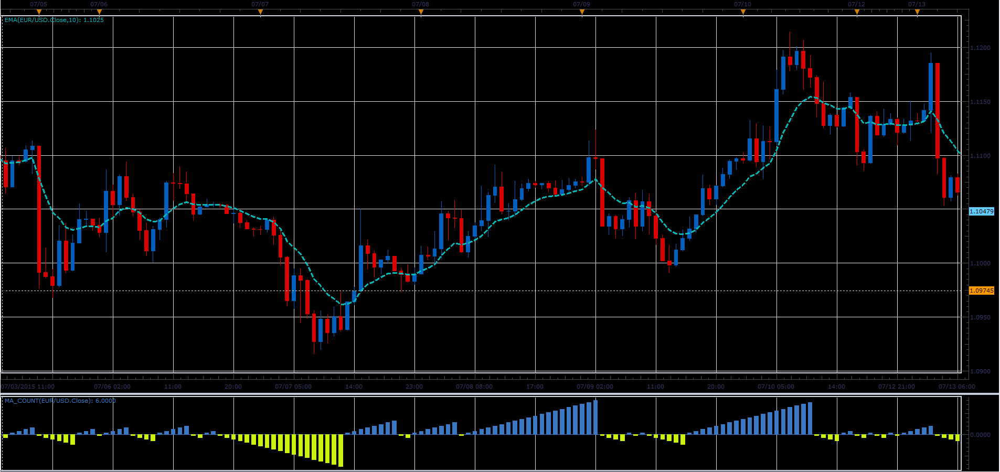

# MA Count oscillator

> Source: https://fxcodebase.com/code/viewtopic.php?f=17&t=62423  
> Forum: 17 · Topic 62423 · 2 post(s)

---

## MA Count oscillator

**el_mar** · Tue Jul 14, 2015 4:58 pm

The indicator resets to zero when price crossing the MA.
If Price>MA, Indicator>0,
If Price<MA, Indicator<0.

 

Download MA_Count.lua:

 [MA_Count.lua](files/101410/MA_Count.lua)

---

## Re: MA Count oscillator

**Apprentice** · Mon Oct 29, 2018 7:03 am

The indicator was revised and updated.
