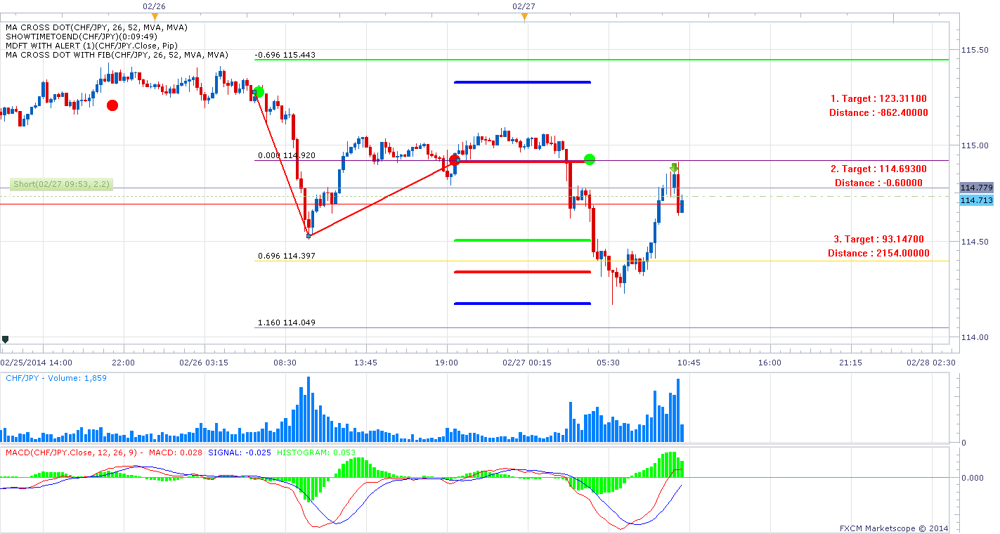
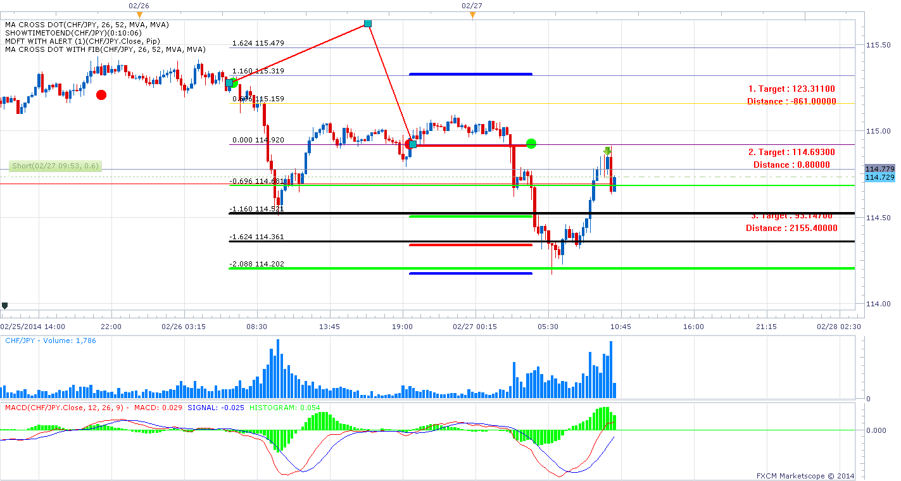

# MA Cross Dot

> Source: https://fxcodebase.com/code/viewtopic.php?f=17&t=60316  
> Forum: 17 · Topic 60316 · 18 post(s)

---

## MA Cross Dot

**Apprentice** · Mon Feb 17, 2014 3:34 am

Will add dot for each MA Cross of selected two moving averages.

 [MA Cross Dot.lua](files/92712/MA%20Cross%20Dot.lua)

 [MA Cross Dot with Fib.lua](files/92712/MA%20Cross%20Dot%20with%20Fib.lua)

The indicator was revised and updated

---

## Re: MA Cross Dot

**speakinmymind** · Mon Feb 24, 2014 1:30 am

Could you please create an auto fib expansion tool?

The three points would be "dot 1" "dot 2" and the high or low price within those dots.

Fore example,

red dot, high price, green dot

or

green dot, low price, red dot.

To reduce clutter, the indicator should use only on chart information, and only use the dots with the greatest number of pips between them. This will limit the tool to only one expansion at a time.

Thanks!

---

## Re: MA Cross Dot

**Apprentice** · Mon Feb 24, 2014 4:26 am

Your request is added to the development list.

---

## Re: MA Cross Dot

**Apprentice** · Thu Feb 27, 2014 6:45 am

MA Cross Dot with Fib Added.

---

## Re: MA Cross Dot

**speakinmymind** · Thu Feb 27, 2014 9:20 am

This great! could you please add the fib label and price next to the lines?

I notice about half of the lines disappear when zooming in and out.

Also, can you add a filter to only display the fib levels for the dots with the most distance between them? With this feature, the lines should extend forever.

also, could you add a few more fib levels? Say four more?

---

## Re: MA Cross Dot

**speakinmymind** · Thu Feb 27, 2014 9:43 am

Does this use fib expansion?

---

## Re: MA Cross Dot

**speakinmymind** · Thu Feb 27, 2014 10:22 am

for some reason output is upside down.

 

when i move the middle part of the expansion to the opposite side, they lines line up.

 

Thanks for all the hard work you do!!

---

## Re: MA Cross Dot

**speakinmymind** · Tue Mar 04, 2014 7:19 pm

Ok, I understand how this indicator works, the lines are a percentage of the move between two dots.

I am hoping you can use the expansion tool instead. As you can see from my earlier posts and pictures, the expansion points would always use the dots as point 1 and 3. Point 2 would be the highest or lowest price between point 1 and 3.

if point 1 is GREEN dot then point 2 is the LOW price before reaching point 3 which would be a RED dot.

if point 1 is RED dot then point 2 is the HIGH price before reaching point 3 which would be a GREEN dot.

Thanks in advance, having this automated would help a lot.

---

## Re: MA Cross Dot

**speakinmymind** · Wed Mar 19, 2014 12:01 pm

Do you think this is feasible?

---

## Re: MA Cross Dot

**Apprentice** · Thu Mar 20, 2014 3:17 am

Sure, unfortunately I was a little busy.
devoted to other user tasks.

---

## Re: MA Cross Dot

**speakinmymind** · Thu Mar 20, 2014 12:23 pm

I apologize if I'm being impatient, I know you guys do a lot of work. I only replied because I knew the site was down for a couple days and I did not know if it made the developmental list.

Thanks again!

---

## Re: MA Cross Dot

**Daydreaminblue** · Tue May 06, 2014 1:06 pm

Hi,

Would you be able to strategize this? Buy on the Cross up and exit + short on the cross down?

---

## Re: MA Cross Dot

**Apprentice** · Wed May 07, 2014 3:40 am

Requested can be found here.
[viewtopic.php?f=31&t=60657](https://fxcodebase.com/code/viewtopic.php?f=31&t=60657)

---

## Re: MA Cross Dot

**Fx4mt.com** · Mon Jul 21, 2014 7:44 pm

Hello Apprentice,
 It isn't said enough around here, I truly appreciate your efforts. I really, really do. I am sure I am not the only one.

I have a request, is there anyway to modify this code where instead of a dot, a vertical line is drawn? Perhaps spanning 400-500 pips vertically? This would be most excellent.

And again, whether you find the time or not for this modification, I really honestly appreciate the work you've given thus far for the dozens of indicators you've programmed that I've used over the years. Big thumbs up to you dude.

---

## Re: MA Cross Dot

**Apprentice** · Tue Jul 22, 2014 2:23 am

Something like Two MA Cross Pivots Indicator?
[viewtopic.php?f=17&t=60057&hilit=MA+Pivot](https://fxcodebase.com/code/viewtopic.php?f=17&t=60057&hilit=MA+Pivot)

---

## Re: MA Cross Dot

**Fx4mt.com** · Tue Jul 22, 2014 4:27 pm

Hello Apprentice,

 Yes very similar to the indicator you posted above. I just find that one too cumbersome for my approach, as multiple intersects over time creat a very cluttered chart. Just looking for the indicator to post a vertical line only, with no horizontal line.

Thanks a bunch

---

## Re: MA Cross Dot

**Fx4mt.com** · Tue Jul 22, 2014 4:35 pm

I went ahead and took a look at the code, was able to edit it to fulfill my needs.

I will post updated indicator for those interested.

Thanks again

---

## Re: MA Cross Dot

**Apprentice** · Tue Jul 11, 2017 2:14 pm

The indicator was revised and updated.
