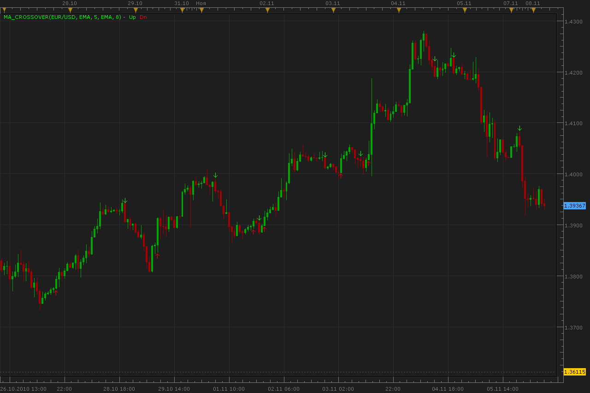
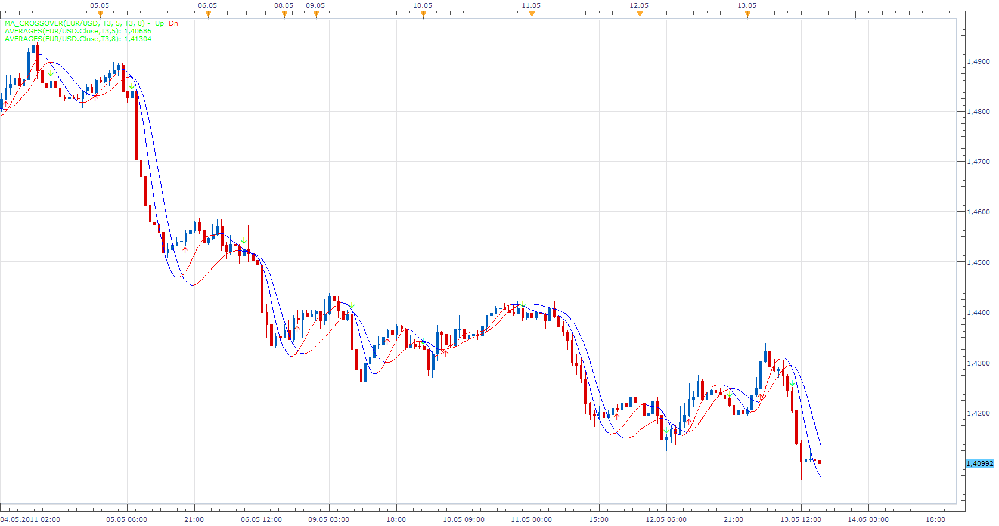

# MA crossover indicator

> Source: https://fxcodebase.com/code/viewtopic.php?f=17&t=2621  
> Forum: 17 · Topic 2621 · 30 post(s)

---

## MA crossover indicator

**Alexander.Gettinger** · Mon Nov 08, 2010 4:23 am

Indicator shows UP
if FastMA[i]<SlowMA[i] and FastMA[i-1]>Slow[i-1] and FastMA[i+1]<SlowMA[i+1],
Indicator shows DOWN
 if FastMA[i]>SlowMA[i] and FastMA[i-1]<Slow[i-1] and FastMA[i+1]>SlowMA[i+1]

 

 [MA_Crossover.lua](files/5901/MA_Crossover.lua)

For this indicator must be installed Averages indicator: [viewtopic.php?f=17&t=2430](https://fxcodebase.com/code/viewtopic.php?f=17&t=2430)

The indicator was revised and updated

---

## Re: MA crossover indicator

**DS0167** · Mon Nov 15, 2010 8:07 pm

Hello Alexander,

This indicator is very useful since the chart is much more clean and it would be very much appreciated if you can just allow the change the size of the arrows (so that my four eyes can more easily see them), is it possible?

Thanks in advance for your answer.

Kind regards,
DS0167

---

## Re: MA crossover indicator

**Apprentice** · Tue Nov 16, 2010 3:40 am

Arrow Size Option Added.

---

## Re: MA crossover indicator

**DS0167** · Tue Nov 16, 2010 1:49 pm

Thank you very much Apprentice, highly appreciated

For those who trade with MA, this indicator is just a real pleasure.

Kind regards,
DS0167

---

## Re: MA crossover indicator

**wengen** · Wed Nov 17, 2010 8:03 am

Hello,

This is a really nice indicator - thanks!

Is there a way to set up a Strategy for this so I can get alerts (pop-up & sound)?

Best Regards,

wengen

---

## Re: MA crossover indicator

**Fortunelost** · Sun Nov 21, 2010 11:44 am

Hi Alexander,
This is a good indicator, however as there are many other indicators attached to the price chart by a trader, the small arrows often get lost and un-noticed, especially when you have three time frame charts on the screen. is it possible to enlarge the arrows for clear visibility and attention grab.. thanks.

---

## Re: MA crossover indicator

**Apprentice** · Sun Nov 21, 2010 11:59 am

Probably you have an older version.
This feature already exists.

---

## Re: MA crossover indicator

**wengen** · Sun Nov 21, 2010 12:13 pm

Is it possible to get a Strategy for this?

Thanks

Best Regards,

---

## Re: MA crossover indicator

**Fortunelost** · Sun Nov 21, 2010 12:18 pm

Thank you, the new arrows work very well. best regards

---

## Re: MA crossover indicator

**Apprentice** · Sun Nov 21, 2010 12:49 pm

Added to developmental cue.

---

## Re: MA crossover indicator

**Faalaakh** · Mon Feb 28, 2011 6:14 am

Hi,
in the current version the indicator uses only price feed as a datasource. Would it be possible to modify that such that user could choose different datasources (i.e. Laguerre EMA crossover and arrows would appear in the oscillator window whenever two EMAs cross).

---

## Re: MA crossover indicator

**Faalaakh** · Wed Mar 16, 2011 5:53 am

Hi,
I tried to modify the code myself but was not able to. All I am looking for is that the user could choose various sources for crossovers and the arrows would paint. For example when Stochastic cross there would be an arrow.

I hope you would have time to modify this, hopefully this would not take too much time.

---

## Re: MA crossover indicator

**abrown8703** · Sun Mar 20, 2011 1:19 pm

Excellent Indicator!!! Have been asking for this one for months! Can you develop a signal for this indicator as well?

---

## Re: MA crossover indicator

**Apprentice** · Mon Mar 21, 2011 2:03 am

Your request has been added to developmental cue.

---

## Re: MA crossover indicator

**Alexander.Gettinger** · Mon Mar 21, 2011 3:09 am

Strategy based on this indicator: [viewtopic.php?f=31&t=3684](https://fxcodebase.com/code/viewtopic.php?f=31&t=3684)

---

## Re: MA crossover indicator

**station0524** · Sat May 14, 2011 4:43 pm

The indicator is fine except the T3 is not correct. If you put two T3 indicators with different time periods, on your chart you will see that the arrows do not appear where the averages cross. I do not know if this is because the T3 is programmed wrong in the "Averages indicator" and affects the crossover indicator or not. Also is it possible to add the "KAMA" moving average to the "Averages indicator" so that it can be used for the MA crossover indicator?

---

## Re: MA crossover indicator

**Apprentice** · Sun May 15, 2011 9:23 am

Conduct test and I did not find differences.
As you can see.

 

Your request has been added to developmental cue.

---

## Re: MA crossover indicator

**station0524** · Sat May 21, 2011 1:35 pm

Here is a screen shot of mine as as you can see it is not accurate. I used T3's using periods of 4 and 30.

---

## Re: MA crossover indicator

**station0524** · Sat May 21, 2011 5:14 pm

Here is another example to show you how incorrect the indicator is. Using the same T3's as in your screen shot you will see that the arrows are totally wrong. As a matter of fact look at the signals that I circled. Gave two signals where they did not even cross.

---

## Re: MA crossover indicator

**Apprentice** · Sun May 22, 2011 3:46 am

The cause of the problem is that you are using different version of T3 moving indicators.
In MA crossover indicator Alex used the T3 moving average, from Averages indicators.
You are using T3 stand alone indicator.

Try to add to chart T3 from Averages indicators.

---

## Re: MA crossover indicator

**station0524** · Sun May 22, 2011 11:19 am

Yes I see that when you use T3 from the AVERAGES then the signals are correct. However, the T3 from the AVERAGES indicator is not correct like the T3 that I use which I downloaded from this link.
[viewtopic.php?f=17&t=1302](https://fxcodebase.com/code/viewtopic.php?f=17&t=1302). This one is exactly like the T3's from other charting packages like MT4 etc.

On the page where the AVERAGES indicator is, it reads that the T3 was rewritten because it was wrong.

"Moving Average Indicator: 20 in 1

Postby Alexander.Gettinger » Sun Oct 17, 2010 1:24 pm
ng, apprentice: The indicator has been updated Mar, 29 2011. Please update the older version!!! **Nothing is changed in algorithms except fixing SMMA and T3 methods which were wrong,** but the calculations are highly optimized. This is extremely important if you are going to use this indicator and strategies based on this indicator in sdk 2.0 backtester and parameters optimizer. See in the end of this post for performance comparison.

Is it possible for me to replace the T3 in the Averages Indicator with the other one?

---

## Re: MA crossover indicator

**station0524** · Sun May 22, 2011 11:32 am

One more thing to add. the T3 in the Averages Old version is correct and the same as the the T3 that I referred to in my other post. It seems that when they changed it to the new AVERAGES indicator they changed the T3 to where it is now incorrect. I tried to use MA crossover with the old AVERAGES indicator but it won't work.

---

## Re: MA crossover indicator

**station0524** · Sun Jun 05, 2011 11:32 am

Is it possible to program this indicator so one can use different time frames. For example I want to use a T3 on a 30 min chart and want a signal when it crosses a T3 from a four hour chart? Furthermore is it possible to get a alarm when a signal appears on both the MC crossover indicator and possibly the one I asked about using different time frames?

---

## Re: MA crossover indicator

**Apprentice** · Mon Jun 06, 2011 12:02 am

Your request has been added to developmental cue.

---

## Re: MA crossover indicator

**station0524** · Sat Jun 11, 2011 11:12 pm

Is it possible to get a alarm when the averages cross?

---

## Re: MA crossover indicator

**Apprentice** · Sun Jun 12, 2011 5:55 am

For this purpose you can use this strategy.
[viewtopic.php?f=31&t=2622&p=5902&hilit=averages#p5902](https://fxcodebase.com/code/viewtopic.php?f=31&t=2622&p=5902&hilit=averages#p5902)

---

## Re: MA crossover indicator

**thetruth** · Thu Sep 22, 2011 8:45 am

Can you add some other option to other indicator, example, like regression line or coral or averages of averages, the same logic of indi, just and option to test with other indicators.
thanks

---

## Re: MA crossover indicator

**Apprentice** · Thu Sep 22, 2011 3:05 pm

Your request is added to the developmental cue.

---

## Re: MA crossover indicator

**free2readme** · Sun Sep 06, 2015 5:51 am

Hey Apprentice,
before I post my request as we discussed, I found this post and noticed from the user station0524 and I have to agree with him. I am experiencing the same problem. T3 in Averages is displaying incorrectly on charts as the T3 indicator itself.
MA 20 in 1 is a great tool but T3 should be excluded and done separately because it functions differently than other ordinary MAs.
I am still trying to find that t3 cross post where I would like to leave my post for overlay.

---

## Re: MA crossover indicator

**Apprentice** · Mon Jul 31, 2017 4:57 am

The indicator was revised and updated.
