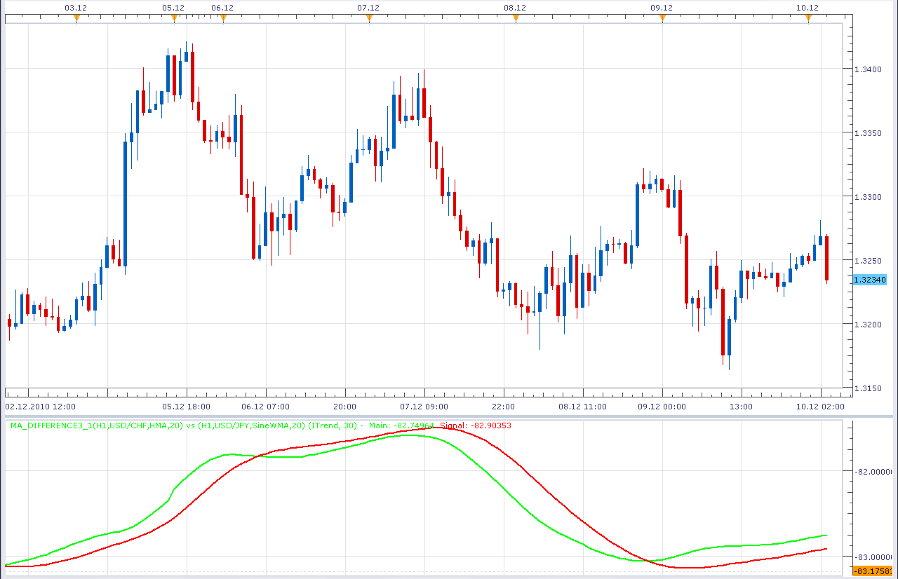

# MA Difference indicator

> Source: https://fxcodebase.com/code/viewtopic.php?f=17&t=2925  
> Forum: 17 · Topic 2925 · 2 post(s)

---

## MA Difference indicator

**Alexander.Gettinger** · Fri Dec 10, 2010 4:18 am

Indicator show difference between two MA of different instruments and timeframes.
Also, indicator have a signal line.

 

Download:

 [MA_Difference.lua](files/6691/MA_Difference.lua)

For this indicator must be installed Averages indicator ([viewtopic.php?f=17&t=2430](https://fxcodebase.com/code/viewtopic.php?f=17&t=2430)).
MT4/MQ4 version.
[viewtopic.php?f=38&t=64427](https://fxcodebase.com/code/viewtopic.php?f=38&t=64427)

The indicator was revised and updated

---

## Re: MA Difference indicator

**Apprentice** · Thu Feb 02, 2017 4:20 pm

Indicator was revised and updated.
