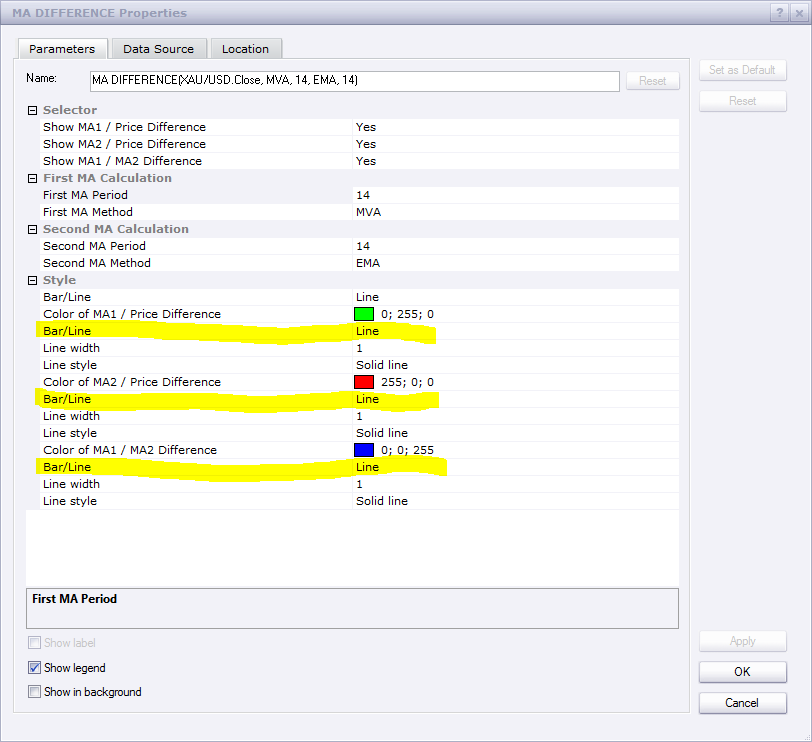
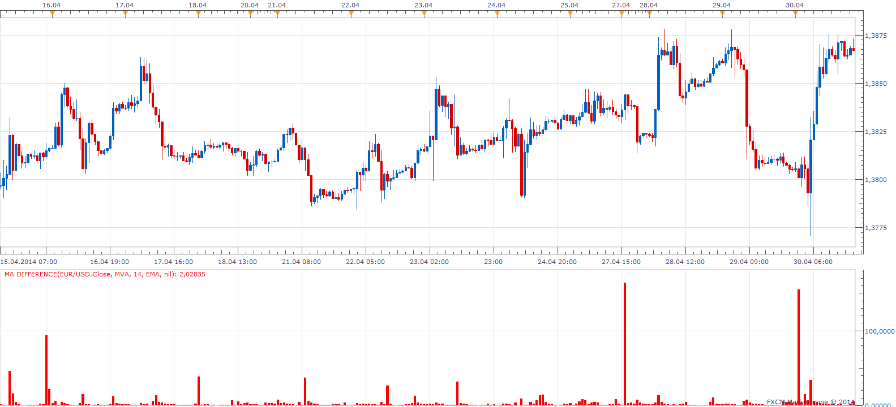

# MA Difference

> Source: https://fxcodebase.com/code/viewtopic.php?f=17&t=41822  
> Forum: 17 · Topic 41822 · 38 post(s)

---

## MA Difference

**Apprentice** · Mon Jun 24, 2013 6:58 am

Indicator will show Absolute Difference between.
1) Price / First MA
2) Price / Second MA
3) MA First / Second MA

 [MA Difference.lua](files/68234/MA%20Difference.lua)

 

 [MA Difference Candle.lua](files/68234/MA%20Difference%20Candle.lua)

---

## Re: MA Difference

**gnarlyarbitrage** · Mon Jun 24, 2013 11:54 am

Much appreciate for this and the RSI.

---

## Re: MA Difference

**gnarlyarbitrage** · Sun Jul 07, 2013 11:19 pm

Could you add in the option to have a bar-style instead of a line?

Thanks!

---

## Re: MA Difference

**Apprentice** · Tue Jul 09, 2013 4:35 am

bar style, for which data stream.

---

## Re: MA Difference

**gnarlyarbitrage** · Tue Jul 09, 2013 3:27 pm

price/ma1 and ma1/ma2

---

## Re: MA Difference

**Apprentice** · Wed Jul 10, 2013 8:00 am

Bar Option Added to all three data streams.

---

## Re: MA Difference

**gnarlyarbitrage** · Thu Jul 11, 2013 1:51 am

You already added it? If so, I can't find the option. Or are you just saying that the three have been added to the queue?

---

## Re: MA Difference

**Apprentice** · Thu Jul 11, 2013 2:26 am

---

## Re: MA Difference

**gnarlyarbitrage** · Thu Jul 11, 2013 3:01 am

Whoops, looks like I could've been clearer. I meant to say candlesticks, but the indicator that I found that gave me the idea was the bar rsi or something, so I figured you knew what I meant. I wanna see the wicks.

Thanks!

---

## Re: MA Difference

**Apprentice** · Sun Jul 14, 2013 2:37 am

It is possible.
However, for only one line at a time.

To have two or more candlesticks is not the way to go.

---

## Re: MA Difference

**Alexander.Gettinger** · Tue Aug 13, 2013 9:26 am

MQL4 version of this indicator: [viewtopic.php?f=38&t=59067](https://fxcodebase.com/code/viewtopic.php?f=38&t=59067)

---

## Re: MA Difference

**wccmcd** · Tue May 06, 2014 5:00 am

Apprentice and Alexander.Gettinger,

This indicator is a super. I also noticed that the ratio between MA2/PRICE and MA1/MA2 is very important. When the value of MA2/PRICE (the difference value of the slower MA and price) is beyond 2*(MA1/MA2), it is something worth a notice. Can you make a indicator to show the ratio of this?

DIFF1 = ABS(PRICE - M2);
DIFF2 = ABS(M1-M2);
RATIO = DIFF1/DIFF2

It will be awesome to have this as a signaling indicator, especially when price is approaching the turning point.

I am using MT4 so if you decide to write it, please make a MT4 version as well. Thank you.

---

## Re: MA Difference

**Apprentice** · Tue May 06, 2014 5:46 am

Before we proceed further.
It this what you envisioned.

---

## Re: MA Difference

**wccmcd** · Tue May 06, 2014 6:09 am

hum... the computer results is different from what I eyeballed on chart. But anyway, computer should be the right one, and those super high peaks made the indicator unreadable.

What I found is something like in the attached picture: when price go beyond level 200 (2*diff), it could be a good point for entry/exist.

---

## Re: MA Difference

**wccmcd** · Tue May 06, 2014 6:21 am

Apprentice,

I know what happened. when the two MA corss, the value of DIFF2 will be zero or very small, that results in a very huge ratio value.

---

## Re: MA Difference

**Apprentice** · Tue May 06, 2014 6:32 am

Please Re-Download.
I found a minor bug.
Waiting for your input.

---

## Re: MA Difference

**wccmcd** · Tue May 06, 2014 6:42 am

Apprentice,

Sorry I only use MT4. But from your picture I noticed the "zero problem" and realized it can't be a readable indicator anyway. It will only work on some specific time, such as when DIFF2 is big enough, otherwise the result of ratio will be chaos.

---

## Re: MA Difference

**wccmcd** · Tue May 06, 2014 6:51 am

for now, I will use your indicator as it is. I will look for the peak manually, when price is approaching the turning point. This way the DIFF won't be to small or zero.

---

## Re: MA Difference

**Apprentice** · Tue May 06, 2014 7:12 am

If you use the difference in place of the ratio, you'll get this.

 [Price MA Ratio.lua](files/93873/Price%20MA%20Ratio.lua)

---

## Re: MA Difference

**wccmcd** · Tue May 06, 2014 7:22 am

Doesn't look right. You know before price fall, it tends to jump up, (sometimes even make a new high),then heads down. when it jumps up, it's normally a good time to exit long. That's what I am trying to figure out through the indicator.

---

## Re: MA Difference

**wccmcd** · Tue May 06, 2014 6:33 pm

Isn't it the same as showing the value of PRICE/MA1?

[PRICE TO MA2(slower MA)] - [MA1 TO MA2] = [PORICE TO MA1], Am I right?

> **Apprentice wrote:**
>
>
> Price MA Ratio.lua
>
>
> If you use the difference in place of the ratio, you'll get this.
>
>
> Price MA Ratio.png

---

## Re: MA Difference

**Apprentice** · Wed May 07, 2014 2:51 am

This is the formula.
DIFF1 = (source[period] - Two.DATA[period]);
DIFF2 = (One.DATA[period]-Two.DATA[period]);

Ratio[period] = DIFF1-DIFF2;

---

## Re: MA Difference

**gnarlyarbitrage** · Thu Mar 12, 2015 6:17 pm

Could you make the ma1/ma2 difference into a candlestick?

Thank you.

---

## Re: MA Difference

**Apprentice** · Mon Mar 16, 2015 2:56 am

Please explain.
Something like RSI Candle?
[viewtopic.php?f=17&t=1927&hilit=RSI+Candle](https://fxcodebase.com/code/viewtopic.php?f=17&t=1927&hilit=RSI+Candle)

---

## Re: MA Difference

**gnarlyarbitrage** · Tue Mar 17, 2015 2:23 am

Yes. I want to be able to see wicks, instead of just the line.

---

## Re: MA Difference

**Apprentice** · Tue Mar 17, 2015 4:50 am

MA Difference Candle.lua added.

---

## Re: MA Difference

**Coondawg71** · Tue Mar 17, 2015 7:16 am

Neat indicator. Simple and very effective ! Thanks for sharing this concept.

sjc

---

## Re: MA Difference

**gnarlyarbitrage** · Tue Mar 17, 2015 11:53 am

Thanks for both.

---

## Re: MA Difference

**gnarlyarbitrage** · Tue Mar 17, 2015 12:11 pm

Something a little weird: when I switch the method to ma1/ma2 and vice versa, I don't get same kind of candlesticks when I do the price/ma method. I'm guessing it's because you included the negative range for the ma's. I was looking for a range of positive-only range as the original indicator has. (0-100000000)

Thanks again.

---

## Re: MA Difference

**Coondawg71** · Tue Mar 17, 2015 1:12 pm

Can we please add horizontal thresholds for this indicator. Users may need customization options for these levels. I use 15 minute time frame often and +- 0.0100 and +-0.0200 levels work well. Please add a "0" line as well.

Thanks!

sjc

---

## Re: MA Difference

**Apprentice** · Wed Mar 18, 2015 3:13 am

OB / OS, Absolute, Pips options Added for MA Difference Candle.

---

## Re: MA Difference

**Apprentice** · Mon Oct 08, 2018 6:12 am

The indicator was revised and updated.

---

## Re: MA Difference

**ahmedalhoseny** · Thu Feb 06, 2020 2:15 pm

Hello Apprentice ,

colud you add Lsma MA to the list of moving averages in the indicator.

thanks in advance

---

## Re: MA Difference

**Apprentice** · Fri Feb 07, 2020 6:16 am

Your request is added to the development list.
Development reference 690.

---

## Re: MA Difference

**Apprentice** · Fri Feb 07, 2020 7:04 am

[MA difference.lua](files/131167/MA%20difference.lua)

You can download Averages.lua here.
[viewtopic.php?f=17&t=2430](https://fxcodebase.com/code/viewtopic.php?f=17&t=2430)

---

## Re: MA Difference

**ahmedalhoseny** · Fri Feb 07, 2020 7:53 pm

> **Apprentice wrote:**
>
>
> Price MA Ratio.png
>
>
> If you use the difference in place of the ratio, you'll get this.
>
>
> Price MA Ratio.lua

Many thanks Apprentice but i mean to add LSMA to Price MA Ratio

thanks

---

## Re: MA Difference

**Apprentice** · Mon Feb 10, 2020 6:14 am

Your request is added to the development list.
Development reference 699.

---

## Re: MA Difference

**Apprentice** · Tue Feb 11, 2020 6:57 am

[Price MA Ratio.lua](files/131224/Price%20MA%20Ratio.lua)
