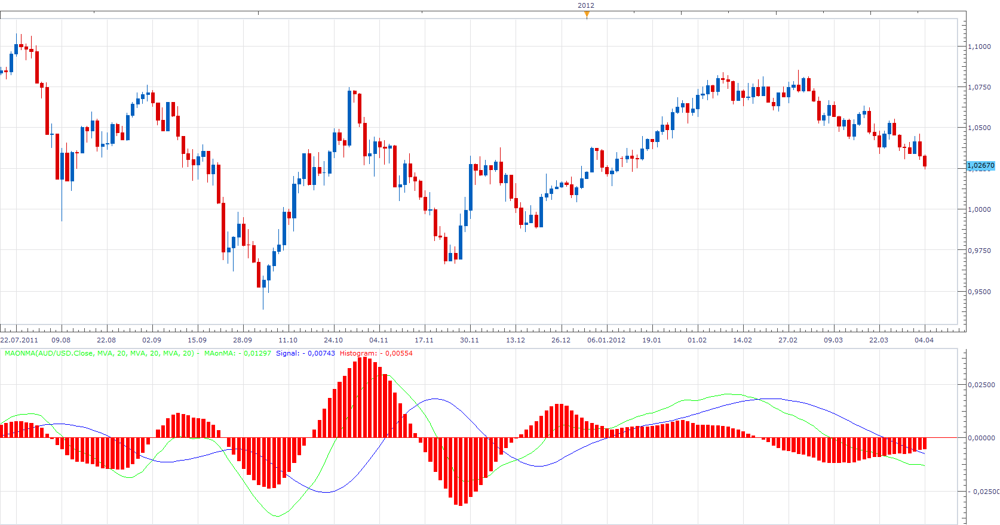

# MA on MA

> Source: https://fxcodebase.com/code/viewtopic.php?f=17&t=15547  
> Forum: 17 · Topic 15547 · 2 post(s)

---

## MA on MA

**Apprentice** · Wed Apr 04, 2012 9:13 am

This indicator is similar to the MACD.

It have three lines.
MAonMA - Moving Average of Source.
Signal - MA of MAonMA
Histogram-difference between MAonMA and signal line.

 [MAonMA.lua](files/29313/MAonMA.lua)

---

## Re: MA on MA

**Apprentice** · Wed Feb 21, 2018 10:58 am

The Indicator was revised and updated.
