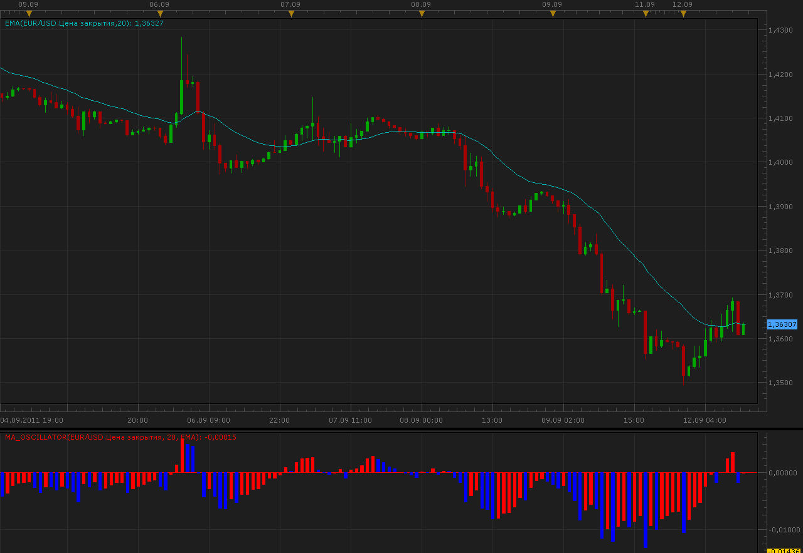

# MA oscillator

> Source: https://fxcodebase.com/code/viewtopic.php?f=17&t=6488  
> Forum: 17 · Topic 6488 · 2 post(s)

---

## MA oscillator

**Alexander.Gettinger** · Mon Sep 12, 2011 10:30 am

MA as an oscillator.

Formulas:
MA_Oscillator=Price/MA-1.

 

Download:

 [MA_Oscillator.lua](files/14827/MA_Oscillator.lua)

For this oscillator must be installed Averages indicator ([viewtopic.php?f=17&t=2430](https://fxcodebase.com/code/viewtopic.php?f=17&t=2430)).

The indicator was revised and updated
MT4/MQ4 version
[viewtopic.php?f=38&t=66136](https://fxcodebase.com/code/viewtopic.php?f=38&t=66136)

---

## Re: MA oscillator

**Apprentice** · Mon May 21, 2018 5:11 am

Indicator was revised and updated.
