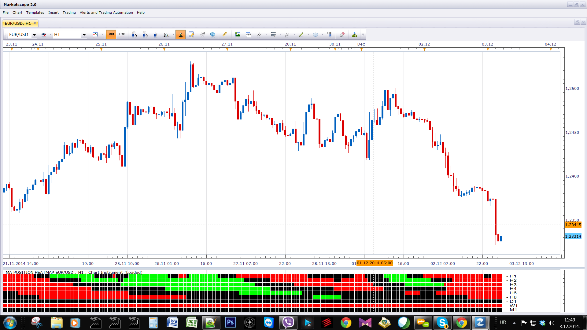
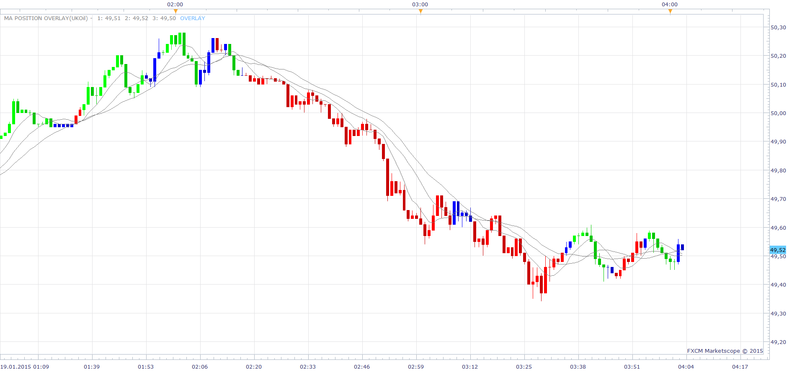

# MA position Heatmap

> Source: https://fxcodebase.com/code/viewtopic.php?f=17&t=61569  
> Forum: 17 · Topic 61569 · 18 post(s)

---

## MA position Heatmap

**Apprentice** · Wed Dec 03, 2014 4:57 am

Green
MA1> MA2 and MA2> MA3
Red
MA1< MA2 and MA2< MA3

 [MA position Heatmap.lua](files/97496/MA%20position%20Heatmap.lua)

 

 [MA position Overlay.lua](files/97496/MA%20position%20Overlay.lua)

MT4/Mq4 version
[viewtopic.php?f=38&t=65205](https://fxcodebase.com/code/viewtopic.php?f=38&t=65205)

---

## Re: MA position Heatmap

**poriyavt** · Wed Dec 03, 2014 10:58 am

Hi Sir

 Thank you Very Much for This Indicator i really appreciate but i need 1 More Help I Need

 OVERLAY and same Strategies for auto trading

Regards

---

## Re: MA position Heatmap

**Apprentice** · Wed Dec 03, 2014 11:33 am

Can you define the overlay presentation.
Can you specify the correct / detailed conditions for the strategy.

---

## Re: MA position Heatmap

**poriyavt** · Thu Dec 04, 2014 12:30 am

dear Sir

 i need This Indicator in OVERLAY and Same Format Strategies

 When Fast MA Cross Medium MA That time i Want Exit Trade Signal And When Both

Fast &Medium Cross Slow MA That time i Need Signal Trade Buy Or Sell Signal No Trade Color Should be

Gray And BUY Color Green And SELL Color Will Be RED I Hope U Understand What i

Want Cozz I Am A little weak in English

---

## Re: MA position Heatmap

**Apprentice** · Thu Dec 04, 2014 3:09 am

By do you mean something candle overlay, See link below.
[viewtopic.php?f=17&t=41915&p=68343&hilit=OVERLAY#p68343](https://fxcodebase.com/code/viewtopic.php?f=17&t=41915&p=68343&hilit=OVERLAY#p68343)

---

## Re: MA position Heatmap

**poriyavt** · Thu Dec 04, 2014 3:31 am

Hi

 Yes Sir Same Like That But I Need Only Three Color Like UP I want Green Down Red And No

Trade Color Grey

Regards

---

## Re: MA position Heatmap

**Apprentice** · Thu Dec 04, 2014 5:56 am

MA position Overlay Added.

---

## Re: MA position Heatmap

**poriyavt** · Fri Dec 05, 2014 8:36 am

Please make a strategy for this very good incator apperentice. Very good job. Please make as soon as

possible. same as a indicator like when neutral indicator will come that time i need what ever open

position will be close

Regards

---

## Re: MA position Heatmap

**Apprentice** · Sun Dec 07, 2014 5:39 am

Requested can be found here.
[viewtopic.php?f=31&t=61580](https://fxcodebase.com/code/viewtopic.php?f=31&t=61580)

---

## Re: MA position Heatmap

**poriyavt** · Sun Jan 18, 2015 2:18 am

Dear Sir

 I wanna 1 Indicator like
A- EMA
B- TMA
C-TMA

Buy
When A Cross Over C Buy
When A Cross Over B Neutral

Sell
When A Cross Over C Sell
When A Cross Over B Neutral

 This Signal I want In Candle Overlay Like Buy Green Color Sell Red Color And Neutral Gray Color

I hope You understand my Request

Regards

---

## Re: MA position Heatmap

**Apprentice** · Mon Jan 19, 2015 3:48 am

You mean something like this.

 

If A MA Cross Over C MA Buy
If A MA Cross Under C MA Sell

if Buy and A CrossUnder B Neutral
if Sell and A CrossOver B Neutral

 [MA position Overlay Cross.lua](files/98207/MA%20position%20Overlay%20Cross.lua)

 

If A MA > C MA Buy
If A MA < C MA Sell

if Buy and A < B Neutral
if Sell and A > B Neutral

 [MA position Overlay Position.lua](files/98207/MA%20position%20Overlay%20Position.lua)

---

## Re: MA position Heatmap

**poriyavt** · Mon Jan 19, 2015 7:40 am

Hi

 Dear Sir

 Can you Make Strategy Same As (MA position Overlay Position)

Thank And Regards

---

## Re: MA position Heatmap

**Apprentice** · Tue Jan 20, 2015 3:39 am

Requested can be found here.
[viewtopic.php?f=31&t=61739&p=98237#p98237](https://fxcodebase.com/code/viewtopic.php?f=31&t=61739&p=98237#p98237)

---

## Re: MA position Heatmap

**Apprentice** · Thu Oct 19, 2017 5:19 am

The indicator was revised and updated.

---

## Re: MA position Heatmap

**SvenStp** · Tue Nov 07, 2017 1:52 pm

Hello Apprentice,

i have some malfunction with the indicator as you will see on the picture.
How come all of those grey candles are in neutral trend?

Cheers,
SvenStp

---

## Re: MA position Heatmap

**Apprentice** · Tue Nov 07, 2017 6:51 pm

We have few versions, Can you provide the exact download link?

---

## Re: MA position Heatmap

**SvenStp** · Wed Nov 08, 2017 5:27 am

Oh, i am sorry, i now see that maybe i posted in the wrong place. I tested few of those and i would say that the one in question is downloaded from [http://fxcodebase.com/code/viewtopic.php?f=17&t=61569](https://fxcodebase.com/code/viewtopic.php?f=17&t=61569). I will try to upload the file if that helps.

Cheers,
SvenStp

---

## Re: MA position Heatmap

**Apprentice** · Mon Apr 09, 2018 6:28 am

The indicator was revised and updated.
