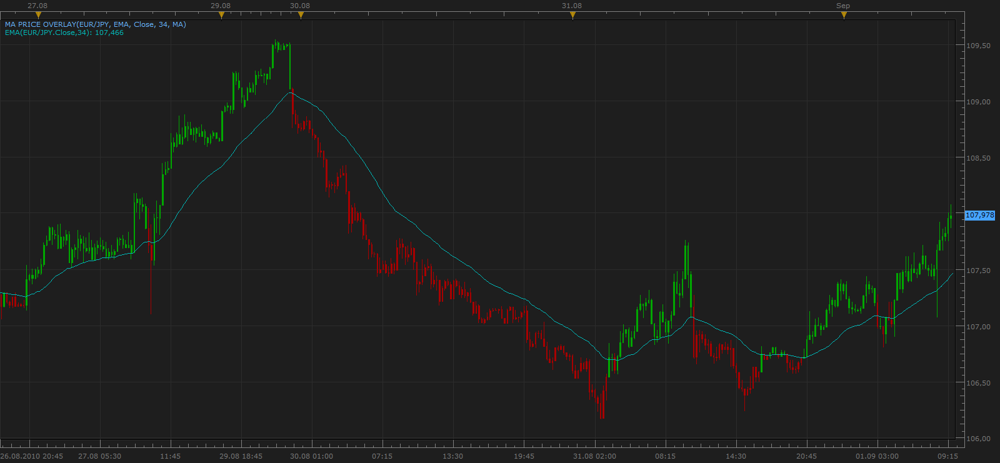

# MA Price Overlay

> Source: https://fxcodebase.com/code/viewtopic.php?f=17&t=2012  
> Forum: 17 · Topic 2012 · 13 post(s)

---

## MA Price Overlay

**Apprentice** · Wed Sep 01, 2010 8:46 am

 [MA Price Overlay.lua](files/4104/MA%20Price%20Overlay.lua)

The indicator was revised and updated

---

## Re: MA Price Overlay

**zekelogan** · Wed Sep 01, 2010 11:56 am

Lovely

---

## Re: MA Price Overlay

**basicstrategy** · Fri Mar 04, 2011 12:29 pm

Apprentice, you are a genius !
Even my kids could trade with such an easy-to-use indicator ...

I have two questions for you :

1) is there a strategy available for Trade Station II based on this indicator ? (the closes I can think of is PRICE_MA)
2) is there a port to or from MT4 for this indicator (or close enough) ?

Thanks in advance for your hard work )

BasicStrategy

---

## Re: MA Price Overlay

**Apprentice** · Fri Mar 04, 2011 12:56 pm

You ca use MA / Price Cross Strategy
[viewtopic.php?f=31&t=2403](https://fxcodebase.com/code/viewtopic.php?f=31&t=2403)
 If you need a more complex strategy, we can develop it.

As for MT version.
As you know this is a forum dedicated to Marketskope Charting package.
However, through our premium service such a thing is possible.

---

## Re: MA Price Overlay

**basicstrategy** · Fri Mar 04, 2011 3:57 pm

thanks for the info )

---

## Re: MA Price Overlay

**Hailkayy** · Mon Feb 20, 2012 5:34 pm

Hey, apprentice
How are you friend ?
Nice indi, as always, i have a quick request, could you add TMA in this indicator ? U must have a queue of 200 hundreds indi ^-^ please as this indicator is already done, could you quickly insert code for TMA and make it available on the go ? After your lunch of course :p

Also, Please check my e-mail.

Thanks for help, peace

---

## Re: MA Price Overlay

**Apprentice** · Tue Feb 21, 2012 6:05 am

VIDYA, WMA and TMA Are now supported.

Email?

I have not received anything from you.
Use my private mail.
mario (dot) jemic (at) gmail (dot) com

---

## Re: MA Price Overlay

**Hailkayy** · Tue Feb 21, 2012 8:32 am

Hi app,

How come i can have TMA and stuff in the menu if you didn't post a new version of this indi, where they were only MVA EMA et LMMA ?
Lol
i'll send you new e-mail, many thanks

---

## Re: MA Price Overlay

**Apprentice** · Wed Feb 22, 2012 4:29 am

With a little magic.
I have updated topmost post.
Simply re-download and install indicator.

---

## Re: MA Price Overlay

**Hailkayy** · Wed Feb 22, 2012 4:49 am

Morning sir !

I just erased first version, re downloaded it now , did same thing twice.
I can't see TMA can you ?!

E-mail sent, answer when u have time

---

## Re: MA Price Overlay

**Apprentice** · Wed Feb 22, 2012 7:22 am

I have it.
I can send it to you, by mail.
But this is not the solution.
Try to use other web browsers.
Or delete web browser cache

 [MA Price Overlay.lua](files/26589/MA%20Price%20Overlay.lua)

---

## Re: MA Price Overlay

**Hailkayy** · Wed Feb 22, 2012 8:58 am

Thank man love u, effing nice results by the way related to your performance.
TMA's are often overlooked in the world of trading but look how great a TMA 30 works on a eurusd M30 charts !
They filter nicely.
Anyway you know the business.
Well thanks man.

---

## Re: MA Price Overlay

**Apprentice** · Sun Apr 02, 2017 6:59 am

Indicator was revised and updated.
