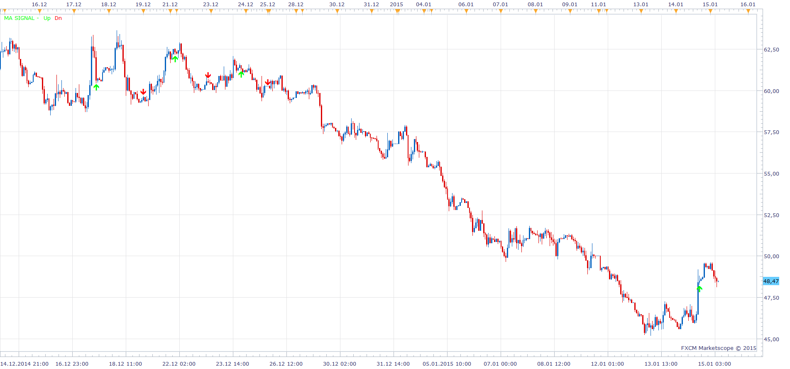
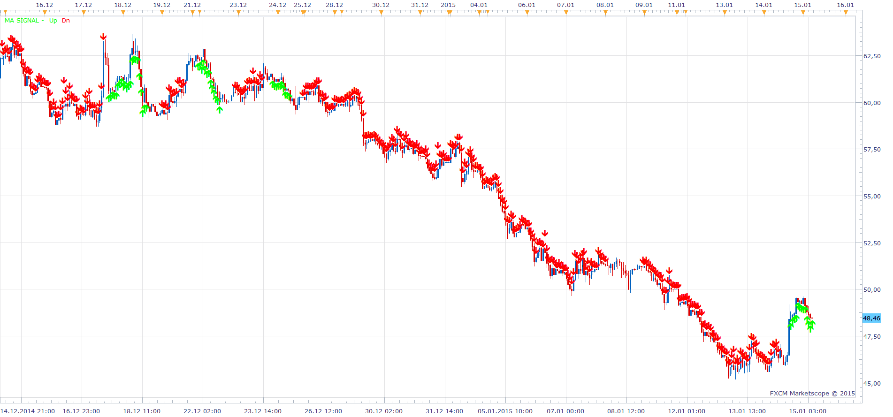

# MA Signal

> Source: https://fxcodebase.com/code/viewtopic.php?f=17&t=61721  
> Forum: 17 · Topic 61721 · 2 post(s)

---

## MA Signal

**Apprentice** · Thu Jan 15, 2015 5:02 am

 

Based on the request.
[viewtopic.php?f=27&t=61716#p98144](https://fxcodebase.com/code/viewtopic.php?f=27&t=61716#p98144)

Up Arrow
EMA10 > EMA50 and
SMA20 > SMA40 then
Down Arrow
EMA10 < EMA50 and
SMA20 < SMA40 then

 [MA Signal.lua](files/98164/MA%20Signal.lua)

The indicator was revised and updated

---

## Re: MA Signal

**Apprentice** · Thu Aug 03, 2017 6:30 am

The indicator was revised and updated.
