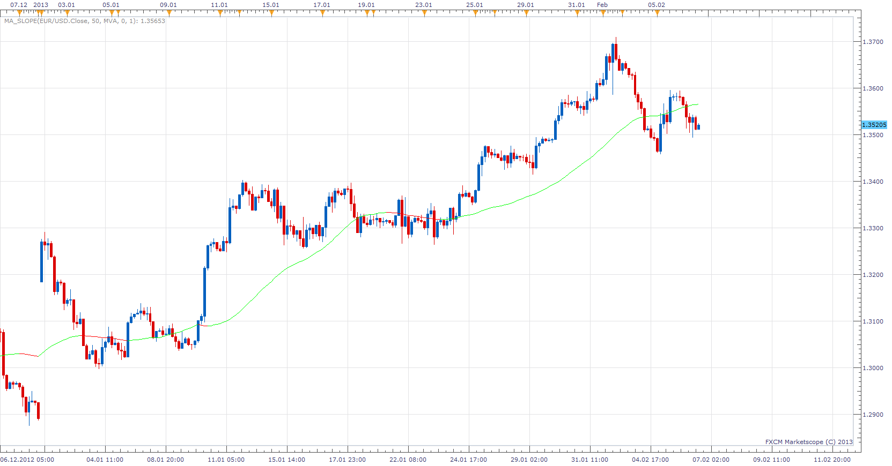
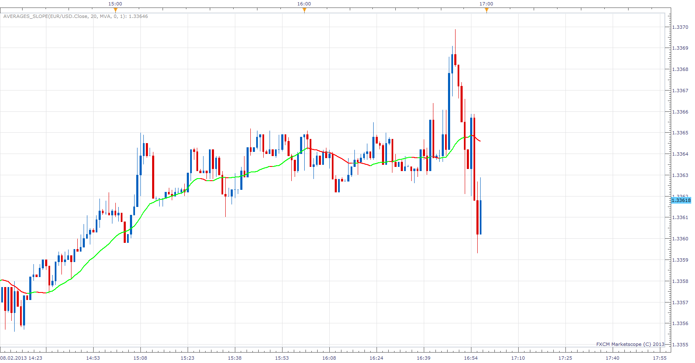

# MA Slope indicator

> Source: https://fxcodebase.com/code/viewtopic.php?f=17&t=1122  
> Forum: 17 · Topic 1122 · 12 post(s)

---

## MA Slope indicator

**Apprentice** · Wed Feb 06, 2013 5:14 pm

Shows the slope of MA, in Pips per period.
MASO (in Pips) = ( MA[period]- MA[period-Bar] )
if MASO > Slope then Buy;
if MASO < Slope then Sell;
else Neutral;

 [MA_Slope.lua](files/54236/MA_Slope.lua)

The indicator was revised and updated

---

## Re: MA Slope indicator

**tradecraft** · Sat Feb 09, 2013 6:36 pm

I really like this indicator. Could you add the nonlagMA2 as one of the available moving average methods?

---

## Re: MA Slope indicator

**Apprentice** · Sun Feb 10, 2013 6:37 am

Try Averages Version.

 [Averages_Slope.lua](files/54403/Averages_Slope.lua)

 [Averages_Slope with Alert.lua](files/54403/Averages_Slope%20with%20Alert.lua)

Please, download and install Averages indicator.
[viewtopic.php?f=17&t=2430](https://fxcodebase.com/code/viewtopic.php?f=17&t=2430)

This indicator will provides Audio / Email Alerts on slope change.

Dec 14, 2015: Compatibility issue Fixed. _Alert helper is not longer needed.

---

## Re: MA Slope indicator

**Alexander.Gettinger** · Fri Nov 29, 2013 2:13 pm

MQL4 version of MA Slope indicator: [viewtopic.php?f=38&t=60021](https://fxcodebase.com/code/viewtopic.php?f=38&t=60021).

---

## Re: MA Slope indicator

**Taskryr** · Fri Jan 31, 2014 10:06 pm

Can we get a correction or explanation for this indicator. If I have the indicator set to 1 slope and 3 bars, my understanding is that the current period line color should be up if the previous three bars average are up, down if the three previous bars are down, and flat if otherwise.

However, it doesn't seem to function that way or else I am misunderstanding what the slope and bars are actually measuring. I say this because the color of the MA for the previous three periods will repaint their colors depending on future bars. I don't understand why. That is, a green bar on my screen will turn red after a few more bars. This is very frustrating. I can understand if the current bar fluctuates colors, but once a period has ended shouldn't the MA color stop fluctuating? Am I missing something?

It is making my backtesting moot since the real-time line fluctuates colors even after the current bar has ended.

---

## Re: MA Slope indicator

**Apprentice** · Sat Feb 01, 2014 2:49 pm

if MASO > Slope then Buy;
if MASO < Slope then Sell;
else Neutral;

At the beginning of the period, the absolute difference between current and previous values ​​can,
be less than the value of Pip.

If the difference is greater then Pip, positive or negative indication is given.

---

## Averages_Slope.lua

**SuperTrader** · Fri May 22, 2015 5:14 am

Hi Apprentice. Your "**Averages_Slope.lua**" indicator above is **fantastic** (it works fine even on tick charts!). Whenever you have time could you please **add**in its code (if possible) an audio-alert (custom *.wav) when it changes color (slope-change) which should trigger "Live" (real-time).
I don't normally use your optional setting "End of Turn" in your other alert-enhanced indicators (I know some traders do though), I only trade with the "Live" alerts and I must admit that all these indicators of yours are **simply awesome!** Many thanks in advance!

---

## Re: MA Slope indicator

**Apprentice** · Mon May 25, 2015 5:17 am

Averages_Slope with Alert.lua Added

---

## Re: MA Slope indicator

**SuperTrader** · Wed Jun 10, 2015 2:47 am

The Alert works **perfectly**(even on tick charts!)
Thank you very much for your help on this Apprentice!

---

## Re: MA Slope indicator

**Apprentice** · Mon Dec 14, 2015 6:10 am

Dec 14, 2015: Compatibility issue Fixed. _Alert helper is not longer needed.

If you want to use updated version of this indicator,
please make sure to use TS Version 01.14.101415. or higher.

---

## Re: MA Slope indicator

**SuperTrader** · Tue Jun 21, 2016 12:17 pm

> **Apprentice wrote:**
> Dec 14, 2015: Compatibility issue Fixed. _Alert helper is not longer needed.

thank you for updating this indicator!

---

## MA Slope indicator

**Apprentice** · Sat Feb 11, 2017 5:39 am

Indicator was revised and updated.
