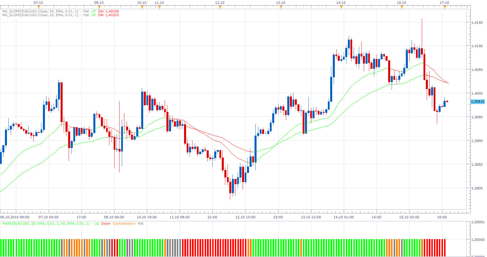
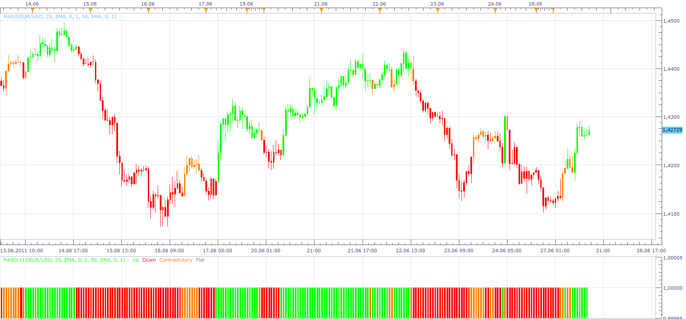
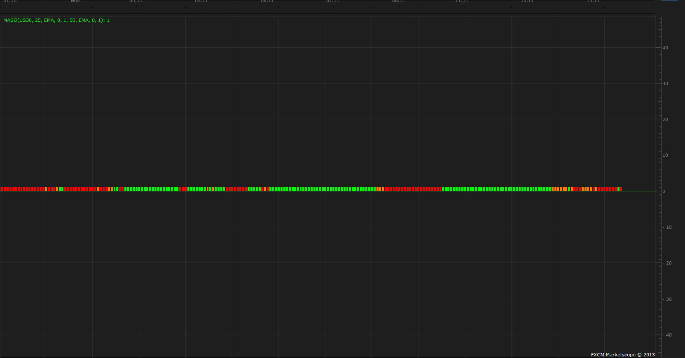
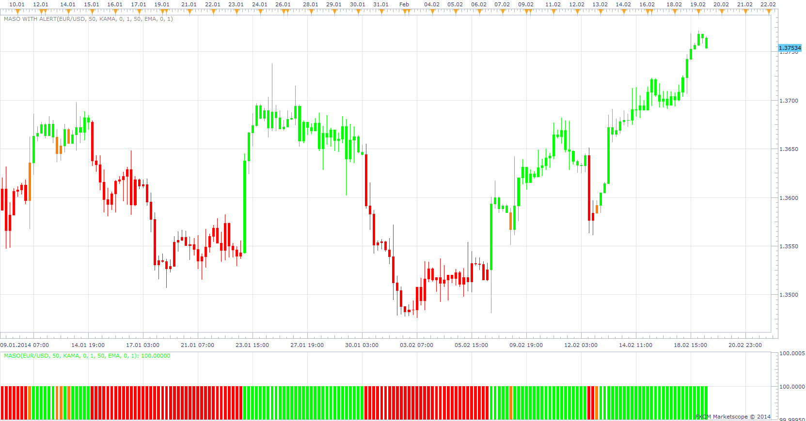

# MA Slope Oscilator

> Source: https://fxcodebase.com/code/viewtopic.php?f=17&t=2431  
> Forum: 17 · Topic 2431 · 18 post(s)

---

## MA Slope Oscilator

**Apprentice** · Sun Oct 17, 2010 3:35 pm

This oscillator combines two MA_Slope indicators.

If both indicators have a positive slope, the indication is positive.
If both indicators have a negative slope, the indication is negative.
Distinguish contradictory, when the signals differ.
And flat, when the slope is less than the minimum.

 [MASO.lua](files/5269/MASO.lua)

 MA_Slope indicator can be found here.
[viewtopic.php?f=17&t=1122&p=2143#p2143](https://fxcodebase.com/code/viewtopic.php?f=17&t=1122&p=2143#p2143)

MT4/MQ4 version.
[viewtopic.php?f=38&t=70367&p=137248#p137248](https://fxcodebase.com/code/viewtopic.php?f=38&t=70367&p=137248#p137248)

---

## Re: MA Slope Oscilator

**Apprentice** · Mon Jun 27, 2011 2:37 pm

Price Bar Overlay Version

 [MASO.lua](files/12112/MASO.lua)

 MA_Slope indicator can be found here.
[viewtopic.php?f=17&t=1122&p=2143#p2143](https://fxcodebase.com/code/viewtopic.php?f=17&t=1122&p=2143#p2143)

---

## Re: MA Slope Oscilator

**Apprentice** · Wed Nov 21, 2012 6:37 am

This version provides Audio / Email Alerts if we have MASO Color change.

 [MASO with Alert.lua](files/45293/MASO%20with%20Alert.lua)

For this indicator you must install MA_Slope.lua
[viewtopic.php?f=17&t=1122&p=2143#p2143](https://fxcodebase.com/code/viewtopic.php?f=17&t=1122&p=2143#p2143)

Dec 14, 2015: Compatibility issue Fixed. _Alert helper is not longer needed.

If you want to use updated version of this indicator,
please make sure to use TS Version 01.14.101415. or higher.

---

## Re: MA Slope Oscilator

**Apprentice** · Wed Feb 06, 2013 5:54 pm

Updated.

---

## Re: MA Slope Oscilator

**GBitaly** · Wed Nov 13, 2013 3:22 am

MASO is very usefull with currency but when I use the indicator with US30,GER30 doesn't work.
Do you know why?

thanks
Guido

---

## Re: MA Slope Oscilator

**Apprentice** · Wed Nov 13, 2013 4:27 am

In fact, it works.
But you probably have not noticed it.
As a result is compressed.
It looks like a bug of some sort.
Will investigate.

---

## Re: MA Slope Oscilator

**GBitaly** · Fri Nov 15, 2013 4:24 am

I have seen that is very compressed.
Notice, if you use cursor data,that there is no value for Maso

Bye
Guido

---

## Re: MA Slope Oscilator

**Alexander.Gettinger** · Mon Dec 02, 2013 10:56 am

MQL4 version of MA Slope oscillator: [viewtopic.php?f=38&t=60048](https://fxcodebase.com/code/viewtopic.php?f=38&t=60048).

---

## Re: MA Slope Oscilator

**GBitaly** · Tue Feb 18, 2014 11:23 am

Why Maso and Maso with Alert are different with the same parameter
Maso with Alert draws Always the contradictory phase

thanks
Guido

---

## Re: MA Slope Oscilator

**Apprentice** · Wed Feb 19, 2014 4:15 am

My test does not reveal this.
Colouration is same.
U can notice that the default settings of this two are not identical.

---

## Re: MA Slope Oscilator

**GBitaly** · Thu Feb 27, 2014 4:20 am

I have always the same problem using different setting... probably with my Marketscope doesn't work !

I couldn 't use this indicator

Bye
Guido

---

## Re: MA Slope Oscilator

**SavvyStrategist** · Sat Oct 31, 2015 9:03 pm

For MASO with Alert.lua, would it be possible to merge the contradictory and down alert into one? So it would only trigger when it goes from up to contradictory/down and from contradictory/down into up.

I find bottoms take longer to develop and contradictory candles rarely give a reliable up signal, but contradictory candles often precede down candles when it comes to market tops.

This would result in faster alerts for shorts and fewer alerts overall.

---

## Re: MA Slope Oscilator

**Apprentice** · Tue Nov 03, 2015 4:42 am

Can you elaborate, We only have contradictory/up/down/flat
Please use this format.
if previous period is ...
if current period is...
then
...

---

## Re: MA Slope Oscilator

**Apprentice** · Mon Dec 14, 2015 7:24 am

Dec 14, 2015: Compatibility issue Fixed. _Alert helper is not longer needed.

If you want to use updated version of this indicator,
please make sure to use TS Version 01.14.101415. or higher.

---

## Re: MA Slope Oscilator

**Apprentice** · Wed Aug 02, 2017 7:00 am

The indicator was revised and updated.

---

## Re: MA Slope Oscilator

**Gilles** · Fri Aug 28, 2020 5:18 am

Hi Apprentice ! :)

Please, a MASO with Price Bar Overlay Version for MT4 :)

See you soon,
Thank you very much :)

---

## Re: MA Slope Oscilator

**Apprentice** · Sat Aug 29, 2020 10:45 am

Your request is added to the development list.
Development reference 1943.

---

## Re: MA Slope Oscilator

**Apprentice** · Wed Sep 02, 2020 3:29 am

MT4/MQ4 version.
[viewtopic.php?f=38&t=70367&p=137248#p137248](https://fxcodebase.com/code/viewtopic.php?f=38&t=70367&p=137248#p137248)
