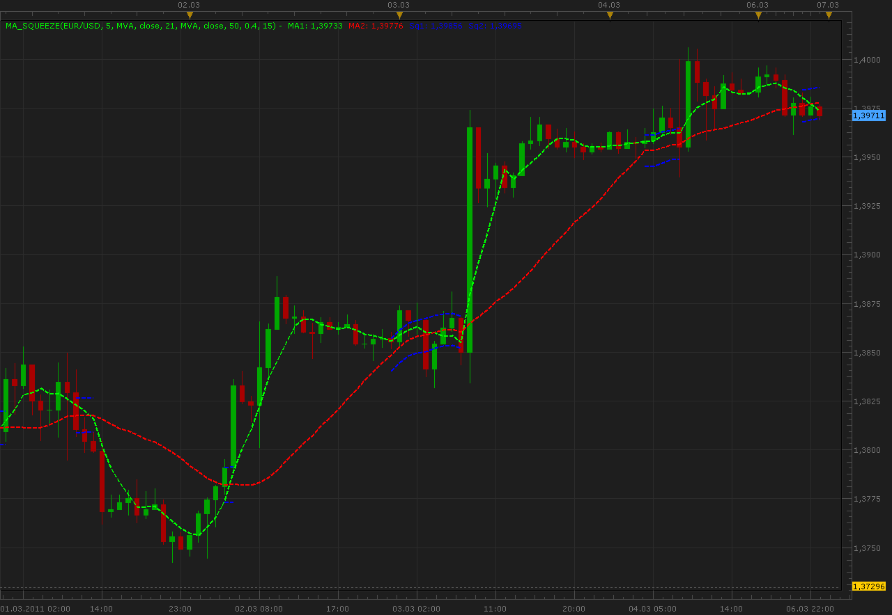

# MA Squeeze indicator

> Source: https://fxcodebase.com/code/viewtopic.php?f=17&t=3613  
> Forum: 17 · Topic 3613 · 6 post(s)

---

## MA Squeeze indicator

**Alexander.Gettinger** · Mon Mar 07, 2011 12:18 am

Indicator draw two MA and display when they close.
Supported 2 ways of the determination squeeze: with ATR indicator and threshold in pips.

 

Download:

 [MA_Squeeze.lua](files/8680/MA_Squeeze.lua)

For this indicator must be installed AVERAGES indicator ([viewtopic.php?f=17&t=2430&p=6686](https://fxcodebase.com/code/viewtopic.php?f=17&t=2430&p=6686)).

The indicator was revised and updated

---

## Re: MA Squeeze indicator

**RJH501** · Sun Jul 31, 2011 12:57 pm

Hi Alexander, it would be great if it was possible to turn-off the MVA lines on this indicator.

Thanks,

Richard

---

## Re: MA Squeeze indicator

**Coondawg71** · Fri Dec 06, 2013 3:00 pm

Can we please add support to Par Ma and VAMA (volume adjusted moving average) to this indicator.

thanks,

sjc

---

## Re: MA Squeeze indicator

**Apprentice** · Sun Dec 08, 2013 6:35 am

Your request is added to the development list.

---

## Re: MA Squeeze indicator

**Alexander.Gettinger** · Wed Aug 20, 2014 10:10 am

MQL4 version of MA Squeeze indicator: [viewtopic.php?f=38&t=61061](https://fxcodebase.com/code/viewtopic.php?f=38&t=61061).

---

## Re: MA Squeeze indicator

**Apprentice** · Fri Jun 16, 2017 7:35 am

The indicator was revised and updated.
