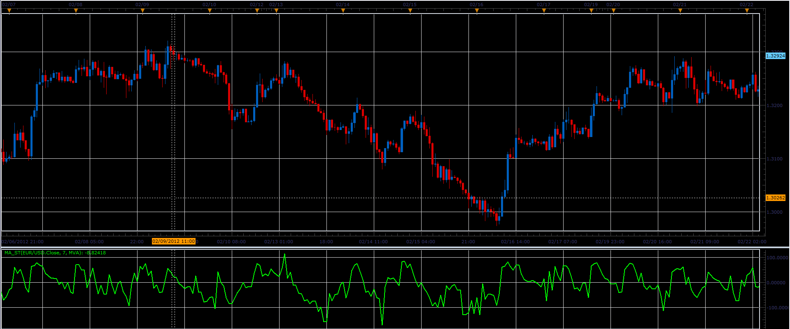

# MA_St oscillator

> Source: https://fxcodebase.com/code/viewtopic.php?f=17&t=13890  
> Forum: 17 · Topic 13890 · 2 post(s)

---

## MA_St oscillator

**Alexander.Gettinger** · Thu Feb 23, 2012 10:19 am

This oscillator is similar to stochastic.

Formulas:
MA_St[i]=100*(Price[i]-MA[i])/Range, where
Range=Max-Min,
Max, Min are a maximum and minimum values (Price-MA) from (i-Period) to (i).

 

Download:

 [MA_St.lua](files/26690/MA_St.lua)

For this oscillator must be installed Averages indicator ([viewtopic.php?f=17&t=2430](https://fxcodebase.com/code/viewtopic.php?f=17&t=2430)).

The indicator was revised and updated

---

## Re: MA_St oscillator

**Apprentice** · Mon Mar 27, 2017 3:55 pm

Indicator was revised and updated.
