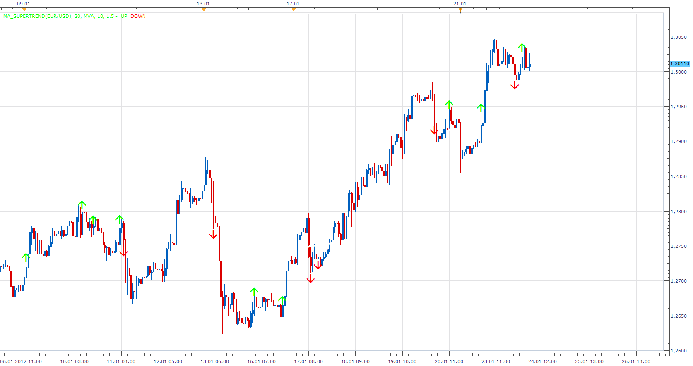

# MA_SuperTrend

> Source: https://fxcodebase.com/code/viewtopic.php?f=17&t=12227  
> Forum: 17 · Topic 12227 · 7 post(s)

---

## MA_SuperTrend

**Apprentice** · Tue Jan 24, 2012 5:39 am

Green / Red Arrows **(enter the trade)**are generated when closing price cross over MA line,
but only if it is confirmed by SuperTrend indicators.

White Arrows **(miss the trade)** are generated when closing price cross over MA line,
but it is not confirmed by SuperTrend indicators.

If you use wider definition options, the Arrows is generated when both conditions are positive, regardless of the sequence of positive indications.

 [MA_SuperTrend.lua](files/24216/MA_SuperTrend.lua)

If you do not have it you need the following indicator.

SUPERTREND INDICATOR:
 [viewtopic.php?f=17&t=605](https://fxcodebase.com/code/viewtopic.php?f=17&t=605)

The indicator was revised and updated

---

## Re: MA_SuperTrend Strategy

**BabyCoder** · Thu Mar 08, 2012 8:10 pm

Hi,

Could this be turned into a strategy.

Condition would be as follows:

Entry at end of candle when price breaks through the MA confirmed by the Supertrend
options will include entry at N candle after condition above is met
and or X pips after close of bar (to eliminate possible false entry)

Exit to be for trailing SL to move to next bar or N bar eg SL to be on bar before current candle or option to be 2 or 3 bars before current candle.

Once again thanks for your support and good work.

---

## Re: MA_SuperTrend

**Hailkayy** · Sun Apr 08, 2012 1:52 pm

Very good work

---

## Re: MA_SuperTrend

**Apprentice** · Tue Apr 10, 2012 2:28 am

It seems that your original request has been overlooked.

---

## Re: MA_SuperTrend

**Rpleandro** · Tue Apr 10, 2012 3:21 pm

Can you code this to enter a trade, short or long , and keep the trade open until it hits either the stop loss or take profit???

---

## Re: MA_SuperTrend

**Apprentice** · Fri Apr 13, 2012 1:44 am

Yes this is possible.

---

## Re: MA_SuperTrend

**Apprentice** · Sun Apr 02, 2017 7:33 am

Indicator was revised and updated.
