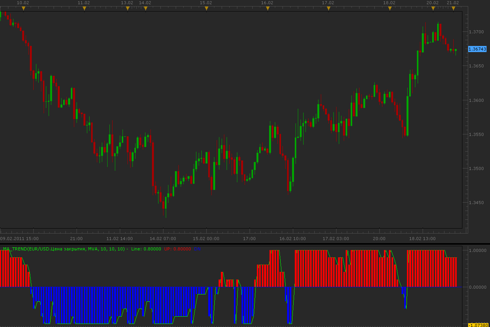

# MA Trend indicator

> Source: https://fxcodebase.com/code/viewtopic.php?f=17&t=3481  
> Forum: 17 · Topic 3481 · 3 post(s)

---

## MA Trend indicator

**Alexander.Gettinger** · Mon Feb 21, 2011 1:23 am

Indicator analyses [Count_MA] moving averages with first period [Start_Period] and step [Step_Period].
MA_Trend=Sum(S)/Count_MA, where
S(i)=1 if Price>MA(i) and S(i)=-1 if Price<MA(i).

 

Download:

 [MA_Trend.lua](files/8288/MA_Trend.lua)

For this indicator must be installed Averages indicator ([viewtopic.php?f=17&t=2430&start=0](https://fxcodebase.com/code/viewtopic.php?f=17&t=2430&start=0)).

Mq4/MT4 version.
[viewtopic.php?f=38&t=64492](https://fxcodebase.com/code/viewtopic.php?f=38&t=64492)

The indicator was revised and updated

---

## Re: MA Trend indicator

**Alexander.Gettinger** · Thu Mar 17, 2011 2:16 am

Strategy based on this indicator: [viewtopic.php?f=31&t=3656](https://fxcodebase.com/code/viewtopic.php?f=31&t=3656)

---

## Re: MA Trend indicator

**Apprentice** · Fri Mar 03, 2017 8:58 am

Indicator was revised and updated.
