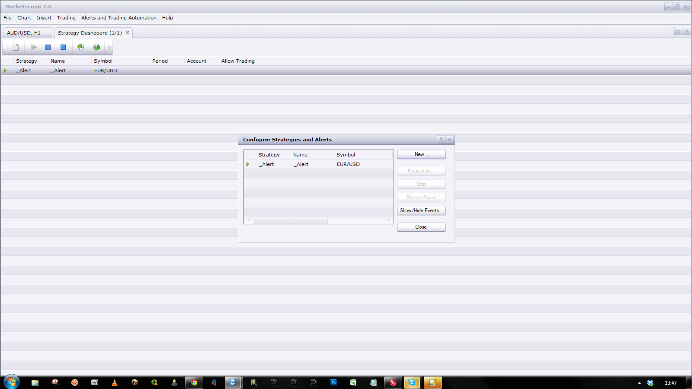

# MA with Alert

> Source: https://fxcodebase.com/code/viewtopic.php?f=17&t=18926  
> Forum: 17 · Topic 18926 · 19 post(s)

---

## MA with Alert

**Apprentice** · Tue May 22, 2012 5:23 am

This indicator provides Audio / Email Alerts for most of moving averages.
The signal is generated by Cross of moving average and selected data source.
MA Slope Change Alert is an optional function.

 [MA with Alert.lua](files/33770/MA%20with%20Alert.lua)

Dec 26, 2015: Compatibility issue Fix. _Alert helper is not longer needed.

---

## Re: MA with Alert

**fchirawu** · Wed May 23, 2012 12:19 pm

Hi

Nice work, I like the indicator, but the email and sound alert are not work for me.

---

## Re: MA with Alert

**Apprentice** · Wed May 23, 2012 3:43 pm

Sorry, I forgot to mention that you must install and activate the Alert Signal

---

## Re: MA with Alert

**fchirawu** · Thu May 24, 2012 2:29 am

Thanks, it works perfect. I like it.

I have a request. Is it possible for you to create an alert that plays a sound or sends an email when, lets say EMA 8 crosses EMA 34?

---

## Re: MA with Alert

**Apprentice** · Thu May 24, 2012 6:03 am

Your request is added to the development list.

---

## Re: MA with Alert

**fchirawu** · Thu May 24, 2012 9:14 am

Thank you

---

## Re: MA with Alert

**Apprentice** · Sat May 26, 2012 5:05 am

Try this version.
[viewtopic.php?f=17&t=19197](https://fxcodebase.com/code/viewtopic.php?f=17&t=19197)

---

## Re: MA with Alert

**The Chartist** · Thu May 31, 2012 1:40 pm

Apprentice,

I see you do a lot of work here and I would much appreciate your help and guidance. I am looking for a simple strategy that will send a market order when current price = a EMA. It would be great if the strategy would be able to do multiple EMA- EMAs that can be set to the close, the Low and the High and also is the order can be set to a buy or sell. Do you know of an already made strategy like that?

Thank you in advance!

---

## Re: MA with Alert

**Apprentice** · Thu May 31, 2012 4:40 pm

Have you try MA Advisor or Two_MA_Cross_Strategy.

---

## Re: MA with Alert

**Surasit** · Wed Jun 27, 2012 4:58 pm

Hi Apprentice,
May I requested to put the arrow on top & bottom of the candle that the MA crossed?
Thanks a lot in advance.

---

## Re: MA with Alert

**Apprentice** · Thu Jun 28, 2012 1:22 am

Your request is added to the development list.

---

## Re: MA with Alert

**free2readme** · Fri Aug 24, 2012 4:19 am

How do you install and active an Alert Signal?
I tried with importing it into Alerts and Trading Auto-import, but I dont think it is working.

---

## Re: MA with Alert

**Apprentice** · Fri Aug 24, 2012 5:24 am

Pozdrav iz Zagreba

Read this topic first.
[viewtopic.php?f=31&t=2310](https://fxcodebase.com/code/viewtopic.php?f=31&t=2310)

Treat _Alert as any signal or strategy.
You have to have to have activ _Alert signal in order for this could function.

---

## Re: MA with Alert

**free2readme** · Fri Aug 24, 2012 5:52 am

Hey! Pozdrav iz Slovenije. Thanks for the reply, I appreciate it.

I read the topic and did everything it says but still cant see the _Alert among Others.
Is it because I changed the name and the code of other indicator?

---

## Re: MA with Alert

**Apprentice** · Mon Aug 27, 2012 6:43 am

_Alert is not Indicator, U have to Load it as Strategy

 

---

## Re: MA with Alert

**Apprentice** · Sun Dec 27, 2015 10:18 am

Dec 26, 2015: Compatibility issue Fix. _Alert helper is not longer needed.

---

## Re: MA with Alert

**Apprentice** · Tue Aug 01, 2017 6:00 am

The indicator was revised and updated.

---

## Re: MA with Alert

**octaviomejia** · Fri Aug 10, 2018 5:41 am

> **fchirawu wrote:**
> Thanks, it works perfect. I like it.
>
> I have a request. Is it possible for you to create an alert that plays a sound or sends an email when, lets say EMA 8 crosses EMA 34?

Hi Apprentice!

I would like to know if there is an EMA with Alert indicator created,

Thanks.

---

## Re: MA with Alert

**Apprentice** · Sat Aug 11, 2018 5:50 am

You can select EMA as MA Method for MA with Alert.
