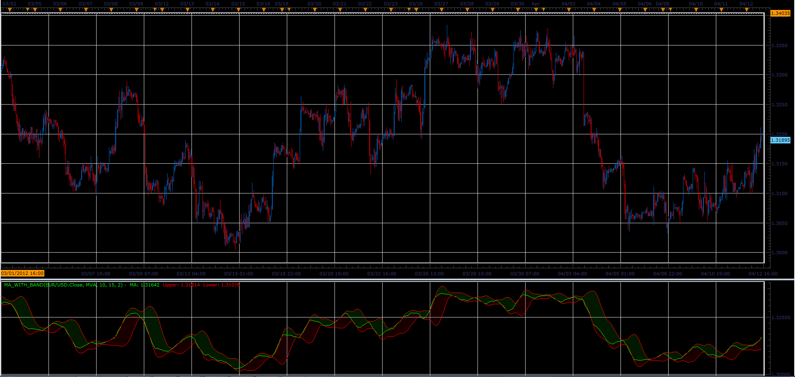

# MA with Band

> Source: https://fxcodebase.com/code/viewtopic.php?f=17&t=15874  
> Forum: 17 · Topic 15874 · 2 post(s)

---

## MA with Band

**Alexander.Gettinger** · Thu Apr 12, 2012 1:41 pm

The indicator draws the moving average and the Bollinger Bands calculated on MA.

 

Download:

 [MA_with_Band.lua](files/29808/MA_with_Band.lua)

For this indicator must be installed Averages indicator ([viewtopic.php?f=17&t=2430](https://fxcodebase.com/code/viewtopic.php?f=17&t=2430)).

The indicator was revised and updated

---

## Re: MA with Band

**Apprentice** · Mon Apr 03, 2017 5:59 am

Indicator was revised and updated.
