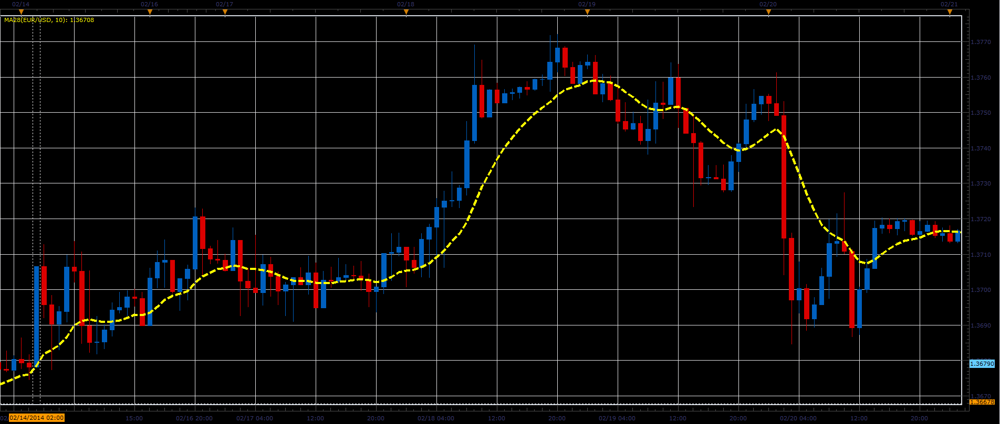

# MA28 indicator

> Source: https://fxcodebase.com/code/viewtopic.php?f=17&t=60368  
> Forum: 17 · Topic 60368 · 3 post(s)

---

## MA28 indicator

**Alexander.Gettinger** · Thu Feb 27, 2014 11:36 am

The indicator represents the average of 28 variants moving average.

Formulas:
MA28 = (Sum_MVA+Sum_EMA+Sum_SMMA+Sum_LWMA)/28, where
Sum_MVA = MVA(Open)+MVA(Close)+MVA(High)+MVA(Low)+MVA(Median)+MVA(Typical)+MVA(Weighted),
Sum_EMA = EMA(Open)+EMA(Close)+EMA(High)+EMA(Low)+EMA(Median)+EMA(Typical)+EMA(Weighted),
Sum_SMMA = SMMA(Open)+SMMA(Close)+SMMA(High)+SMMA(Low)+SMMA(Median)+SMMA(Typical)+SMMA(Weighted),
Sum_LWMA = LWMA(Open)+LWMA(Close)+LWMA(High)+LWMA(Low)+LWMA(Median)+LWMA(Typical)+LWMA(Weighted).

 

Download:

 [MA28.lua](files/92929/MA28.lua)

The indicator was revised and updated

---

## Re: MA28 indicator

**Alexander.Gettinger** · Thu Feb 27, 2014 11:38 am

MQL4 version of MA28 indicator: [viewtopic.php?f=38&t=60369](https://fxcodebase.com/code/viewtopic.php?f=38&t=60369).

---

## Re: MA28 indicator

**Apprentice** · Fri Jun 02, 2017 6:53 am

Indicator was revised and updated.
