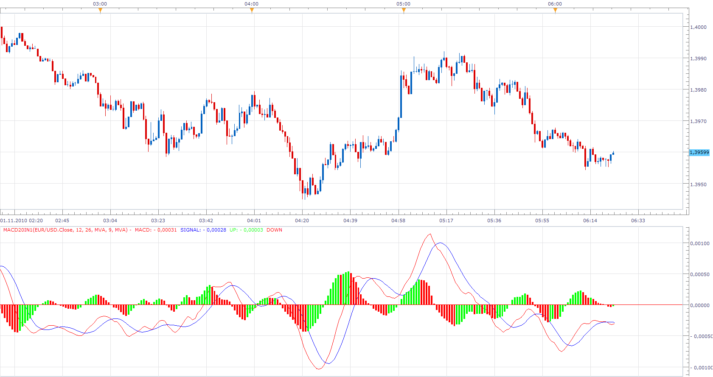

# MACD (20 in 1 MA)

> Source: https://fxcodebase.com/code/viewtopic.php?f=17&t=2564  
> Forum: 17 · Topic 2564 · 10 post(s)

---

## MACD (20 in 1 MA)

**Apprentice** · Mon Nov 01, 2010 5:32 am

If you use dafault settings, in all respects this is the standard MACD.
This version has the option of selecting the type of moving average.
Standard MACD, always use EMA fror MACD calculation,
and MVA for Signal Calculation.

 [MACD20IN1.lua](files/5712/MACD20IN1.lua)

To work, you must install AVEREGES Indikcator.
[viewtopic.php?f=17&t=2430](https://fxcodebase.com/code/viewtopic.php?f=17&t=2430)

The indicator was revised and updated

---

## Re: MACD (20 in 1 MA)

**smartfx** · Mon Nov 01, 2010 2:40 pm

Thank you for the prompt response! Wish you more profits!

---

## Re: MACD (20 in 1 MA)

**Alexander.Gettinger** · Mon Nov 01, 2010 9:57 pm

Link to strategy on this indicator: [viewtopic.php?f=31&t=2569](https://fxcodebase.com/code/viewtopic.php?f=31&t=2569)

---

## Re: MACD (20 in 1 MA)

**Apprentice** · Mon Dec 10, 2012 2:19 am

Updated.

---

## Re: MACD (20 in 1 MA)

**Apprentice** · Tue Mar 05, 2013 7:59 am

Shift parameters added to AVERAGES MACD.lua

---

## Re: MACD (20 in 1 MA)

**Coondawg71** · Sun Mar 31, 2013 7:31 pm

Can we please add support of VARMA to this indicator and to the corresponding Strategy. I find it extremely useful.

Thanks,

sjc

---

## Re: MACD (20 in 1 MA)

**Apprentice** · Mon Apr 01, 2013 7:17 am

Your request is added to the development list.

---

## Re: MACD (20 in 1 MA)

**Coondawg71** · Sat May 04, 2013 12:02 pm

Can we please ADD support of Volume Moving Average (VolMA) and Kauffmans Adaptive Moving Average (KAMA) to this indicator.

Thanks,

sjc

---

## Re: MACD (20 in 1 MA)

**Apprentice** · Sun May 05, 2013 6:07 am

Your request is added to the development list.

---

## Re: MACD (20 in 1 MA)

**Apprentice** · Tue May 23, 2017 10:14 am

Indicator was revised and updated.
