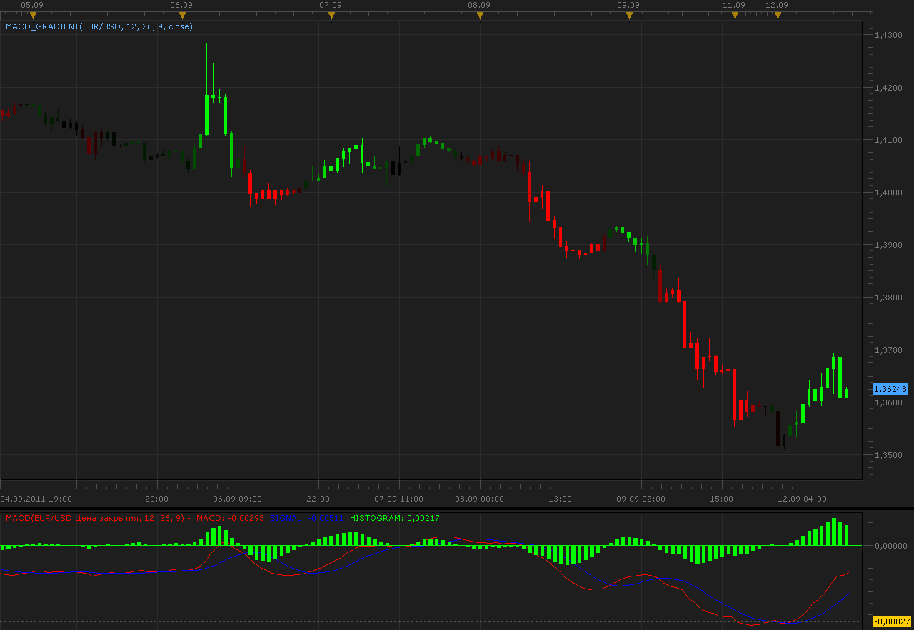

# MACD, CCI, RSI and RLW gradient candles

> Source: https://fxcodebase.com/code/viewtopic.php?f=17&t=6486  
> Forum: 17 · Topic 6486 · 9 post(s)

---

## MACD, CCI, RSI and RLW gradient candles

**Alexander.Gettinger** · Mon Sep 12, 2011 10:17 am

Indicators painted candles in accordance with the values ​​of the oscillators (MACD, CCI, RSI or RLW).

 

Download MACD gradient:

 [MACD_Gradient.lua](files/14824/MACD_Gradient.lua)

Download CCI gradient:

 [CCI_Gradient.lua](files/14824/CCI_Gradient.lua)

Download RSI gradient:

 [RSI_Gradient.lua](files/14824/RSI_Gradient.lua)

Download RLW gradient:

 [RLW_Gradient.lua](files/14824/RLW_Gradient.lua)

The indicator was revised and updated

---

## Re: MACD, CCI, RSI and RLW gradient candles

**jtatalov** · Thu Nov 17, 2011 7:13 am

yes can you please add a deviation parameter to the MACD gradient indicator?

---

## Re: MACD, CCI, RSI and RLW gradient candles

**Apprentice** · Thu Nov 17, 2011 6:05 pm

Can you elaborate your request further.

---

## Re: MACD, CCI, RSI and RLW gradient candles

**jtatalov** · Thu Nov 17, 2011 7:07 pm

sure, if you look at this strategy [http://fxcodebase.com/code/viewtopic.php?f=31&t=7604](https://fxcodebase.com/code/viewtopic.php?f=31&t=7604) there is a buy/sell level (or a zero line deviation parameter). My though is if you could incorporate this parameter into the gradient you could manually adjust the dark (or black) regions. this would also blacken out possible sideways movement.

---

## Re: MACD, CCI, RSI and RLW gradient candles

**Apprentice** · Sat Nov 19, 2011 3:50 am

Now we're on the same page.

---

## Re: MACD, CCI, RSI and RLW gradient candles

**Alexander.Gettinger** · Tue Dec 13, 2011 2:35 am

> **jtatalov wrote:**
> yes can you please add a deviation parameter to the MACD gradient indicator?

Please, see this indicator.

Download:

 [MACD_Gradient2.lua](files/20488/MACD_Gradient2.lua)

I hope I understand you correctly.

---

## Re: MACD, CCI, RSI and RLW gradient candles

**Alexander.Gettinger** · Tue Dec 13, 2011 3:47 am

Other gradient indicators:

 [CCI_Gradient2.lua](files/20496/CCI_Gradient2.lua)

 [RSI_Gradient2.lua](files/20496/RSI_Gradient2.lua)

 [RLW_Gradient2.lua](files/20496/RLW_Gradient2.lua)

---

## Re: MACD, CCI, RSI and RLW gradient candles

**JPNWV7** · Wed Dec 14, 2011 5:51 pm

How does these indicators work as far as to buy or sell?

I noticed that it makes the colors real bright or very dim?

Thanks

---

## Re: MACD, CCI, RSI and RLW gradient candles

**Apprentice** · Mon Mar 20, 2017 7:51 am

Indicator was revised and updated.
