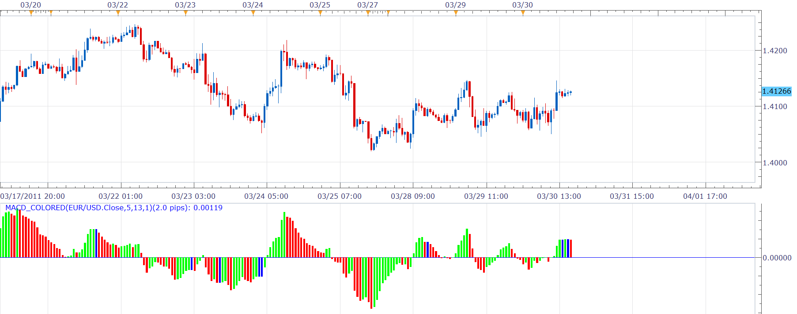
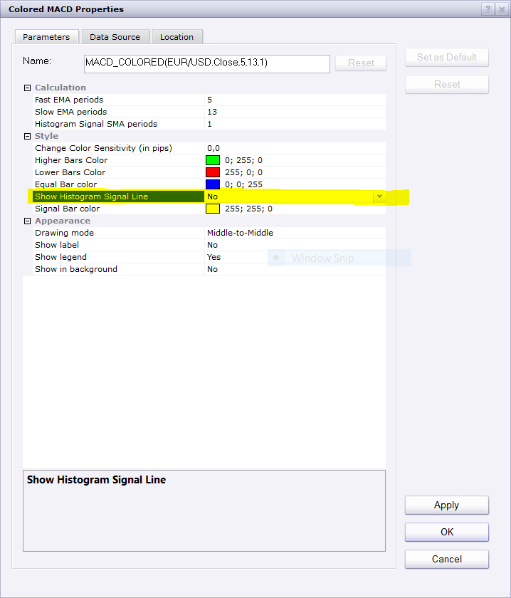

# MACD colored with change color prediction

> Source: https://fxcodebase.com/code/viewtopic.php?f=17&t=3789  
> Forum: 17 · Topic 3789 · 15 post(s)

---

## MACD colored with change color prediction

**Nikolay.Gekht** · Wed Mar 30, 2011 4:43 pm

The indicator is a port of MACD_Colored_v102.mq4 by Herb Spirit ([http://www.forexfactory.com/showthread.php?t=20349](http://www.forexfactory.com/showthread.php?t=20349))

This is the simple MACD where
histogram := FastEMA - SlowEMA
and
signal := SMA(histogram)

The higher/lower than previous bars are colored. The default parameters are optimized for 4-hour strategy.

The highlight of the indicator is that, being applied on the live chart, shows the distance in pips between the current price and the price at which the current histogram bar will be equal to the previous (i.e. will change it's color). the positive value means that the price must go upward and the negative value means that the price must go downward.

 

Download indicator:

 [MACD_colored.lua](files/9217/MACD_colored.lua)

Source code:

Code: [Select all](https://fxcodebase.com/code/)
`function Init()
    indicator:name("Colored MACD");
    indicator:description("Colored MACD with sensitivity and an ability to predict how much pips market shall move to change the color of the bar");
    indicator:requiredSource(core.Tick);
    indicator:type(core.Oscillator);

    indicator.parameters:addGroup("Calculation");
    indicator.parameters:addInteger("FEMA", "Fast EMA periods", "", 5);
    indicator.parameters:addInteger("SEMA", "Slow EMA periods", "", 13);
    indicator.parameters:addInteger("SMA", "Signal SMA periods", "", 1);

    indicator.parameters:addGroup("Style");
    indicator.parameters:addDouble("SENS", "Change Color Sensitivity (in pips)", "", 0);
    indicator.parameters:addColor("UP", "Higher Bars Color", "", core.rgb(0, 255, 0));
    indicator.parameters:addColor("DN", "Lower Bars Color", "", core.rgb(255, 0, 0));
    indicator.parameters:addColor("EQ", "Equal Bar color", "", core.rgb(0, 0, 255));
    indicator.parameters:addBoolean("ShowSignal", "Show Signal Line", "", false);
    indicator.parameters:addColor("SC", "Signal Bar color", "", core.rgb(255, 255, 0));
end

local source;               -- source
local first;                -- first histogram
local firsts;               -- first signal
local fema, sema, diff;     -- fast EMA and slow EMA buffers
local fa, sa;               -- fast alpha, slow alpha
local hist, signal;         -- histogram and signal buffers
local sens;                 -- sensitivity
local sma;                  -- signal MVA
local EQ, UP, DN;           -- colors for histogram
local alive;                -- is price alive?
local point;

function Prepare(onlyName)
    local name;

    name = profile:id() .. "(" .. instance.source:name() .. "," .. instance.parameters.FEMA .. "," .. instance.parameters.SEMA .. "," .. instance.parameters.SMA .. ")";
    instance:name(name);
    if onlyName then
        return ;
    end

    source = instance.source;
    alive = source:isAlive();
    point = source:pipSize();

    fa = 2 / (instance.parameters.FEMA + 1);
    sa = 2 / (instance.parameters.SEMA + 1);
    sma = instance.parameters.SMA;
    first = source:first();
    firsts = first + sma - 1;

    EQ = instance.parameters.EQ;
    UP = instance.parameters.UP;
    DN = instance.parameters.DN;
    sens = instance.parameters.SENS;

    fema = instance:addInternalStream(first, 0);
    sema = instance:addInternalStream(first, 0);

    hist = instance:addStream("H", core.Bar, name .. ".H", "H", EQ, first);
    if instance.parameters.ShowSignal then
        signal = instance:addStream("S", core.Line, name .. ".S", "S", instance.parameters.SC, firsts);
    else
        signal = nil;
    end
end

function Update(period, mode)
    if period < first then
        return ;
    end

    local price = source[period];

    -- calculate fast and slow EMA
    if period == first then
        fema[period] = price;
        sema[period] = price;
    else
        fema[period] = fa * price + (1 - fa) * fema[period - 1];
        sema[period] = sa * price + (1 - sa) * sema[period - 1];
    end

    -- calculate histogram
    hist[period] = fema[period] - sema[period];

    if period > first then
        -- colorize histogram
        if math.abs(hist[period] - hist[period - 1]) / point > sens then
            if hist[period] > hist[period - 1] then
                hist:setColor(period, UP);
            else
                hist:setColor(period, DN);
            end
        else
            hist:setColor(period, EQ);
        end
    end

    if signal ~= nil and period >= firsts then
        if period == firsts then
            if sma == 1 then
                signal[period] = hist[period];
            else
                signal[period] = mathex.avg(hist, period - sma + 1, period);
            end
        else
            signal[period] = signal[period - 1] - hist[period - sma] / sma + hist[period] / sma;
        end
    end

    if alive and period == source:size() - 1 and period > 1 then
        -- find how much pips must be skept to change the color of the bar
        local x = math.floor(((hist[period - 1] - ((1 - fa) * fema[period - 1] - (1 - sa) * sema[period - 1])) / (fa - sa)) / point * 10) / 10;
        if x >= 0.1 then
            core.host:execute("setStatus", string.format("%.1f pips", x - price / point));
        else
            core.host:execute("setStatus", "");
        end
    end
end`

---

## Re: MACD colored with change color prediction

**Nikolay.Gekht** · Wed Mar 30, 2011 4:59 pm

p.s. The indicator may be interesting for the developers. Please see this post about how properly port such indicators to Lua:
[viewtopic.php?f=28&t=3790](https://fxcodebase.com/code/viewtopic.php?f=28&t=3790)

---

## Re: MACD colored with change color prediction

**larkin1** · Mon Jan 23, 2012 8:27 pm

Is it possible to have this indicator corrected or have the MACD On Off Indicator incorporate the prediction functions. Thank You

---

## Re: MACD colored with change color prediction

**Apprentice** · Tue Jan 24, 2012 3:26 am

Try My ON / OFF MACD
[viewtopic.php?f=17&t=1050&p=3371&hilit=macd#p3371](https://fxcodebase.com/code/viewtopic.php?f=17&t=1050&p=3371&hilit=macd#p3371)

---

## Re: MACD colored with change color prediction

**larkin1** · Tue Jan 24, 2012 7:38 pm

I am currently using it but would like to see the blue bar predictor as in the other indicator but that one does not work.

---

## Re: MACD colored with change color prediction

**larkin1** · Thu Jan 26, 2012 7:58 pm

When I load the Macd On / Off parallel with the Macd color with change prediction indicator, the Macd color with change prediction indicator does not line up even after I confirm the settings are the same. Please assist. Thank You.

---

## Re: MACD colored with change color prediction

**Panther** · Wed May 22, 2013 7:44 am

Could you add three sets of line level options?
set 1 default .00015 and -.00015 color, width, style
set 2 default .0003 and -.0003 color,width, style
set 3 default .00045 and -.00045 color, width, style
Thanks

---

## Re: MACD colored with change color prediction

**Apprentice** · Fri May 24, 2013 3:43 am

Your request is added to the development list.

---

## Re: MACD colored with change color prediction

**elsigis** · Wed Jun 24, 2015 8:13 pm

Thanks a million for this indicator!
The traditional MACD on market scope does not allow for the value of 1for the signal line.
This version of MACD is used for the 4HR MACD strategy which has a very high success rate, better than most of the expensive strategies out there. I know because I've tried alot of them. Just google 4HR MACD strategy. It's very popular and you'll be glad you did.
(sorry, if this comment is not in the appropriate section).

---

## Re: MACD colored with change color prediction

**Pips34** · Fri Sep 30, 2016 9:23 am

Hello Developer,

I am wondering if you can also add the signal line to this indicator.

I currently have 2 separate MACD indcators:
(1) gives me the MACD movements as a colored histogram (Green/Purple) but no signal line
(2) the MACD indicator with histogram colored only grey if it moves to other side of signal line (Red/Blue/Green) but the histogram logic is NOT the same as (1)

So if you can add a signal line to this indicator, that will meet my need.

Please advise when you can deliver this

Many thanks

---

## Re: MACD colored with change color prediction

**Pips34** · Fri Sep 30, 2016 9:25 am

Hello Developer,

I am wondering if you can also add the signal line to this indicator.

I currently have 2 separate MACD indcators:
(1) gives me the MACD movements as a colored histogram (Green/Purple) but no signal line
(2) the MACD indicator with histogram colored only grey if it moves to other side of signal line (Red/Blue/Green) but the histogram logic is NOT the same as (1)

So if you can add a signal line to this indicator, that will meet my need.

Please advise when you can deliver this

Many thanks

---

## Re: MACD colored with change color prediction

**Apprentice** · Sun Oct 02, 2016 4:39 am

Signal line is already available.

---

## Re: MACD colored with change color prediction

**Pips34** · Sun Oct 02, 2016 7:22 pm

Hello Apprentice,

The parameters you have shown me are for the 2nd indicator which has the Signal line but the logic for the MACD coloring is based on when it crosses the signal line.

I am looking for a signal line parameter for the 1st indicator which does NOT have a signal line and the logic of the MACD coloring is based purely on the previous MACD histogram and not on anything else.

If you see the parameters for the 1st indicator (attached) there is no signal line to setup.

Can you add the signal line to the 1st indicator please

Thank you.

---

## Re: MACD colored with change color prediction

**Pips34** · Sun Oct 02, 2016 7:33 pm

My apologies, after i posted my reply to your post, I realized that this is a the 3rd indicator which you are referring to that already has the signal line. Sorry for the confusion, I got what I was looking for.

---

## Re: MACD colored with change color prediction

**Apprentice** · Sun Sep 02, 2018 5:35 am

The indicator was revised and updated.
