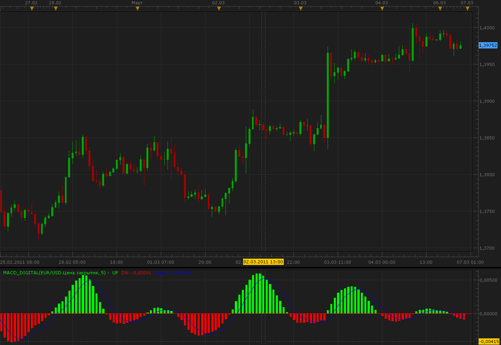

# MACD Digital

> Source: https://fxcodebase.com/code/viewtopic.php?f=17&t=3607  
> Forum: 17 · Topic 3607 · 2 post(s)

---

## MACD Digital

**Alexander.Gettinger** · Sun Mar 06, 2011 11:03 pm

This is a version MACD with digital filter.

 

Download:

 [MACD_Digital.lua](files/8671/MACD_Digital.lua)

For this indicator must be installed AVERAGES indicator ([viewtopic.php?f=17&t=2430&p=6686](https://fxcodebase.com/code/viewtopic.php?f=17&t=2430&p=6686)).

The indicator was revised and updated

---

## Re: MACD Digital

**Apprentice** · Fri Mar 03, 2017 8:48 am

Indicator was revised and updated.
