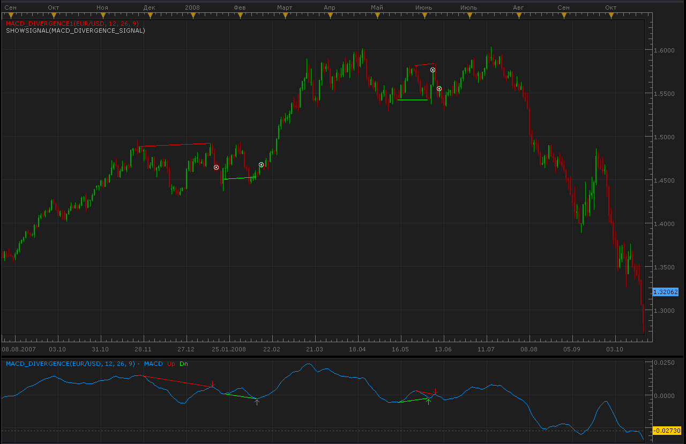

# MACD Divergence indicator and signal

> Source: https://fxcodebase.com/code/viewtopic.php?f=17&t=869  
> Forum: 17 · Topic 869 · 15 post(s)

---

## MACD Divergence indicator and signal

**Alexander.Gettinger** · Wed Apr 28, 2010 10:05 pm

1. MACD Divergence indicator. Shows MACD of close prices and MACD divergence lines.

 [MACD_Divergence.lua](files/1571/MACD_Divergence.lua)

2) MACD Divergence Indicator. Shows trend lines on the prices. The MACD_Divergence.lua must be also installed.

 [MACD_Divergence1.lua](files/1571/MACD_Divergence1.lua)

MT4 version.
[https://fxcodebase.com/code/viewtopic.p ... 04#p160404](https://fxcodebase.com/code/viewtopic.php?f=38&t=76281&p=160404#p160404)

MT4 version.
[https://fxcodebase.com/code/viewtopic.php?f=38&t=76315](https://fxcodebase.com/code/viewtopic.php?f=38&t=76315)

---

## Re: MACD Divergence indicator and signal

**Alexander.Gettinger** · Wed Apr 28, 2010 10:07 pm

3) MACD Divergence Signal. Signals when the divergence is detected (pay attention that signal happens two candles past the detected trend). The MACD_Divergence.lua must be also installed.

 [MACD_Divergence_Signal.lua](files/1572/MACD_Divergence_Signal.lua)

---

## Re: MACD Divergence indicator and signal

**craige** · Mon Dec 27, 2010 5:03 am

It's very handy and helpful.

thank you my friend

---

## Re: MACD Divergence indicator and signal

**pippelin** · Sat Feb 05, 2011 9:22 pm

> **Alexander.Gettinger wrote:**
>
>
> MACD_Divergence.png
>
>
>
> 1. MACD Divergence indicator. Shows MACD of close prices and MACD divergence lines.
>
>
> MACD_Divergence.lua
>
>
>
> 2) MACD Divergence Indicator. Shows trend lines on the prices. The MACD_Divergence.lua must be also installed.
>
>
> MACD_Divergence1.lua

hi
would you please tell me how can i set the macd divergence indicator to just detect divergences according to close price ?
i just cant change the data source to close and its always history
appreciated

---

## Re: MACD Divergence indicator and signal

**gezisLV** · Wed Jun 24, 2015 12:26 am

Can you turn MACD div Signal into strategy?

---

## Re: MACD Divergence indicator and signal

**Apprentice** · Wed Jun 24, 2015 5:36 am

Your request is added to the development list.

---

## Re: MACD Divergence indicator and signal

**Apprentice** · Tue Jul 04, 2017 9:19 am

The indicator was revised and updated.

---

## Re: MACD Divergence indicator and signal

**Alexander.Gettinger** · Wed Mar 13, 2019 8:41 pm

Please try this strategy:

 [MACD_Divergence_Strategy.lua](files/124395/MACD_Divergence_Strategy.lua)

---

## Re: MACD Divergence indicator and signal

**khanatd** · Sun Aug 24, 2025 2:02 am

Hi sir kindly mt4 version of it,

thanks
khan

---

## Re: MACD Divergence indicator and signal

**Apprentice** · Mon Aug 25, 2025 2:31 am

We have added your request to the development list.
Development reference 533

---

## Re: MACD Divergence indicator and signal

**Apprentice** · Fri Aug 29, 2025 4:28 am

MT4 version.
[https://fxcodebase.com/code/viewtopic.p ... 04#p160404](https://fxcodebase.com/code/viewtopic.php?f=38&t=76281&p=160404#p160404)

---

## Re: MACD Divergence indicator and signal

**khanatd** · Sat Sep 13, 2025 2:11 am

plz reminder sir mt4 version with arrows

---

## Re: MACD Divergence indicator and signal

**Apprentice** · Mon Sep 15, 2025 12:42 pm

We have added your request to the development list.
Development reference 587

---

## Re: MACD Divergence indicator and signal

**Apprentice** · Tue Sep 23, 2025 4:29 am

MT4 version.
[https://fxcodebase.com/code/viewtopic.php?f=38&t=76315](https://fxcodebase.com/code/viewtopic.php?f=38&t=76315)

---

## Re: MACD Divergence indicator and signal

**khanatd** · Mon Sep 29, 2025 12:26 am

thanks a lot sir, waiting
