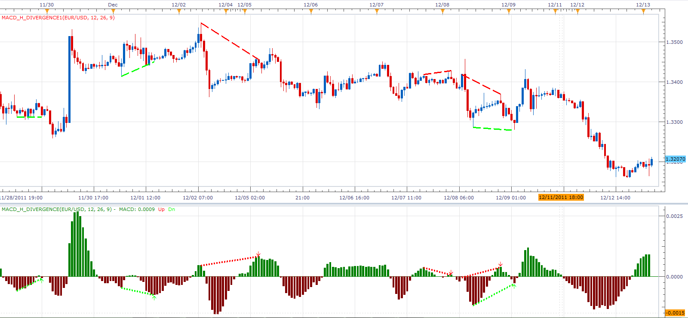

# MACD Histogram divergence

> Source: https://fxcodebase.com/code/viewtopic.php?f=17&t=9555  
> Forum: 17 · Topic 9555 · 7 post(s)

---

## MACD Histogram divergence

**Alexander.Gettinger** · Tue Dec 13, 2011 3:23 am

The indicator shows the divergence between price and MACD histogram.

 

Download divergence oscillator:

 [MACD_H_Divergence.lua](files/20492/MACD_H_Divergence.lua)

Download divergence indicator for main chart:

 [MACD_H_Divergence1.lua](files/20492/MACD_H_Divergence1.lua)

The indicator was revised and updated

---

## Re: MACD Histogram divergence

**Blackcat2** · Mon Dec 19, 2011 2:46 am

Is there a signal for this?

Cheers..
BC

---

## Re: MACD Histogram divergence

**Apprentice** · Mon Dec 19, 2011 4:50 am

No, as far as I know.

---

## Re: MACD Histogram divergence

**Alexander.Gettinger** · Mon Dec 19, 2011 9:58 pm

> **Blackcat2 wrote:**
> Is there a signal for this?
> BC

Please, see this strategy: [viewtopic.php?f=31&t=10156](https://fxcodebase.com/code/viewtopic.php?f=31&t=10156)

---

## Re: MACD Histogram divergence

**Apprentice** · Tue Mar 21, 2017 6:06 am

Indicator was revised and updated.

---

## Re: MACD Histogram divergence

**conjure** · Sat Jul 22, 2017 7:31 am

Is it possible to change the color of the central line in histogram to yellow without changing the bar colour?
How can i do it??
Thank you for the indicator.

---

## Re: MACD Histogram divergence

**Apprentice** · Mon Jul 24, 2017 8:22 am

Try it now.
