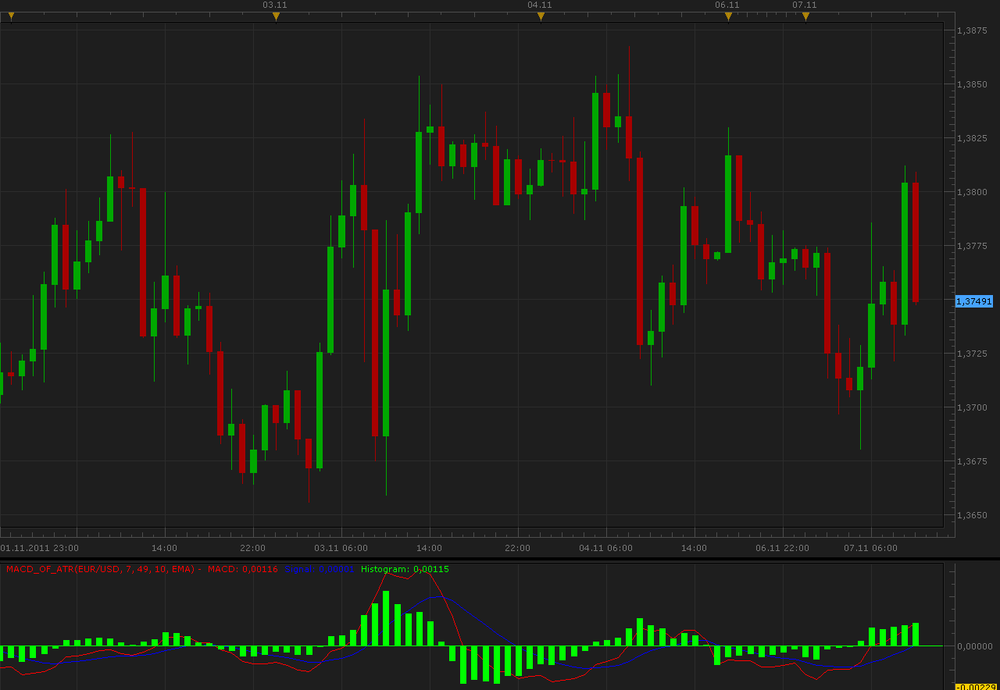

# MACD of ATR oscillator

> Source: https://fxcodebase.com/code/viewtopic.php?f=17&t=7885  
> Forum: 17 · Topic 7885 · 2 post(s)

---

## MACD of ATR oscillator

**Alexander.Gettinger** · Mon Nov 07, 2011 10:58 am

This indicator is the MACD which, instead of two MA uses 2 ATR.

Formulas:
MACD=ATR(Short period)-ATR(Long period),
Signal=MA(MACD),
Histogram=MACD-Signal.

 

Download:

 [MACD_Of_ATR.lua](files/17487/MACD_Of_ATR.lua)

For this indicator must be installed AVERAGES indicator ([viewtopic.php?f=17&t=2430](https://fxcodebase.com/code/viewtopic.php?f=17&t=2430)).

The indicator was revised and updated

---

## Re: MACD of ATR oscillator

**Apprentice** · Sun Mar 19, 2017 10:44 am

Indicator was revised and updated.
