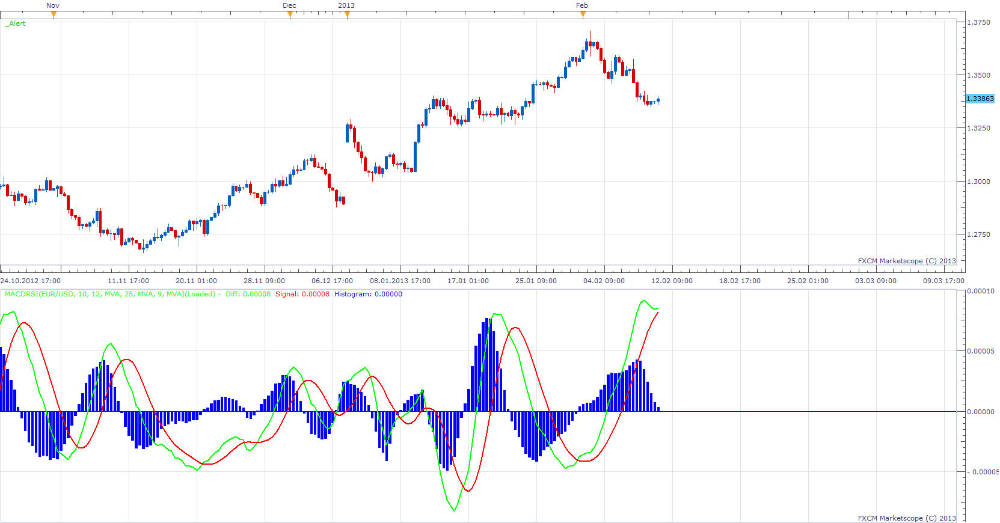

# MACD OF RELATIVE STRENGTH

> Source: https://fxcodebase.com/code/viewtopic.php?f=17&t=31949  
> Forum: 17 · Topic 31949 · 2 post(s)

---

## MACD OF RELATIVE STRENGTH

**Apprentice** · Mon Feb 11, 2013 6:59 am

As described in the October 1999 issue of S & C magazine.
We use Relative strength between two instruments for MACD calculation.

 [MACDRSI.lua](files/54450/MACDRSI.lua)

Note, if u have same index and chart instrument, you'll have a flat line.

---

## Re: MACD OF RELATIVE STRENGTH

**Apprentice** · Thu Apr 05, 2018 6:10 am

The Indicator was revised and updated.
