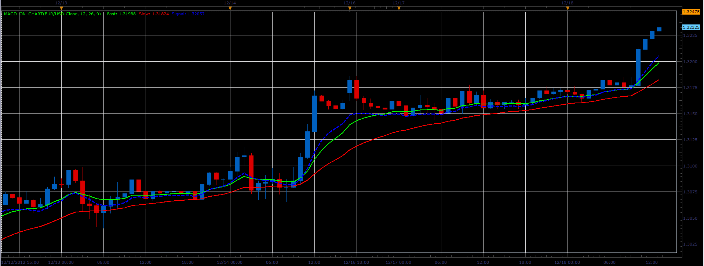

# MACD on chart

> Source: https://fxcodebase.com/code/viewtopic.php?f=17&t=27799  
> Forum: 17 · Topic 27799 · 2 post(s)

---

## MACD on chart

**Alexander.Gettinger** · Tue Dec 18, 2012 1:20 pm

Formulas:
Signal = Fast_EMA(Price)-MACD+Signal_MVA(MACD), where
MACD=Slow_EMA(Price)-Fast_EMA(Price).

 

Download:

 [MACD_On_Chart.lua](files/48714/MACD_On_Chart.lua)

---

## Re: MACD on chart

**Apprentice** · Wed Feb 21, 2018 6:45 am

The Indicator was revised and updated.
