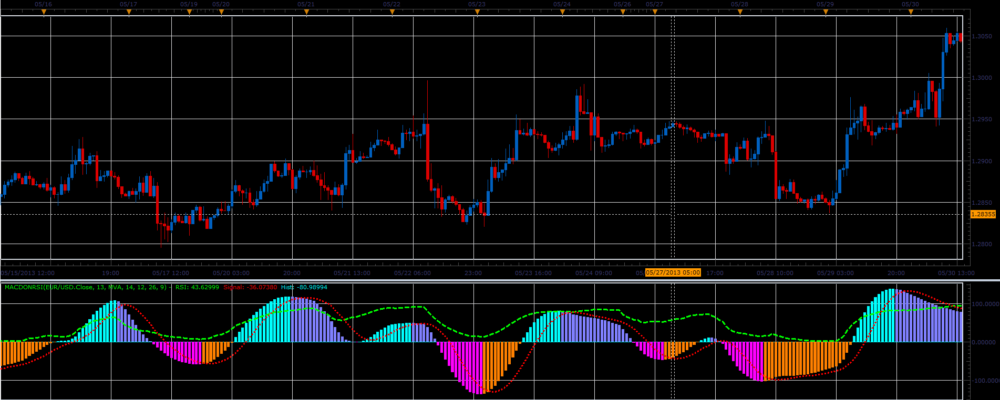

# MACD on RSI

> Source: https://fxcodebase.com/code/viewtopic.php?f=17&t=41286  
> Forum: 17 · Topic 41286 · 2 post(s)

---

## MACD on RSI

**Alexander.Gettinger** · Tue Jun 18, 2013 12:33 pm

This indicator is a ported MQL5 indicator from [http://www.mql5.com/en/code/1706](http://www.mql5.com/en/code/1706)

 

Download:

 [MACDonRSI.lua](files/67506/MACDonRSI.lua)

For this indicator must be installed Averages indicator ([viewtopic.php?f=17&t=2430](https://fxcodebase.com/code/viewtopic.php?f=17&t=2430)).

The indicator was revised and updated

---

## Re: MACD on RSI

**Apprentice** · Sat May 27, 2017 11:27 am

Indicator was revised and updated.
