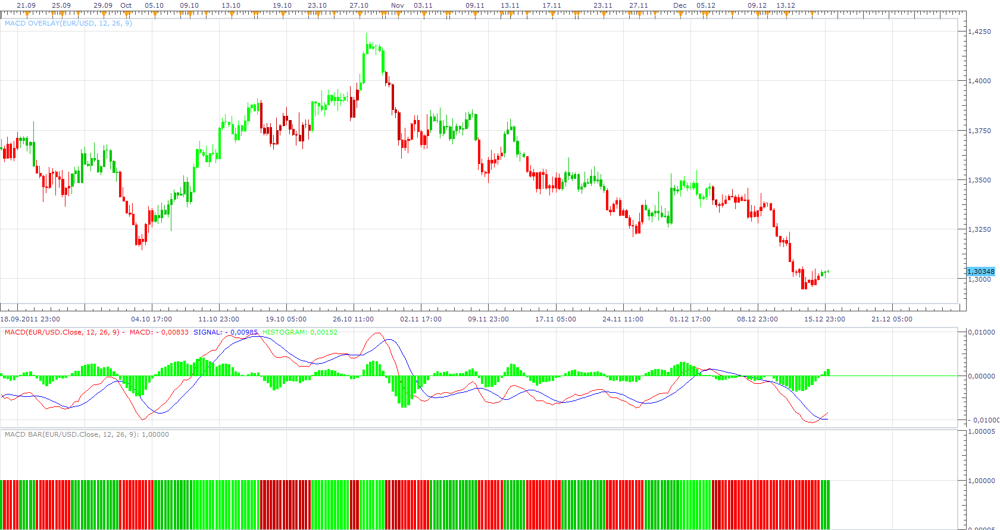

# MACD Overlay/Bar

> Source: https://fxcodebase.com/code/viewtopic.php?f=17&t=9806  
> Forum: 17 · Topic 9806 · 23 post(s)

---

## MACD Overlay/Bar

**Apprentice** · Fri Dec 16, 2011 5:41 am

 [MACD Overlay.lua](files/20854/MACD%20Overlay.lua)

 [MACD Bar.lua](files/20854/MACD%20Bar.lua)

 [MACD Overlay With Alert.lua](files/20854/MACD%20Overlay%20With%20Alert.lua)

Compatibility issue fixed.
_Alert Helper is not longer needed.

 

 [MTF MCP MACD Overlay Heat Map.lua](files/20854/MTF%20MCP%20MACD%20Overlay%20Heat%20Map.lua)

MT4/MQ4 version
[viewtopic.php?f=38&t=70351](https://fxcodebase.com/code/viewtopic.php?f=38&t=70351)

Indicator based strategy.
[viewtopic.php?f=31&t=70424](https://fxcodebase.com/code/viewtopic.php?f=31&t=70424)

---

## Re: MACD Overlay/Bar

**biggiesmalls** · Sat Dec 17, 2011 5:31 pm

Thanks for the indicator. Any way we could have it setup to where it can show us data on a higher time frame and place it on a lower time frames chart? I know currently I can post the indicator on a chart and APPLY it to a higher time frame in Marketscope, but the problem is for example, I'll use this on a 15 minute chart and apply the MACD bar indicator to a 1-hour chart; but while I'm looking at the 15-minute chart, the MACD bar indicator is showing one FAT bar for four candles of price.

Does my request make any sense?

---

## Re: MACD Overlay/Bar

**Apprentice** · Mon Dec 19, 2011 4:49 am

Probably yes. I will think about it. But in my opinion, this solution is also appropriate.
The truth we needs to learn to read it.

---

## Re: MACD Overlay/Bar

**trader-muc** · Mon Nov 05, 2012 4:54 pm

is it possible to get the following price overlay indicator ?

green candles : MACD over zero line
red candles: MACD below zero line

Thank you so much !

---

## Re: MACD Overlay/Bar

**Apprentice** · Tue Nov 06, 2012 7:22 am

Your request is added to the development list.

---

## Re: MACD Overlay/Bar

**Alexander.Gettinger** · Tue Nov 06, 2012 1:08 pm

> **trader-muc wrote:**
> is it possible to get the following price overlay indicator ?
>
> green candles : MACD over zero line
> red candles: MACD below zero line
>
> Thank you so much !

Download:

 [MACD Overlay2.lua](files/43832/MACD%20Overlay2.lua)

---

## Re: MACD Overlay/Bar

**Jeffreyvnlk** · Tue Jul 09, 2013 5:36 pm

> **Alexander.Gettinger wrote:**
>
>
> > **trader-muc wrote:**
> > is it possible to get the following price overlay indicator ?
> >
> > green candles : MACD over zero line
> > red candles: MACD below zero line
> >
> > Thank you so much !
>
>
>
> Download:
>
>
> MACD Overlay2.lua

Thank you for this great indicator
Could you elaborate further by adding 1 more condition : MACD also must stay above the signal line, otherwise the price bars not painted as green any more and back to the default color on Market Scope
Vice versa, the price bars painted as red only 2 conditions met: MACD below zero line and MACD below the signal line as well
Thank you

---

## Re: MACD Overlay/Bar

**Apprentice** · Wed Jul 10, 2013 7:20 am

Your request is added to the development list.

---

## Re: MACD Overlay/Bar

**Apprentice** · Wed Sep 11, 2013 4:27 am

Additional algorithms / filters added.

---

## Re: MACD Overlay/Bar

**udaysharma** · Fri Nov 15, 2013 12:19 am

Hello There
Can you please add RED (as sell signal) & GREEN (as buy signal) ARROW with ALERT,to this.
I shall be very thankfull to you.

Regards
Uday Sharma

---

## Re: MACD Overlay/Bar

**Apprentice** · Fri Nov 15, 2013 10:58 am

MACD Overlay With Alert Added.

---

## Re: MACD Overlay/Bar

**udaysharma** · Fri Nov 22, 2013 6:46 am

hello
Thanks for your kind help.

Uday Sharma

---

## Re: MACD Overlay/Bar

**Apprentice** · Sun Feb 09, 2014 1:36 pm

MTF MCP MACD Overlay Heat Map Added.

---

## Re: MACD Overlay/Bar

**amazon1a** · Sun Feb 09, 2014 4:36 pm

Hi Apprentice,

Thanks for the MACD Heat Map. It is exactly what I had hoped for.

AG

---

## Re: MACD Overlay/Bar

**Apprentice** · Sun Dec 06, 2015 4:50 am

Compatibility issue fixed.
_Alert Helper is not longer needed.

---

## Re: MACD Overlay/Bar

**Apprentice** · Sun Feb 04, 2018 7:31 am

The Indicator was revised and updated.

---

## Re: MACD Overlay/Bar

**Gilles** · Fri Aug 28, 2020 6:14 am

Hi, Apprentice !

Please, a MACD overlay version for MT4 :) !

Thank you very much !
See you soon :)

---

## Re: MACD Overlay/Bar

**Apprentice** · Sat Aug 29, 2020 10:44 am

Your request is added to the development list.
Development reference 1942.

---

## Re: MACD Overlay/Bar

**Apprentice** · Mon Aug 31, 2020 9:00 am

MT4/MQ4 version
[viewtopic.php?f=38&t=70351](https://fxcodebase.com/code/viewtopic.php?f=38&t=70351)

---

## Re: MACD Overlay/Bar

**Apprentice** · Thu Sep 03, 2020 2:41 am

MACD_Overlay added.

---

## Re: MACD Overlay/Bar

**chai88888** · Wed Sep 09, 2020 8:27 pm

can you make strategy based on the overlay

buy green candle

sell red candle

thanks

---

## Re: MACD Overlay/Bar

**Apprentice** · Thu Sep 10, 2020 1:24 am

Your request is added to the development list.
Development reference 2003.

---

## Re: MACD Overlay/Bar

**Apprentice** · Fri Sep 11, 2020 3:46 am

Indicator based strategy.
[viewtopic.php?f=31&t=70424](https://fxcodebase.com/code/viewtopic.php?f=31&t=70424)
