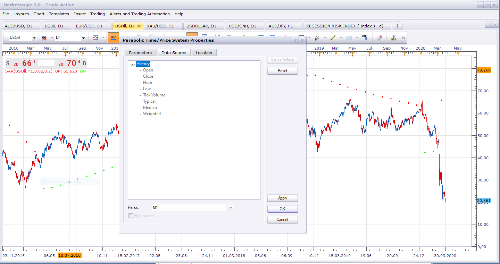
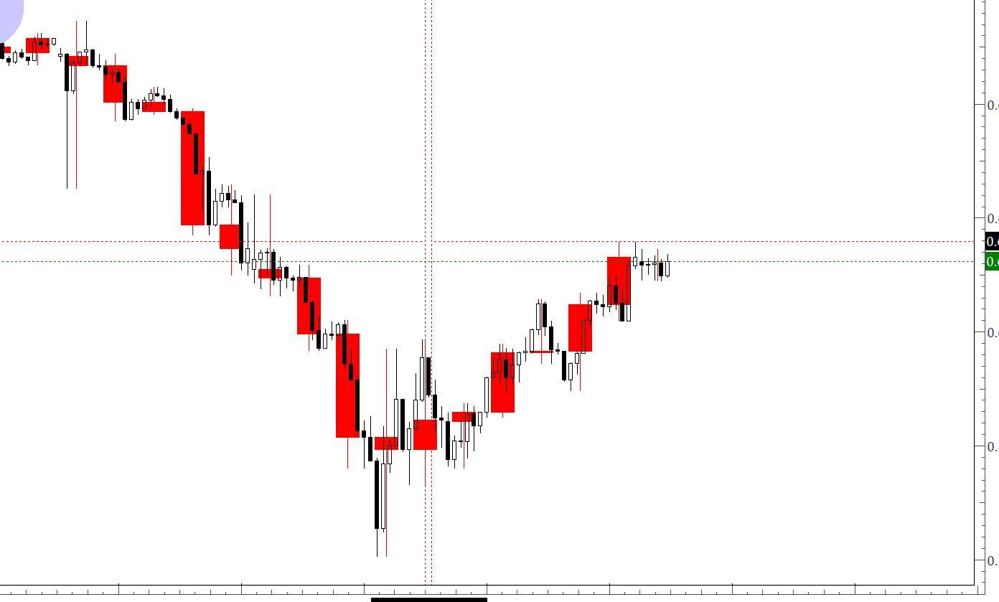

# MACD RSI Stochastic Overlay

> Source: https://fxcodebase.com/code/viewtopic.php?f=17&t=25319  
> Forum: 17 · Topic 25319 · 29 post(s)

---

## MACD RSI Stochastic Overlay

**Apprentice** · Fri Nov 02, 2012 8:38 am

u can choose one of the three filters.
If all selected filters agree,
we will have an indication.

1.MACD Filter
MACD/SIGNAL Line

2.Stochastic Filter
K/D Line

3. RSI Filter
RSI / 50 Line

4. CCI Filter
CCI / Zero Line

5. Smoothed ADX Filter
Up
ADX > Level
DIP > Level
DIP > DIM
Down
ADX > Level
DIM > Level
DIM > DIP

6. SAR Filter
Up / Down SAR Signal

 [MACD RSI Stochastic Dots.lua](files/43529/MACD%20RSI%20Stochastic%20Dots.lua)

 [MACD RSI Stochastic Overlay.lua](files/43529/MACD%20RSI%20Stochastic%20Overlay.lua)

 

 [MACD RSI Stochastic Signal Indicator.lua](files/43529/MACD%20RSI%20Stochastic%20Signal%20Indicator.lua)

Smoothed_ADX.lua is available here.
[viewtopic.php?f=17&t=7635](https://fxcodebase.com/code/viewtopic.php?f=17&t=7635)

MT4/MQ4 version
[viewtopic.php?f=38&t=68705](https://fxcodebase.com/code/viewtopic.php?f=38&t=68705)

---

## Re: MACD RSI Stochastic Overlay

**Apprentice** · Fri Nov 02, 2012 9:09 am

UP arrow
 STOCH > 50
RSI > 70
MACD > 0.0001
CCI > 100

DOWN arrow
 STOCH < 50
RSI < 30
MACD < -0.0001.
CCI < -100

 [Custom MACD RSI Stochastic Signal Indicator.lua](files/43535/Custom%20MACD%20RSI%20Stochastic%20Signal%20Indicator.lua)

 [Custom MACD RSI Stochastic Overlay.lua](files/43535/Custom%20MACD%20RSI%20Stochastic%20Overlay.lua)

---

## Re: MACD RSI Stochastic Overlay

**irvin_verma** · Fri Nov 02, 2012 12:11 pm

Hi Apprentice,
Thanks a lot for this great help.

I just wanted if it was possible to draw arrows only at crossovers, UP arrow for crossing from low to up and DOWN arrow , for crossing from upside to below the levels.

This will help in restricting the trade and saving from OVERTRADING.

Thanks a lot,
Irvin

---

## Re: MACD RSI Stochastic Overlay

**Apprentice** · Fri Nov 02, 2012 1:09 pm

crossovers of which Indicator, single one or ALL of them,
 here we have three of them.

---

## Re: MACD RSI Stochastic Overlay

**irvin_verma** · Fri Nov 02, 2012 9:49 pm

Hi,
Arrows when all the three collectively make crossovers. I think the RSI Level could be set to above 50 for UP and below 50 for DOWN.
It is a great help, I really am thankful.
Thanks a lot.
Irvin

---

## Re: MACD RSI Stochastic Overlay

**Apprentice** · Sat Nov 03, 2012 3:58 am

To have Arrows, only, if all filters make crossovers in same period?
This can be done.
However, such events are extremely rare.

---

## Re: MACD RSI Stochastic Overlay

**irvin_verma** · Sat Nov 03, 2012 9:15 am

Within a specified period like 5 seconds or customisable?
Such rarity is what i am looking for, to cut the number of false signals.

Also I just wanted a little change in the settings, the RSI value be set above or below 50 instead of present two values, and the MACD cross above signal line for up and cross below signal line instead of 0.0001 values.

I am very thankful if some strategy to back test results is also made into a separate indicator.

Thanks
Irvin

---

## Re: MACD RSI Stochastic Overlay

**Apprentice** · Sun Nov 04, 2012 7:50 am

Your request is added to the development list.

---

## Re: MACD RSI Stochastic Overlay

**7510109079** · Thu Feb 05, 2015 11:30 am

Apprentice,
was there ever any strategy done for the Custom indicator? (One which would take note of which of the 3 'Selector' options were 'yes' and enter accordingly on the next bar) as this indicator works well even on its own.

If not could you create one please?

---

## Re: MACD RSI Stochastic Overlay

**Apprentice** · Sun Feb 08, 2015 2:21 am

Custom MACD RSI Stochastic Overay Added.

---

## Re: MACD RSI Stochastic Overlay

**Apprentice** · Sun Feb 08, 2015 3:00 am

Requested strategy can be found here.
[viewtopic.php?f=31&t=61792](https://fxcodebase.com/code/viewtopic.php?f=31&t=61792)

---

## Re: MACD RSI Stochastic Overlay

**7510109079** · Wed Feb 18, 2015 10:13 am

Hi again Apprentice,

would you be able to add two more filters to this indicator; namely the CCI and OBOS indicators, so that via the 'selector' we could choose to use any combo, or indeed, all of the 5 filters.

Both the CCI & OBOS would have similar user settings as the RSI i.e.
- Data Source
- Period
- Buy Level
- Sell Level

Some way to set the symbol size would be an added extra but not urgent.

These additions will make this an awesome custom indicator

much thx in advance

---

## Re: MACD RSI Stochastic Overlay

**Apprentice** · Fri Mar 20, 2015 7:11 am

CCI Filter added.

---

## Re: MACD RSI Stochastic Overlay

**7510109079** · Fri Mar 20, 2015 12:32 pm

many thanks Mario. Works well

---

## Re: MACD RSI Stochastic Overlay

**Apprentice** · Thu Jul 13, 2017 3:58 am

The indicator was revised and updated.

---

## Re: MACD RSI Stochastic Overlay

**jrichardson83** · Wed Mar 07, 2018 1:49 pm

> **Apprentice wrote:**
> The indicator was revised and updated.

Can we add the Smoothed ADX and PSAR as additional parameters and make them selectable or unselectable like the other parameters? For PSAR pretty simple, overlay based on direction of signal but the step value and acceleration should be alterable.

 For the Smoothed ADX:

ADX> n-value (20 or 25)
DI+>DI- and above 25
DI->DI+ and above 25

---

## Re: MACD RSI Stochastic Overlay

**Apprentice** · Fri Mar 09, 2018 6:36 am

Your request is added to the development list under Id Number 4068

---

## Re: MACD RSI Stochastic Overlay

**Apprentice** · Sat Mar 17, 2018 11:16 am

Smoothed ADX and SAR filters added.

---

## Re: MACD RSI Stochastic Overlay

**jrichardson83** · Mon Jul 22, 2019 5:25 pm

Can we get an MT4 version of this?

---

## Re: MACD RSI Stochastic Overlay

**Apprentice** · Tue Jul 23, 2019 8:30 am

Your request is added to the development list under Id Number 4799

---

## Re: MACD RSI Stochastic Overlay

**Apprentice** · Wed Jul 24, 2019 4:39 am

MT4/MQ4 version
[viewtopic.php?f=38&t=68705](https://fxcodebase.com/code/viewtopic.php?f=38&t=68705)

---

## Re: MACD RSI Stochastic Overlay

**jrichardson83** · Fri Mar 27, 2020 4:39 pm

> **Apprentice wrote:**
>
>
> MACD RSI Stochastic Overlay.png
>
>
> u can choose one of the three filters.
> If all selected filters agree,
> we will have an indication.
>
> 1.MACD Filter
> MACD/SIGNAL Line
>
> 2.Stochastic Filter
> K/D Line
>
> 3. RSI Filter
> RSI / 50 Line
>
> 4. CCI Filter
> CCI / Zero Line
>
> 5. Smoothed ADX Filter
> Up
> ADX > Level
> DIP > Level
> DIP > DIM
> Down
> ADX > Level
> DIM > Level
> DIM > DIP
>
> 6. SAR Filter
> Up / Down SAR Signal
>
>
>
> MACD RSI Stochastic Overlay.lua
>
>
>
>
>
> MACD RSI Stochastic Signal Indicator.png
>
>
>
>
>
> MACD RSI Stochastic Signal Indicator.lua
>
>
>
> Smoothed_ADX.lua is available here.
> [http://fxcodebase.com/code/viewtopic.php?f=17&t=7635](https://fxcodebase.com/code/viewtopic.php?f=17&t=7635)
>
> MT4/MQ4 version
> [http://fxcodebase.com/code/viewtopic.php?f=38&t=68705](https://fxcodebase.com/code/viewtopic.php?f=38&t=68705)

Would it be possible to add a parameter called "Show as SAR"?

Basically, the indicator would display the same as the standard SAR, as dots either above or below price, rather than as an overlay. What I have in mind is a means to display the indicator for a higher level chart on a lower level chart without having the huge overlay candles on the chart. For example, I can show the Daily SAR on a 4 hour chart without obstructing the chart.

---

## Re: MACD RSI Stochastic Overlay

**Apprentice** · Mon Mar 30, 2020 6:34 am

You can do this already by using the Data Source period option.

---

## Re: MACD RSI Stochastic Overlay

**jrichardson83** · Mon Mar 30, 2020 12:18 pm

> **Apprentice wrote:**
>
>
> The attachment **Capture.PNG** is no longer available
>
>
> You can do this already by using the Data Source period option.

Apprentice,

I was just using that as an example. What I'm wanting to do is print the indicator as a SAR. So instead of the indicator printing as an overlay on top of the candles, it'll print as dots above or below the candle, the way the SAR does.

For example, I want to run the CCI overlay for the Daily on a 4HR chart. When I do that, this is what it looks like...

 

So in order to workaround this, I was wanting to have you add the parameter to "Show As SAR" or "Show as Dots" or whatever language is appropriate, so that the indicator prints above and below the candles rather than overlayed on top.

---

## Re: MACD RSI Stochastic Overlay

**Apprentice** · Tue Mar 31, 2020 5:11 am

Something like Main Chart Oscillator Overlay Template?
[viewtopic.php?f=28&t=61403&start=20](https://fxcodebase.com/code/viewtopic.php?f=28&t=61403&start=20)

---

## Re: MACD RSI Stochastic Overlay

**jrichardson83** · Tue Mar 31, 2020 10:09 am

> **Apprentice wrote:**
> Something like Main Chart Oscillator Overlay Template?
> [viewtopic.php?f=28&t=61403&start=20](https://fxcodebase.com/code/viewtopic.php?f=28&t=61403&start=20)

Not quite. All I'm wanting is to show the indicator as "Dots" above or below the candles, like SAR. I've hand drawn these in the picture below.

 

The OVERLAY is set on DAILY on the 4HR chart, so as you can see its printing on top of several candles. To avoid this, I want to set the overlay to dots above or below the candles so that it doesn't obscure the chart.

---

## Re: MACD RSI Stochastic Overlay

**Apprentice** · Wed Apr 01, 2020 6:03 am

Your request is added to the development list.
Development reference 980.

---

## Re: MACD RSI Stochastic Overlay

**Apprentice** · Thu Apr 02, 2020 6:39 am

[viewtopic.php?f=17&t=25319&p=43529#p43529](https://fxcodebase.com/code/viewtopic.php?f=17&t=25319&p=43529#p43529)

MACD RSI Stochastic Dots added.

---

## Re: MACD RSI Stochastic Overlay

**Apprentice** · Thu Dec 30, 2021 6:09 am

BB added.

 [MACD RSI Stochastic Overlay.lua](files/144572/MACD%20RSI%20Stochastic%20Overlay.lua)
