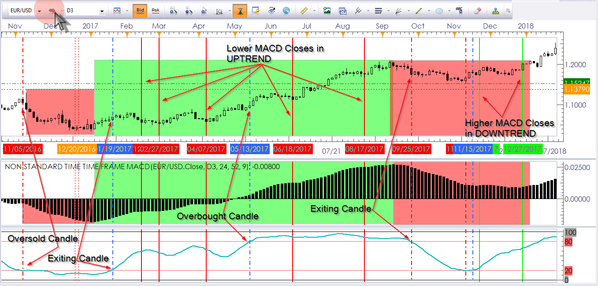
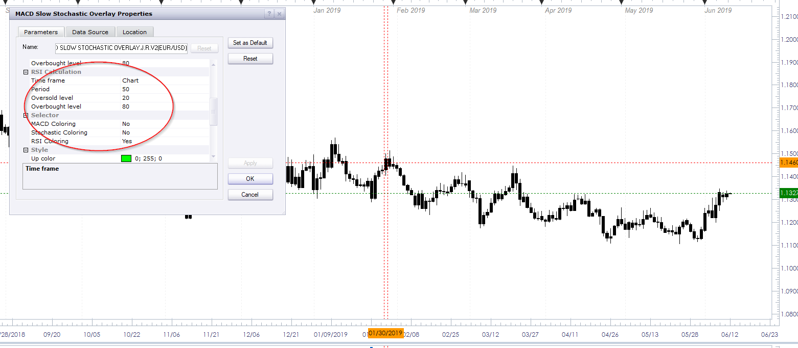

# MACD Slow Stochastic Overlay

> Source: https://fxcodebase.com/code/viewtopic.php?f=17&t=66700  
> Forum: 17 · Topic 66700 · 16 post(s)

---

## MACD Slow Stochastic Overlay

**Apprentice** · Sat Oct 06, 2018 11:38 am

Up Trend
K-line has upslope
MACD Histogram line has upslope
Down Trend
K-line has downslope
MACD Histogram line has downslope
else
Neutral Trend

 [MACD Slow Stochastic Overlay.lua](files/121354/MACD%20Slow%20Stochastic%20Overlay.lua)

MT4/MQ4 version
[viewtopic.php?f=38&t=66828](https://fxcodebase.com/code/viewtopic.php?f=38&t=66828)

---

## Re: MACD Slow Stochastic Overlay

**jrichardson83** · Sun Oct 07, 2018 7:59 pm

Apprentice,

I realized the explanation for the overlay rules was probably not very clear. So, its probably simpler to say it this way. The main body of the overlay is based off of the MACD Histogram (not the Histogram line) closing in relationship to the prior close. The Slope of the K-Line can be completely disregarded altogether.

For the SSD I'm only interested **in the candle**that initially enters into Overbought/Oversold territory and the candle that exits (Like bookends) So,

If MACD Histogram Current close < Prior Close = DOWNTREND
If MACD Histogram Current close > Prior Close = UPTREND

The SSD will only be used to indicate which price candle has ENTERED INTO and CLOSED in either Overbought or Oversold territory and then which candle has EXITED OUT OF and CLOSED below or above the Overbought or Oversold lines respectively. The color change will ONLY apply to that candle. It can be labeled OB/OS candle and will be given a color.

So, **there really isn't a true neutral trend overlay**. The main overlay is based solely on the close of the MACD Histogram bars (Not Slope of the Line) in relationship to the previous close. And there will only be two signals for the SSD, when it has entered and exited OB/OS territory.

In the image the red and blue dashed line show which candle has closed either in or exited out of the OB/OS territory.

The Shaded Red box shows the general downtrend based on the MACD Histogram.
The Shaded Green box shows the general uptrend based on the MACD Histogram.

The solid red and green lines show the candles within the trends where the MACD Histogram closed higher than the previous low in a downtrend or lower than the previous high in an uptrend. For example there are about 83 bars in that green uptrend and only 5 of those closing bars had lower closes than the one prior to it.

 

---

## Re: MACD Slow Stochastic Overlay

**Apprentice** · Mon Oct 08, 2018 5:42 am

Your request is added to the development list under Id Number 4266

---

## Re: MACD Slow Stochastic Overlay

**DanPhi74** · Wed Oct 10, 2018 4:59 am

Great Job !!
could you code it for MT4 please ?
Best regards

---

## Re: MACD Slow Stochastic Overlay

**Apprentice** · Wed Oct 10, 2018 12:56 pm

Your request is added to the development list under Id Number 4269

---

## Re: MACD Slow Stochastic Overlay

**Apprentice** · Sun Oct 14, 2018 3:32 am

For jrichardson83

 [MACD Slow Stochastic Overlay.J.R..lua](files/121577/MACD%20Slow%20Stochastic%20Overlay.J.R..lua)

---

## Re: MACD Slow Stochastic Overlay

**Apprentice** · Mon Oct 15, 2018 5:06 am

MT4/MQ4 version
[viewtopic.php?f=38&t=66828](https://fxcodebase.com/code/viewtopic.php?f=38&t=66828)

---

## Re: MACD Slow Stochastic Overlay

**DanPhi74** · Tue Oct 16, 2018 5:30 pm

Many Thanks Guys !

---

## Re: MACD Slow Stochastic Overlay

**jrichardson83** · Fri Jun 07, 2019 2:07 pm

> **Apprentice wrote:**
> For jrichardson83
>
>
> MACD Slow Stochastic Overlay.J.R..lua

I wanted to request two additional parameters to this indie. Can you add 1) an RSI component and 2) the choice to just show the overbought/oversold entry and exit candles?

RSI Calculation
Time frame
Number of Periods
Overbought level
Oversold level

and

Show OB/OS Only

---

## Re: MACD Slow Stochastic Overlay

**Apprentice** · Sat Jun 08, 2019 2:49 am

Your request is added to the development list under Id Number 4704

---

## Re: MACD Slow Stochastic Overlay

**Apprentice** · Mon Jun 10, 2019 3:38 am

Try this version.

 [MACD Slow Stochastic Overlay.J.R.v2.lua](files/126810/MACD%20Slow%20Stochastic%20Overlay.J.R.v2.lua)

---

## Re: MACD Slow Stochastic Overlay

**jrichardson83** · Tue Jun 11, 2019 7:49 pm

> **Apprentice wrote:**
> Try this version.
>
>
> The attachment **MACD Slow Stochastic Overlay.J.R.v2.lua** is no longer available

Hey guys. Something isn't quite right with the indie. The only thing painting according to the inputs is the MACD. The RSI and Stoch are only painting all bars in black and not showing the OB/OS candles.

 

I had previously requested for the option to just show the overbought and oversold candles, but I don't think that would be feasible. Instead, is there a way to indicate the overbought and oversold entry and exit candles with a "dot" above or below the candle?

---

## Re: MACD Slow Stochastic Overlay

**Apprentice** · Wed Jun 12, 2019 2:58 am

OS / OB cross candles have a red and green color.
Is different logic required?

---

## Re: MACD Slow Stochastic Overlay

**jrichardson83** · Thu Jun 13, 2019 12:39 am

> **Apprentice wrote:**
> OS / OB cross candles have a red and green color.
> Is different logic required?

The logic there is correct, I was wanting to ask for an option to show the candles with a some sort of character, such as a dot or arrow, or something like that.

The logic for the paint bar is not working correctly when I select RSI as the filter. It just paints all the candles in black.

---

## Re: MACD Slow Stochastic Overlay

**Apprentice** · Thu Jun 13, 2019 7:36 am

Your request is added to the development list under Id Number 4721

---

## Re: MACD Slow Stochastic Overlay

**Apprentice** · Fri Jun 14, 2019 8:50 am

Try this version.

 [MACD Slow Stochastic Overlay.J.R.v3.lua](files/126930/MACD%20Slow%20Stochastic%20Overlay.J.R.v3.lua)
