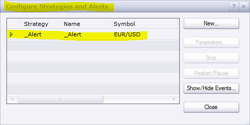

# MACD with Alert

> Source: https://fxcodebase.com/code/viewtopic.php?f=17&t=19034  
> Forum: 17 · Topic 19034 · 28 post(s)

---

## MACD with Alert

**Apprentice** · Wed May 23, 2012 3:41 pm

This indicator provides Audio / Email Alerts, for you the MACD indicator,
It is possible to define a total of six separate signals.
MACD Cross Over / Under for Central / Signal
and Histogram / Central Line Cross Over/Under

 [MACD with Alert.lua](files/33920/MACD%20with%20Alert.lua)

The indicator was revised and updated

---

## Re: MACD with Alert

**idomeneo** · Thu May 16, 2013 1:55 am

Hi Apprentice!

I downloaded these two programs but it doesn't work because the _Alerts.lua is an empty window: there is nothing to select - how do I "activate" this?

Thanks for your great job... and your answer to this question

Idomeneo

---

## Re: MACD with Alert

**Apprentice** · Fri May 17, 2013 4:57 am

_Alert Is Indicator helper.
U can activate it in the same way as a strategy.

---

## Re: MACD with Alert

**idomeneo** · Fri May 17, 2013 9:19 am

Thanks for this but there is still a problem: I don't see on the screen "new strategy and alert" the MACD with Alert.lua - although I downloaded it as you can see on the screen "import indicators"

Should I do something else to "activate" this MACD with Alert.lua?

Should I cancel another .lua which is redundent and doesn't allow MACD with Alert.lua to work?

Thanks again for your precious help!

Idomeneo

---

## Re: MACD with Alert

**Apprentice** · Tue May 21, 2013 5:25 am

Go to strategys and alerts window, and activate _Alert signal.

---

## Re: MACD with Alert

**idomeneo** · Tue May 21, 2013 7:17 am

I did this, as you can see hereunder
I am just surprised because _Alert screen doesn't allow any parameters - but maybe it doesn't need...
My problem is that I cannot "activate" MACD with Alert.lua

Thanks for your help!

---

## Re: MACD with Alert

**idomeneo** · Tue May 21, 2013 12:00 pm

I checked MarketScope2 after this weekend update and... IT WORKS!
Thanks and regards
Idomeneo

---

## Re: MACD with Alert

**compxtrader** · Wed Jun 05, 2013 12:05 am

I have installed both macd alert and alert, however when I run them i get an error when the alert is triggered.

What am I doing incorrect?

Thank you

---

## Re: MACD with Alert

**Apprentice** · Wed Jun 05, 2013 3:19 am

Testing your claim, for now, I was unable to reproduce.

---

## Re: MACD with Alert

**compxtrader** · Wed Jun 05, 2013 6:24 am

The macd alert is installed as an indicator on the chart, it is set to email alert. The _Alert is installed as an alert/trading strategy. it is set to alert on center line cross.

When the Macd indicator on chart sets alert that the signal line has crossed center line this error is created. I tried to add Macd Alert as a strategy, but it does not allow me to. Only allows me to insert it as indicator which reflects on the chart.

If i try to run the _Alert as stand alone alert/strategy it does nothing and the parameter dialogue box is empty and it does not allow me to type anything into it.

---

## Re: MACD with Alert

**Apprentice** · Thu Jun 06, 2013 2:31 am

Please try the updated version.

---

## Re: MACD with Alert

**Coondawg71** · Sun Sep 15, 2013 7:57 pm

Is it possible to have MACD with three streams? With Alert on crossing of each Stream?

For example:
Fast Stream: HPF
Slow Stream: Par MA
Signal Stream: EMA

thanks,

sjc

---

## Re: MACD with Alert

**Apprentice** · Mon Sep 16, 2013 2:56 am

MA selector added,
At this time will not add HPF.
This complicates things quite a lot.

---

## Re: MACD with Alert

**Coondawg71** · Tue Sep 17, 2013 6:45 am

Can you please advise/suggest to me which Filter may be used for indicator development.
Laguerre,Butterworth, etc, etc,

Thanks for all your efforts and service, great work!

sjc

---

## Re: MACD with Alert

**Apprentice** · Tue Sep 17, 2013 8:23 am

Any that has only one integer parameter, and use as Tick Data Source.
Obviously, other choices are also possible,
Unfortunately in this case, I have to adjust code in case by case case.

---

## Re: MACD with Alert

**dschur** · Tue Sep 17, 2013 12:43 pm

Nice can we add an option so it prints arrows on the price chart on crossovers ( down arrow for negative crossover , up for positive )
Thx

---

## Re: MACD with Alert

**dschur** · Wed Sep 18, 2013 12:02 am

the visuals on the indicator works, it plots the dots when the lines crossover but i cant get the audio alert to work. installed both files. any instructions?

---

## Re: MACD with Alert

**Apprentice** · Wed Sep 18, 2013 12:17 pm

Please activate _Alert.
_Alert Is Indicator helper.
U can activate it in the same way as a strategy.

---

## Re: MACD with Alert

**SuperTrader** · Mon Jan 13, 2014 1:05 pm

This **"_Alert"** indicator helper is great Apprentice, really useful for audio/email notifications (and I can see it's designed to work with many of your indicators).

One question: If we need to be notified about let's say 30 instruments, do we need to install it as a signal/strategy **only once ?** (i.e. set it up for EUR/USD **only**) and not 30 times (once for each instrument) and it will still give audio/email notifications on all its indicators **for all 30** instruments ? is that correct ?

---

## Re: MACD with Alert

**nweiss** · Fri Dec 12, 2014 7:37 am

Could you insert that the indicator gives a pop up when a crossover was ?

---

## Re: MACD with Alert

**nweiss** · Sun Dec 14, 2014 5:32 pm

could you also insert live and close of the candle =))

---

## Re: MACD with Alert

**Apprentice** · Mon Dec 15, 2014 5:18 am

"Live" / "End of Turn" options Added.

---

## Re: MACD with Alert

**nweiss** · Tue Dec 16, 2014 7:48 am

Thanks for your great work but I have an error Methode of AsyncOperationFinished is not define.

This error is only at some Pairs Eur/Usd ......

---

## Re: MACD with Alert

**Apprentice** · Tue Dec 16, 2014 12:51 pm

Try it Now.

---

## Re: MACD with Alert

**lucmat** · Fri Dec 19, 2014 4:46 am

Hello all and Apprentice,
is it possible to make a translation from MT4 of this indicator?
Thanks.

Lucmat

---

## Re: MACD with Alert

**Apprentice** · Fri Dec 19, 2014 4:58 am

Can u provide.
JJMASeries.mqh
JurXSeries.mqh
PriceSeries.mqh
And post this in an appropriate topic.

---

## Re: MACD with Alert

**Apprentice** · Wed Dec 02, 2015 6:24 am

Compatibility issue Fix.
_Alert helper is not longer needed.

---

## Re: MACD with Alert

**Apprentice** · Sat Aug 05, 2017 4:13 am

The indicator was revised and updated.
