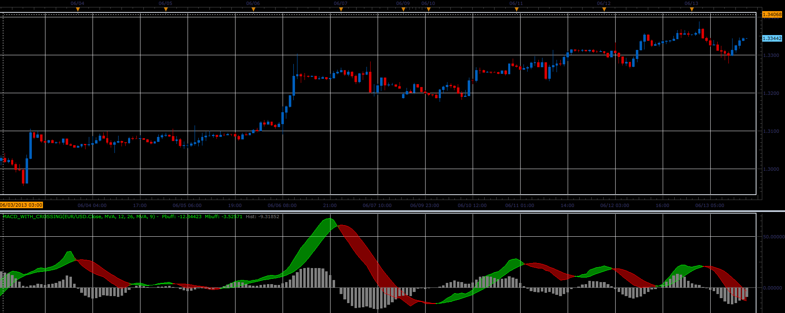
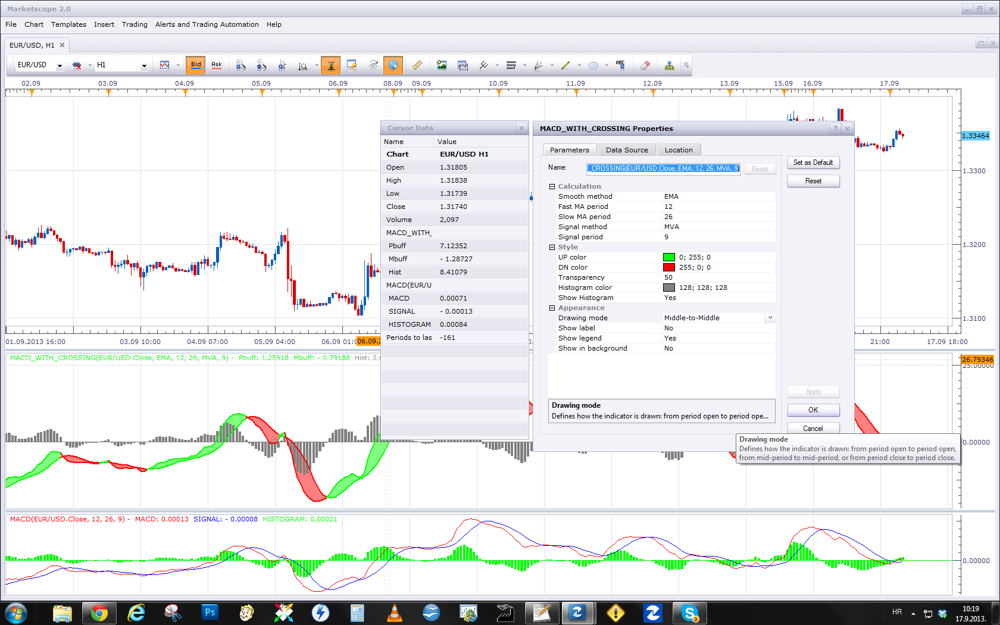

# MACD with crossing

> Source: https://fxcodebase.com/code/viewtopic.php?f=17&t=41284  
> Forum: 17 · Topic 41284 · 18 post(s)

---

## MACD with crossing

**Alexander.Gettinger** · Tue Jun 18, 2013 12:25 pm

This indicator is a ported MQL5 indicator from [http://www.mql5.com/en/code/1691](http://www.mql5.com/en/code/1691)

 

Download:

 [MACD_with_Crossing.lua](files/67504/MACD_with_Crossing.lua)

For this indicator must be installed Averages indicator ([viewtopic.php?f=17&t=2430](https://fxcodebase.com/code/viewtopic.php?f=17&t=2430)).

---

## Re: MACD with crossing

**toxxum** · Thu Sep 05, 2013 11:47 pm

Hi Alex,

Is there a chance to include an option that removes the histogram? It obscures the view quite a bit and it is redundant data anyway. I have tried to make the histogram the same colour as the chart background but then the zero line disappears too which I find is an important piece of information.

Thanks!

---

## Re: MACD with crossing

**Apprentice** · Fri Sep 06, 2013 3:55 am

Histogram on/off option added.

---

## Re: MACD with crossing

**udaysharma** · Mon Sep 16, 2013 7:14 am

Hi Apprentice
This is my first post on fxcodebase.com
I need some help on MACD_WITH_CROSSING
1) The cross over given by MACD_WITH_CROSSING are bit different with crossover given by
 default MACD indicator in marketscope (with 12,26,9 & EMA settings),This is because the
 values of **Mbuff are not matching with SIGNAL**.(Which is why I am getting wrong
 crossover,many times).
2) Second thing If you please add BUY & SELL Arrows with crossover ,than it will be a great help
 for me.

Thanks

---

## Re: MACD with crossing

**Apprentice** · Mon Sep 16, 2013 8:10 am

Standard use MACD and EMA on First, MVA on second.
Furthermore MACD_with_crossing expresses values ​​in Pips, not in apsulutna value.
The numbers are the same, I checked.

As for Arrows, this is adequate substitute?
[viewtopic.php?f=17&t=19034](https://fxcodebase.com/code/viewtopic.php?f=17&t=19034)

---

## Re: MACD with crossing

**udaysharma** · Mon Sep 16, 2013 12:24 pm

Hi Apprentice
Thanks for your reply,my concerns are
1)I am using EMA in both i.e. in "MACD_WITH_CROSSING" & in marketscope's "MACD" indicator,means I am using same parameters in both indicators,still the values of "Mbuff" and "Signal" are varying.I am sending herewith as an attachment to explain.In the image because of different values in "Mbuff" and "Signal" the crossover (-ve histogram) are on different candles.
Value of "Pbuff" and "MACD" are same but values of "Mbuff" and "Signal" are varying.
2)"MACD with ALERT" is not what I want,I want that MACD/Signal to be shown on the price chart as upward and downward arrows.

Thanks

---

## Re: MACD with crossing

**Apprentice** · Tue Sep 17, 2013 3:23 am

Try with this parameter.
Once again, the standard MACD uses the MVA (SMA) for the signal.
The difference, in my example is due to rounding, and conversion to pips .

---

## Re: MACD with crossing

**udaysharma** · Tue Sep 17, 2013 9:11 am

Hi Apprentice
Thank You Very much for your help
Now please help me in getting MACD with BUY & SELL Arrow in price chart.
1)MACD/signal crossover + current price close above a particular ema +BUY signal (up GREEN arrow)
2)MACD/signal crossover + current price close below a particular ema +SELL signal (up RED arrow).
Means MACD should alert BUY when close price is above (say 14 ema) and MACD should alert SELL when close price is below (say 14 ema).

Thanks

---

## Re: MACD with crossing

**udaysharma** · Wed Sep 18, 2013 8:34 am

Hi Apprentice
Please let me know if it is possible what I am looking for in a signal/alert.
Still Waiting for your reply

---

## Re: MACD with crossing

**Apprentice** · Wed Sep 18, 2013 12:14 pm

Your request is added to the development list.

---

## Re: MACD with crossing

**udaysharma** · Thu Sep 26, 2013 8:04 am

Hi Apprentice
Still waiting for the signal/alert.
Please let me know,When I can expect a reply from development team ?

Thanks

---

## Re: MACD with crossing

**udaysharma** · Mon Oct 21, 2013 10:33 am

Hi Apprentice
Please let me know -What does it mean ?----- Your Request has been added to development Team.
I am waiting for the signal/alert since last 1 month but no update from your side !
Can You Please let me know that whether you people are going to update it or not able to generate that study ?
Please let me know Even in case, if it is not possible for you people to create that study, because in that case, I'll not wait and hope for the study any more.

Regards
Uday

---

## Re: MACD with crossing

**Apprentice** · Tue Oct 22, 2013 4:24 am

It is notes for me, that I have read your post, and added your request to the internal database.

Sorry you're waiting, some wait longer, I have limited time available,
working on several projects unrelated to Fxcodebase.
Furthermore, I was on sick leave for some time.

I have ask, anyone can take your task, unfortunately, there are few who are willing to participate.

Will try to fix this indicator for you today.

---

## Re: MACD with crossing

**Apprentice** · Tue Oct 22, 2013 9:00 am

Requested can be found here.
[viewtopic.php?f=17&t=59718](https://fxcodebase.com/code/viewtopic.php?f=17&t=59718)

---

## no zero-line when histogram off

**SuperTrader** · Sun Dec 08, 2013 10:52 am

Hi Apprentice, this is a **visually great MACD**, I just love it, great work **once again**, thank you for that There's only one little thing though: Hiding the histogram **also hides** the zero-line! (I don't normally need to see the histogram, but I definitely need to see the zero-line, in all cases). Can you please have a quick look at this issue, unhiding the zero-line? Thank you.

---

## Re: MACD with crossing

**Apprentice** · Wed Dec 11, 2013 9:23 am

Try to use Updated Version.

---

## Re: MACD with crossing

**SuperTrader** · Sat Dec 14, 2013 4:13 am

I did, it works fine, thanks!

---

## Re: MACD with crossing

**Apprentice** · Tue Oct 23, 2018 6:53 am

The indicator was revised and updated.
