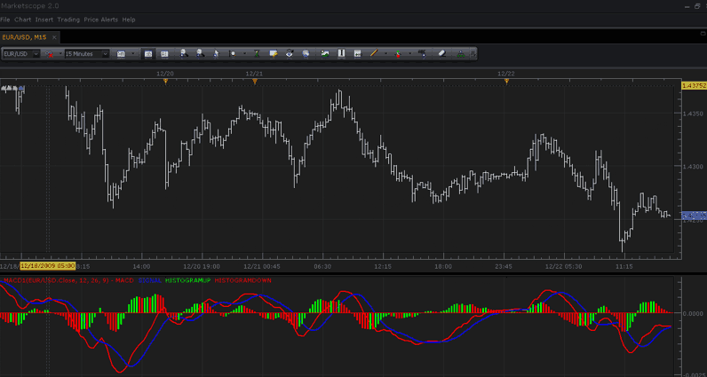
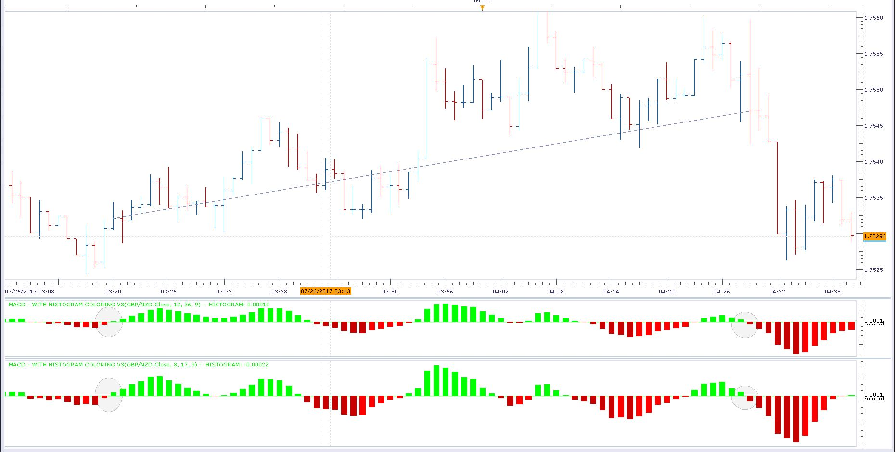

# MACD With Histogram Coloring

> Source: https://fxcodebase.com/code/viewtopic.php?f=17&t=229  
> Forum: 17 · Topic 229 · 48 post(s)

---

## MACD With Histogram Coloring

**TonyMod** · Wed Jan 06, 2010 2:15 pm

Hello Everybody,

Here i'm posting a new indicator variation of MACD which has small change to it, histogram is colored now. It compares current histogram bar to previous one and colors current one into **Green** if this current bar is bigger than previous, or if bar is smaller than previous then current will be colored with **Red**.

This was developed on user's request, here is the original topic: **[http://www.fxcodebase.com/code/viewtopic.php?f=18&t=134](http://www.fxcodebase.com/code/viewtopic.php?f=18&t=134)**

Description on how to use "Moving Average Convergence/Divergence (MACD)" can be found here: **[http://www.investopedia.com/terms/m/macd.asp](http://www.investopedia.com/terms/m/macd.asp)**

**Screenshot:**

 

*Screenshot of MACD in MarketScope.*

**Download:**

 [MACD - With Histogram Coloring.lua](files/322/MACD%20-%20With%20Histogram%20Coloring.lua)

 [MACD - HC with Alert.lua](files/322/MACD%20-%20HC%20with%20Alert.lua)

Indicator-Based strategy.
[https://fxcodebase.com/code/viewtopic.php?f=31&t=72015](https://fxcodebase.com/code/viewtopic.php?f=31&t=72015)

---

## Re: MACD With Histogram Coloring

**Panther** · Mon Nov 21, 2011 7:43 am

Great Indicator. Could you program "width" and "style" options like those available for MVA's, etc ?

---

## Re: MACD With Histogram Coloring

**Apprentice** · Tue Nov 22, 2011 4:36 am

Style Option Added.

---

## Re: MACD With Histogram Coloring

**Laurus12** · Tue Nov 29, 2011 8:21 pm

Is it possible to have the histogram paint in the background? I have been looking through the code, but are not able to understand which code lines are defining the plotting order.

Thanks.
Laurus

---

## Re: MACD With Histogram Coloring

**Apprentice** · Thu Dec 01, 2011 9:33 am

Your request is added to the developmental cue.

---

## Re: MACD With Histogram Coloring

**Trader1** · Mon Dec 12, 2011 9:29 am

Thanks for this indicator,
could you please change it so the MACD line is not obscured by the histogram?
the MACD line and signal line should be on top of the histogram for better view,
as it is now it is difficult to se the lines,
many thanks

---

## Re: MACD With Histogram Coloring

**Apprentice** · Wed Dec 14, 2011 3:04 am

Output Stream sequence changed.

 [MACD - With Histogram Coloring v2.lua](files/20595/MACD%20-%20With%20Histogram%20Coloring%20v2.lua)

---

## Re: MACD With Histogram Coloring

**Laurus12** · Wed Dec 14, 2011 6:50 am

Thanks a lot Apprentice. Really appreciate it

---

## Re: MACD With Histogram Coloring

**Panther** · Tue Feb 07, 2012 7:21 pm

Could you add a "Histo Multiplier" that would adjust the height of the histogram?
Thanks.

---

## Re: MACD With Histogram Coloring

**Apprentice** · Wed Feb 08, 2012 6:02 am

Histo Multiplier Added.

 [MACD - With Histogram Coloring.lua](files/25429/MACD%20-%20With%20Histogram%20Coloring.lua)

---

## Re: MACD With Histogram Coloring

**Panther** · Wed Feb 08, 2012 9:46 am

Very nice. Could you apply it to v2?

---

## Re: MACD With Histogram Coloring

**Apprentice** · Thu Feb 09, 2012 6:32 am

[MACD - With Histogram Coloring v2.lua](files/25526/MACD%20-%20With%20Histogram%20Coloring%20v2.lua)

V2 Updated

---

## Re: MACD With Histogram Coloring

**Panther** · Thu Feb 09, 2012 7:54 am

I am getting a "failure to load" message on the last v2. The error details are "143: unexpected symbol near;"

---

## Re: MACD With Histogram Coloring

**Apprentice** · Thu Feb 09, 2012 9:51 am

Bug Fixed.

---

## Re: MACD With Histogram Coloring

**mviton** · Wed Feb 22, 2012 10:54 pm

any possibility to give an option to hide the histogram?

---

## Re: MACD With Histogram Coloring

**Apprentice** · Thu Feb 23, 2012 4:56 am

Try to use this one.
[viewtopic.php?f=17&t=1050&p=7530&hilit=macd#p7530](https://fxcodebase.com/code/viewtopic.php?f=17&t=1050&p=7530&hilit=macd#p7530)

---

## Re: MACD With Histogram Coloring

**Matteo Zucchini** · Tue May 08, 2012 4:54 am

I sue this version of MACD and it's very usefull.

---

## Re: MACD With Histogram Coloring

**Panther** · Thu May 31, 2012 7:41 am

Could you convert the SnakeForce.mq4 file to a lua file to use with Marketscope2.0?
It is called Snake In Borders. It is like a MACD.

---

## Re: MACD With Histogram Coloring

**Nikolay.Gekht** · Thu May 31, 2012 12:31 pm

> **Panther wrote:**
> Could you convert the SnakeForce.mq4 file to a lua file to use with Marketscope2.0?
> It is called Snake In Borders. It is like a MACD.

It is possible. However, do you know that the indicator re-calculates past values?

---

## Re: MACD With Histogram Coloring

**Panther** · Thu May 31, 2012 2:26 pm

Yes, I use it with this MACD and that makes it workable. Thanks.

---

## Re: MACD With Histogram Coloring

**Alexander.Gettinger** · Wed Jun 13, 2012 9:00 am

Snake force indicator for Marketscope: [viewtopic.php?f=17&t=20166](https://fxcodebase.com/code/viewtopic.php?f=17&t=20166)

---

## Re: MACD With Histogram Coloring

**Panther** · Fri Dec 14, 2012 5:39 pm

Could you add 2 line levels, default .00015 and -.00015?
Include line style, width, and color options.
Thanks.

---

## Re: MACD With Histogram Coloring

**Apprentice** · Sat Dec 15, 2012 4:10 am

Your request is added to the development list.

---

## Re: MACD With Histogram Coloring

**Panther** · Mon Dec 17, 2012 6:39 pm

My request is for v2. Thanks again.

---

## Re: MACD With Histogram Coloring

**Apprentice** · Tue Dec 18, 2012 2:24 am

Line Option Added. to Last post of V2.

---

## Re: MACD With Histogram Coloring

**Panther** · Wed Feb 06, 2013 7:32 am

Could you add Up and Down line colors to the MACD line and the Signal line for v2?
I got the idea from the Stochastic With Style indicator.
Thanks, Panther

---

## Re: MACD With Histogram Coloring

**Apprentice** · Wed Feb 06, 2013 2:14 pm

Coloring Option Added.

---

## Re: MACD With Histogram Coloring

**cave76** · Sun May 25, 2014 3:01 pm

added to previous post for

for macd 2 bar momentum indicator basically 2 closed bar slope on thee or more selected time frame in all align in same direction

---

## Re: MACD With Histogram Coloring

**Apprentice** · Mon May 26, 2014 6:13 am

If I understand you want indicator that will show MACD cumulative of several Time frames.
If all three are green we will have green
and vice versa.
I presume Color will come from histogram Coloring?

---

## Re: MACD With Histogram Coloring

**antonstkachenko** · Fri Apr 15, 2016 3:01 am

Hi!

Thank you very much for your effort in modifying MACD. Could you please also add a small variation of coloring to make Alex Elder's Impulse system (described here: [http://stockcharts.com/school/doku.php? ... lse_system](http://stockcharts.com/school/doku.php?id=chart_school:chart_analysis:elder_impulse_system))

And also a general question: is this indicator compatible with Quik, or only MT terminal?

---

## Re: MACD With Histogram Coloring

**Apprentice** · Fri Apr 15, 2016 11:50 am

What about overlay?
[viewtopic.php?f=17&t=63380](https://fxcodebase.com/code/viewtopic.php?f=17&t=63380)

---

## Re: MACD With Histogram Coloring

**SavvyStrategist** · Sat Aug 13, 2016 8:30 pm

Could we have up/up, up/down, down/down and down/up color variants to chose from? As in, if the histogram is above the zero line but descending, a specific color different from the one that would be appropriate if the histogram were descending and below the zero line, and viceversa.

---

## Re: MACD With Histogram Coloring

**Apprentice** · Sun Aug 14, 2016 3:43 am

Try this version.

 [MACD - With Histogram Coloring v3.lua](files/107602/MACD%20-%20With%20Histogram%20Coloring%20v3.lua)

---

## Re: MACD With Histogram Coloring

**conjure** · Wed Jul 26, 2017 6:26 am

Hi.Thank you for this great work on MACD indicator.
I want to try a strategy.

For this i need this indicator to be able to be double,so i can add different parameters.

Enter (buy) when BOTH histogram bars (closed ones) turns up for the first time
and exit (or sell) when BOTH histogram bars (closed ones) turns down for the first time

As shown in the picture...

 

What i need is a message to pop up when these parameters meet.
Is it possible?
Thank you

---

## Re: MACD With Histogram Coloring

**Apprentice** · Wed Jul 26, 2017 7:24 am

Try this version.
[viewtopic.php?f=31&t=64950&p=113750#p113750](https://fxcodebase.com/code/viewtopic.php?f=31&t=64950&p=113750#p113750)

---

## Re: MACD With Histogram Coloring

**amazon1a** · Thu May 20, 2021 7:32 am

Hi Apprentice,

Could you prepare a MT4 version of this MACD version?

MACD - With Histogram Coloring v3.lua

Many thanks, AG

---

## Re: MACD With Histogram Coloring

**Apprentice** · Thu May 20, 2021 10:29 am

Your request is added to the development list.
Development reference 496.

---

## Re: MACD With Histogram Coloring

**Apprentice** · Fri May 21, 2021 9:26 am

Try this version.
[https://fxcodebase.com/code/viewtopic.php?f=27&t=68621](https://fxcodebase.com/code/viewtopic.php?f=27&t=68621)

---

## Re: MACD With Histogram Coloring

**amazon1a** · Fri May 21, 2021 10:49 am

Hi Apprentice,

Thanks for that but I was hoping for a version more like the .lua where there are 2 lines, Macd and Signal, and the Histogram works off the two lines and also has a Histo multiplier.

AG

---

## Re: MACD With Histogram Coloring

**Apprentice** · Tue May 25, 2021 3:54 am

Your request is added to the development list.
Development reference 507.

---

## Re: MACD With Histogram Coloring

**AlexanderS** · Mon Oct 04, 2021 3:45 pm

HI
Can you make Alert in this indikator

one alert option is cross signalline

two alert option is histogram coloring

but pleas two option not all in one alert

THANKS BRO

AND THIS FOR STRATEGY TO

---

## Re: MACD With Histogram Coloring

**Apprentice** · Tue Oct 05, 2021 1:47 am

Your request is added to the development list.
Development reference 890.

---

## Re: MACD With Histogram Coloring

**Apprentice** · Tue Oct 05, 2021 6:04 am

Try the MACD - HC with Alert.lua
[https://fxcodebase.com/code/viewtopic.php?f=17&t=229](https://fxcodebase.com/code/viewtopic.php?f=17&t=229)

Can you please define strategy rules?

---

## Re: MACD With Histogram Coloring

**AlexanderS** · Sun Mar 20, 2022 5:15 pm

HI
Pleas make a strategy
with
MACD - HC WITH ALERT
with all same signals ( ON OFF OPTION )

THANKS

---

## Re: MACD With Histogram Coloring

**Apprentice** · Mon Mar 21, 2022 3:09 am

Your request is added to the development list.
Development reference 171.

---

## Re: MACD With Histogram Coloring

**Apprentice** · Tue Mar 29, 2022 9:42 am

Try this version.
[https://fxcodebase.com/code/viewtopic.php?f=31&t=72015](https://fxcodebase.com/code/viewtopic.php?f=31&t=72015)

---

## Re: MACD With Histogram Coloring

**L8ping** · Tue May 24, 2022 12:47 pm

Error on your formula, it's an EMA to apply, so change
MVAI = core.indicators:create("MVA", MACD, IN);
by
MVAI = core.indicators:create("EMA", MACD, IN);
By the way the default MACD of the trading station have the same bug!

---

## Re: MACD With Histogram Coloring

**Apprentice** · Wed May 25, 2022 3:45 am

Fixed version.
