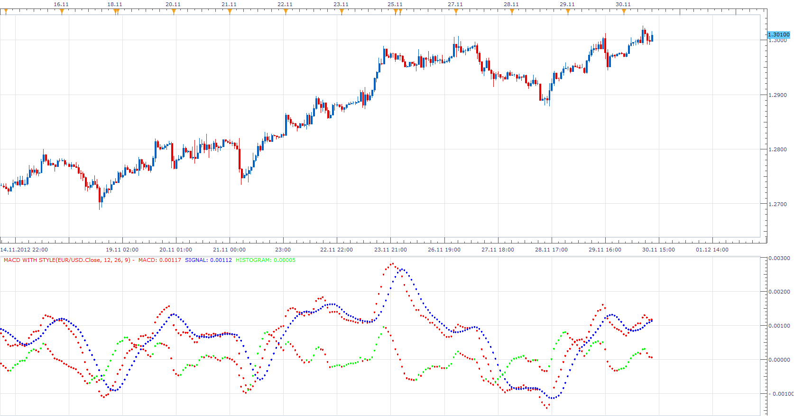
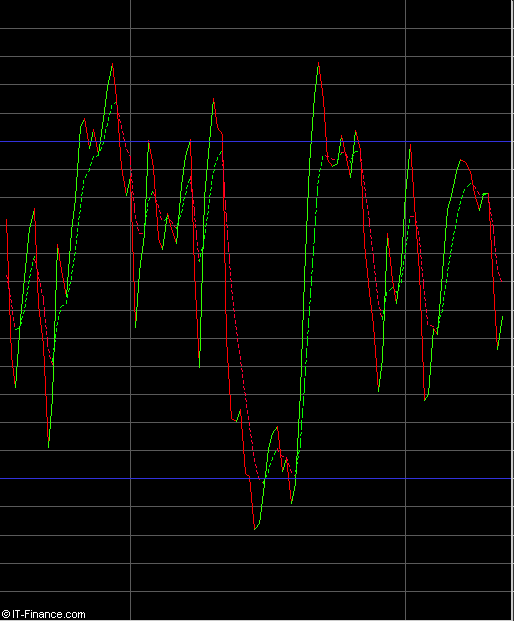
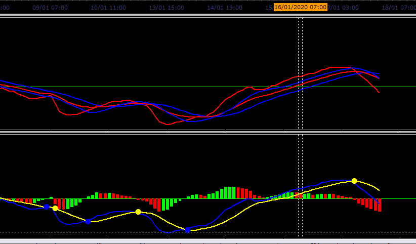

# Macd without histogram

> Source: https://fxcodebase.com/code/viewtopic.php?f=17&t=1050  
> Forum: 17 · Topic 1050 · 23 post(s)

---

## Macd without histogram

**tradingkevin** · Tue May 18, 2010 5:01 am

Hi,
I was wondering if anybody had an Macd without the histrogram ? ( I just need the lines )

THanks
Kevin

---

## Re: Macd without histogram

**Apprentice** · Tue May 18, 2010 7:41 am

*MACD ON OFF*

This version of the MACD indicator lets you choose what you want to draw.
In this example, you have just a Histogram.

 [MACD ON OFF.lua](files/1985/MACD%20ON%20OFF.lua)

 [MACD_ON_OFF with Alert.lua](files/1985/MACD_ON_OFF%20with%20Alert.lua)

**MACD Histogram Usage**

MACD is an indicator that follows the trend of the market.
MACD Histogram can be used as a system for early detection of the MACD crossover.

Bullish
A positive divergence of MACD and the MACD histogram.
A positive crossover of MACD Histogram and Central lines.

Bearish
Negative divergence between MACD and MACD histogram.
Negative crossover of MACD histogram and the central line.

---

## Re: Macd without histogram

**tradingkevin** · Fri May 21, 2010 7:09 am

Thanks a Lot Apprentice. Very useful and handy. Your the MAN !

---

## Re: Macd without histogram

**Hoegie** · Fri Aug 06, 2010 12:14 pm

Is it possible to add colored histogram bars to this indicator (green/red). I am looking for only a histogram that is green when the value is greater than previous bar and red when less than previous bar. Similar to the one with histogram, MACD, and signal line, but only the colored histogram.

Thanks.

---

## Re: Macd without histogram

**Apprentice** · Fri Aug 06, 2010 4:25 pm

You asked for this change?
This was a simple extension.

---

## Re: Macd without histogram

**Hoegie** · Fri Aug 06, 2010 7:16 pm

That was quick...thank you very much...just what I was looking for

---

## Re: Macd without histogram

**Apprentice** · Fri Nov 30, 2012 6:39 am

Additional output streams style option added.

Now you can select Output Style Type.
Bar / Line / Dot.

And for Line also.
Line Style / Line Width

 [MACD On Off with Style.lua](files/47465/MACD%20On%20Off%20with%20Style.lua)

---

## Re: Macd without histogram

**nuhocodebase** · Fri Nov 30, 2012 2:53 pm

Hello,
I just tried the "MACD is Off Style.lua with."
This is exactly what I want.
thank you very much
Is it possible to do the same with a Stochastic.
color choices, up, down?

 

cordially

nuho

---

## Re: Macd without histogram

**Apprentice** · Fri Nov 30, 2012 5:10 pm

Try updated Stochastic with Style.
[viewtopic.php?f=17&t=27221](https://fxcodebase.com/code/viewtopic.php?f=17&t=27221)

---

## little problem with the "MACD On Off with Style" indicator

**SuperTrader** · Sat Dec 07, 2013 5:48 am

Hi Apprentice, just testing your "**MACD On Off with Style**" indicator (posted above), really helpful, thanks for that but there's ony a little **problem** with it: There's **no way** to increase the Signal Line width in the Properties box (the Line always displays on the chart as having **width=1**, no matter what value 1-5 we type in!). Please have a quick look, I just need to **increase its thickness** on all my charts! Thanks!

---

## Re: Macd without histogram

**Apprentice** · Sun Dec 08, 2013 6:44 am

Fixed.

---

## Re: Macd without histogram

**SuperTrader** · Sun Dec 08, 2013 7:05 am

Awesome! Thank you for your quick response man!

---

## Re: Macd without histogram

**Apprentice** · Wed Jun 14, 2017 6:21 am

The indicator was revised and updated.

---

## Re: Macd without histogram

**adloule** · Sat Jan 04, 2020 11:23 am

Hi Apprentice ,
Please, could you add an alert when the 2 MA cross for the MACD ON OFF.lua indicator ?
Thank you very much

---

## Re: Macd without histogram

**Apprentice** · Sun Jan 05, 2020 11:03 am

MA of price.
Or
MA of MACD components.

---

## Re: Macd without histogram

**adloule** · Sun Jan 05, 2020 12:41 pm

ma of macd components please ( 12 and 26 )

---

## Re: Macd without histogram

**adloule** · Sun Jan 05, 2020 7:27 pm

MA of MACD components
thank you

---

## Re: Macd without histogram

**Apprentice** · Mon Jan 06, 2020 8:18 am

Your request is added to the development list.
Development reference 522.

---

## Re: Macd without histogram

**Apprentice** · Thu Jan 09, 2020 4:32 am

Try this version.

 [MACD_ON_OFF smoothing and alert.lua](files/130645/MACD_ON_OFF%20smoothing%20and%20alert.lua)

---

## Re: Macd without histogram

**adloule** · Sat Jan 18, 2020 5:30 am

Hi Apprentice,

thank you for the answer,
but i have problem with showing the alert
i put a picture for you, a comparison between MACD_ON_OFF smoothing and alert.lua and MACD with alert (bottom one)

Thanks

---

## Re: Macd without histogram

**adloule** · Sat Jan 18, 2020 6:27 am

---

## Re: Macd without histogram

**Apprentice** · Sun Jan 19, 2020 5:06 am

Your request is added to the development list.
Development reference 560.

---

## Re: Macd without histogram

**Apprentice** · Mon Jan 20, 2020 10:02 am

[MACD_ON_OFF_smoothing__and_alert.lua](files/130820/MACD_ON_OFF_smoothing__and_alert.lua)

Something like this?
