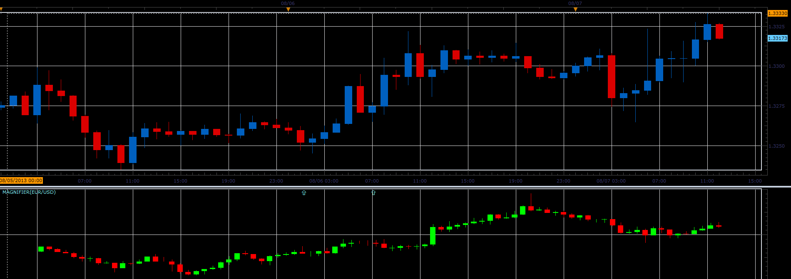
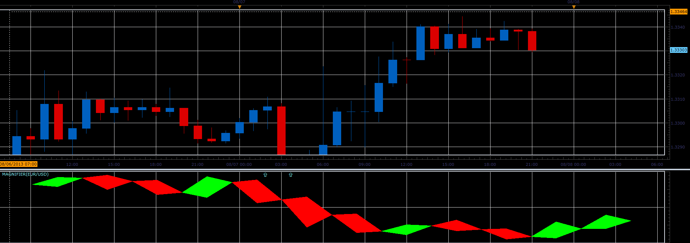
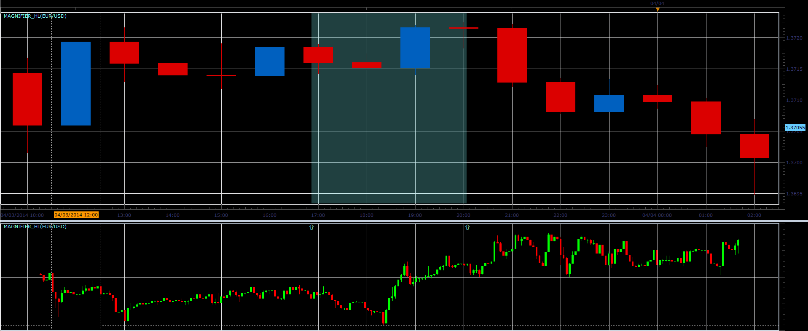
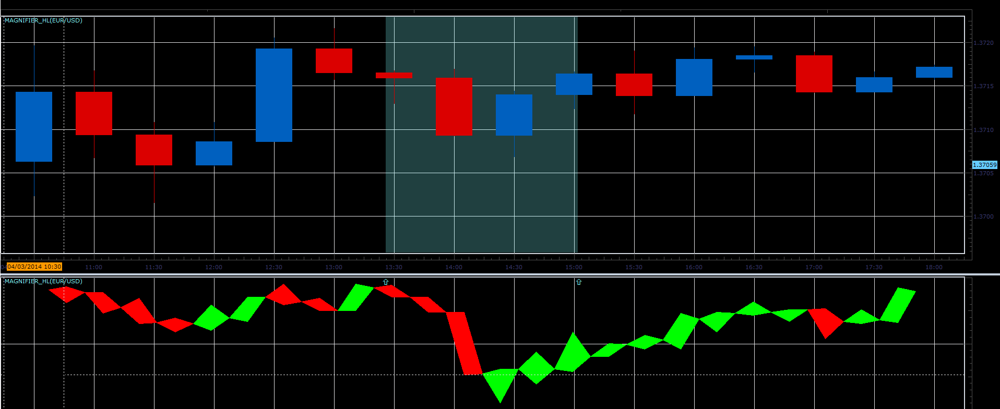
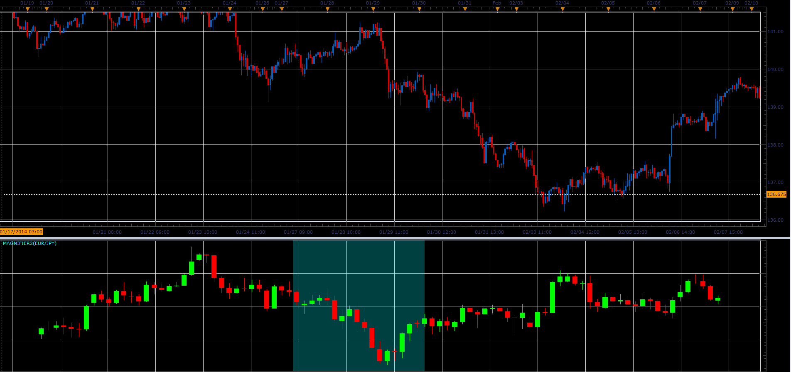

# Magnifier

> Source: https://fxcodebase.com/code/viewtopic.php?f=17&t=58743  
> Forum: 17 · Topic 58743 · 7 post(s)

---

## Magnifier

**Alexander.Gettinger** · Wed Aug 07, 2013 8:17 pm

The indicator shows in an additional window more detailed history for the selected area of the main chart.
The indicator supports different ways of presenting charts.
To move the start and end points of the magnifier is used the menu invoked by right mouse button.

 

 

Download:

 [Magnifier.lua](files/88066/Magnifier.lua)

The indicator was revised and updated

---

## Re: Magnifier

**RunVert** · Thu Aug 08, 2013 2:21 pm

I get "nil value" error message. Doesnt matter what time frame I choose.

---

## Re: Magnifier

**Alexander.Gettinger** · Thu Aug 08, 2013 4:02 pm

Are you using a beta version [viewtopic.php?f=30&t=57814](http://www.fxcodebase.com/code/viewtopic.php?f=30&t=57814)?

---

## Re: Magnifier

**Apprentice** · Tue Oct 15, 2013 1:52 am

Bump Up

---

## Re: Magnifier

**Alexander.Gettinger** · Fri Apr 04, 2014 2:43 pm

Version of the indicator with backlight of the magnified area.

 

 

Download:

 [Magnifier_HL.lua](files/93385/Magnifier_HL.lua)

---

## Re: Magnifier

**Alexander.Gettinger** · Mon Apr 07, 2014 9:06 am

The indicator shows the position of the visible chart on the larger timeframe chart.

 

Download:

 [Magnifier2.lua](files/93410/Magnifier2.lua)

---

## Re: Magnifier

**Apprentice** · Fri Dec 02, 2016 5:13 am

Minor Update.
