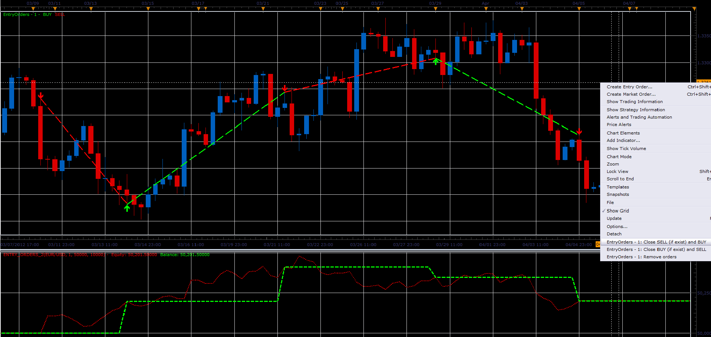

# Manual entry orders indicator

> Source: https://fxcodebase.com/code/viewtopic.php?f=17&t=16403  
> Forum: 17 · Topic 16403 · 3 post(s)

---

## Manual entry orders indicator

**Alexander.Gettinger** · Thu Apr 19, 2012 9:19 am

The indicator provides a possibility for user to place orders on the chart.
For placing orders using command menu (right mouse click).
The second indicator draws a graphs of balance and equity.
User can select the type of prices to calculate the balance and equity.

 

Download indicators:

 [Entry_Orders.lua](files/30511/Entry_Orders.lua)

 [Entry_Orders_Show_Balance.lua](files/30511/Entry_Orders_Show_Balance.lua)

---

## Re: Manual entry orders indicator

**Alexander.Gettinger** · Mon Jul 23, 2012 10:06 am

MQL4 version of this indicator: [viewtopic.php?f=38&t=21218](https://fxcodebase.com/code/viewtopic.php?f=38&t=21218)

---

## Re: Manual entry orders indicator

**Apprentice** · Wed Feb 21, 2018 8:29 am

The Indicator was revised and updated.
