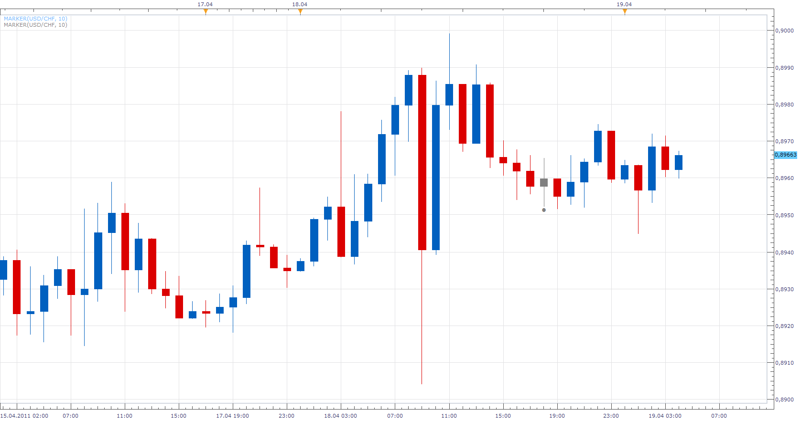
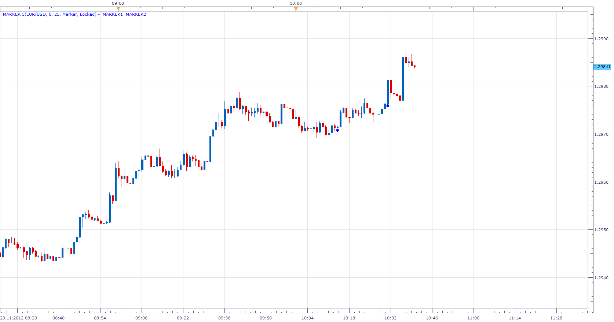

# Marker

> Source: https://fxcodebase.com/code/viewtopic.php?f=17&t=3963  
> Forum: 17 · Topic 3963 · 31 post(s)

---

## Marker

**Apprentice** · Tue Apr 19, 2011 3:30 am

This simple indicator has a option to paint a candle, draw label or Marker N periods backwards from current the closing price.

I added two modes, Locked and Trailing

It was developed by, the request from the user.

The same indicator with the option of using the Date for the lock candles would be desirable.
That's why I suggested to the development team to add functionality that would allow simple implementation of this.

 [MARKER.lua](files/9814/MARKER.lua)

 [Multiple Marker.lua](files/9814/Multiple%20Marker.lua)

The indicator was revised and updated

---

## Re: Marker

**cyanidez** · Tue Apr 19, 2011 6:24 am

How awesome is this, great job thanks Apprentice!

cyanidez

---

## Re: Marker

**RJH501** · Wed Jul 27, 2011 6:53 am

Hi Apprentice!

Just a quick note to say thanks for the Marker indicator.

I was looking for a means to identify when the Silver Signal 2 indicator lock in and stopped re-painting (marking a trend change). And your indicator solved this problem! By using trailing mode it gave the perfect indication to show when STI2 locks in!

Thanks and Best Regards,

Richard

---

## Re: Marker

**rretch** · Wed Jul 27, 2011 9:55 am

Hey Apprentice,

Great indicator...and thanks for developing it! I am, however, seeing a problem. When the indicator is first loaded, it paints the correct bar as it should. When I change time periods though, the bar 'unpaints' itself.

Anyone else seeing this problem?

Also, I think if you could give the painted candle settings to paint itself, when it closes above/below N prior bars, this indicator could be used to make a Tom Demark Wave indicator.

Thanks
rob

---

## Re: Marker

**rretch** · Wed Jul 27, 2011 10:59 am

Hey again Apprentice,

Am I missing something regarding the N bar that is painted. The bar that is painted is only painted as one color and thus leaving me guessing if it closed down or up.

thanks again
rob

---

## Re: Marker

**rretch** · Wed Jul 27, 2011 11:40 am

Hey again Apprentice,

Am I missing something regarding the N bar that is painted. The bar that is painted is only painted as one color and thus leaving me guessing if it closed down or up.

thanks again
rob

excuse me if i sent twice...i was distracted and forgot if i posted or not

---

## Re: Marker

**dlouisbriggs** · Wed Jul 27, 2011 3:29 pm

Would it be possible to modify the code to permit "Markers" in future time period by allowing negative numbers in the "Look Back" field of the parameters? Thank you.

---

## Re: Marker

**nazaar** · Thu Feb 09, 2012 10:25 am

This is an excellent tool as it does not make the charts to cluttered. The marker quickly identifies the N'th bar without having to many lines on the chart.

I was wondering if you could add to the marker to identify the **highest high** with in the N'th period back and the **lowest low**with in the**N'th period back**.

Say for example an arrow pointing down above the highest high and an arrow pointing up below the lowest low of the n'th period back. Ideally, if the user could choose the colour and size of the arrow.

thank very much

---

## Re: Marker

**cyanidez** · Thu Feb 09, 2012 1:31 pm

Hi nazaar,

I actually wrote an indicator like that called "Swings" that identifies exactly that - the swing highs and lows of the parameters that you give it.

I can upload it here? Just have to check with the admins how to do that. Will let you know!

Regards

---

## Re: Marker

**Apprentice** · Thu Feb 09, 2012 2:32 pm

to cyanidez
Contact Nikolay orVasiliy,
regarding permission.

to nazaar
wait for cyanidez addition
If you will not be satisfied, post your comments here.

---

## Re: Marker

**cyanidez** · Thu Feb 09, 2012 2:36 pm

Hi Apprentice,

I've done so, will get back to this thread as soon as I have a reply from one of them.

Thanks!

---

## Re: Marker

**nazaar** · Fri Feb 10, 2012 9:59 am

> **rretch wrote:**
>
> When I change time periods though, the bar 'unpaints' itself.
> rob

Hi, the marker indicator is really great because it is simple dot placed at the Nth bar back so it helps reduce clutter on charts. However, is there any update on the above issue, when you change time or currency pair the marker does not remain.

Thanks in advance.

---

## Re: Marker

**nazaar** · Fri Mar 02, 2012 12:22 pm

> **cyanidez wrote:**
> Hi nazaar,
>
> I actually wrote an indicator like that called "Swings" that identifies exactly that - the swing highs and lows of the parameters that you give it.
>
> I can upload it here? Just have to check with the admins how to do that. Will let you know!
>
> Regards

Hello Cyanidez, any update on the indicator marking the high and low of the nth period back?

thanks

---

## Re: Marker

**cyanidez** · Wed Mar 07, 2012 1:18 am

Hi nazaar,

I JUST received permission to go ahead and upload the indicator!

So I'll be doing to later today and will send you a PM with the link when approved

Talk again later.

---

## Re: Marker

**nazaar** · Thu Mar 15, 2012 12:31 pm

Hello Apprentice,

when I trade, i do a lot of comparison of price action using time divider and time in general. The marker tool is one of my favourites. I like both the trailing and locked options. I was wondering if I could have the marker spot be selected not only by the look back period but at a fixed time and then select lock to leave the marker at that given time.

thanks.

---

## Re: Marker

**nazaar** · Thu Mar 15, 2012 12:43 pm

I tried using a + or - sign in the the lookback period and that is doing what I need done. Using the + sign and then selecting locked from market type is placing a market where I want and it is remaining there.

thanks.

---

## Re: Marker

**Apprentice** · Thu Mar 15, 2012 7:57 pm

Your request is added to the development list.

---

## Re: Marker

**nazaar** · Sat Sep 15, 2012 3:37 pm

hello,

the marker tool does not work if you change time line. Say you are on the 4-hr chart and have the marker tool set for 21 bars back if you change to the say the 1 hour chart it does not show the 21st candle back on the new chart.

Thoughts?

Also, I am trying to add to this tool to by creating another tool, what would the code be to identify the highest high and lowest low for a say the last 9 bars back with the marker tool?

thanks.

---

## Identifying the X bar back

**nazaar** · Tue Oct 09, 2012 5:50 pm

Hello,

I use the Candle LookBack Period.lua found here: [viewtopic.php?f=17&t=11079&hilit=lookback](https://fxcodebase.com/code/viewtopic.php?f=17&t=11079&hilit=lookback)

Please see the attached for my custom version.
This is a useful tool but it identifies the X bar back with a full screen vertical line which clutters up the chart making it hard to read.

Could someone please replace the vertical lines with an option to display either a numerical value showing the bars back or a marker identifying the counted bars back?

Preferably the numerical value identifying the X bar back would be better. I have tried doing it myself but failing each time.

Please see attached file and image.

Thanks.

---

## Re: Marker

**Apprentice** · Wed Oct 10, 2012 4:10 am

Your request is added to the development list.

---

## Re: Marker (adding multiple markers)

**nazaar** · Wed Nov 28, 2012 11:13 pm

Hello,

I am trying to edit the marker.lua tool to have more than one marker input value. I am hoping to have 1 marker tool but with the options to identify several bars using the one tool. The attached file is as far I can get, not sure where I am going wrong.

The attached chart shows a potential final product. Ideally, the user may have the option to display either a marker or the numerical value of the X bar back and be able to choose the colours of each.

Thanks.

ps: it is called marker 5 because I edited the original version one step at a time and got to marker 5 before getting an error message I can't fix.

---

## Re: Marker

**Apprentice** · Thu Nov 29, 2012 4:06 am

will take a look.

---

## Re: Marker

**Apprentice** · Thu Nov 29, 2012 4:36 am

Try this version.

 [Marker x2.lua](files/47276/Marker%20x2.lua)

It is always more difficult to rewrite old code.
Will you offer the new version instead.

---

## Re: Marker

**Apprentice** · Thu Nov 29, 2012 5:58 am

I add version that Allows you to define up to 5 Marker.
See topmost post.

---

## Re: Marker

**nazaar** · Thu Nov 29, 2012 12:12 pm

> **Apprentice wrote:**
> Try this version.
>
>
> Marker x2.lua
>
>
> It is always more difficult to rewrite old code.
> Will you offer the new version instead.

Thanks very much! This will help in counting cycles, thanks.

Any thoughts why when you apply the marker tool on one time line then change the time line the tool does not display. For example, apply it on the 1 hour chart then change that chart to say the 4 hr chart the markers do not display.

Again, thanks for the help.

---

## Re: Marker

**Apprentice** · Thu Nov 29, 2012 12:24 pm

Indicator is locked to an absolute position from last candle.
Not to date.
When you change a time frame, the indicator recalculates.
For this to work you would need to save the marker dates to disk.
And dates are not set by the distance from the last candle,
rather selected with the mouse.

Like in this Elliot Wave Labeling Tool implementation.
[viewtopic.php?f=17&t=4360&p=10845&hilit=label#p10845](https://fxcodebase.com/code/viewtopic.php?f=17&t=4360&p=10845&hilit=label#p10845)

---

## Re: Marker

**Thumper** · Thu Nov 29, 2012 3:08 pm

I refer to 'MARKER.lua' in the first post above. Can you include a vertical line under Market Type selection? This would allow a single line to be drawn through the price bars (or candles) as well as an indicator like an oscillator which would sit below. Thanks, you guys are amazing. Best regards from Australia.

Robert Marshall

---

## Re: Marker

**nazaar** · Thu Nov 29, 2012 5:08 pm

> **Apprentice wrote:**
> Will you offer the new version instead.

Hi Apprentice, how are you?
I am not sure what you meant by the above quote but attached is a modified version of the marker tool with 5 time spans measured. This is a little cleaner.

Along with 9 and 26 ichimoku periods there are some additional periods to measure namely, 17, 33, 41, 65 and 76 periods. Note: 26 is one unit, 65 is a Super Big Unit and 76 is a cycle.

Still learning how to incorporate these into ichimoku analysis.

---

## Re: Marker

**Apprentice** · Thu Nov 29, 2012 6:46 pm

i have write multiple market indicator (topmost post) can have up to five markers

---

## Re: Marker

**Alexander.Gettinger** · Tue Dec 18, 2012 3:13 pm

Marker indicators with line.

 [MARKER2.lua](files/48730/MARKER2.lua)

 [Multiple Marker2.lua](files/48730/Multiple%20Marker2.lua)

---

## Re: Marker

**Apprentice** · Wed Apr 26, 2017 11:19 am

Indicator was revised and updated.
