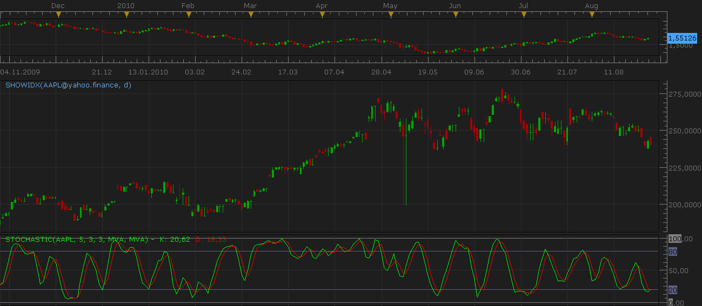

# Market Indexes on the chart [Upd Aug 27]

> Source: https://fxcodebase.com/code/viewtopic.php?f=17&t=611  
> Forum: 17 · Topic 611 · 8 post(s)

---

## Market Indexes on the chart [Upd Aug 27]

**Nikolay.Gekht** · Sun Apr 11, 2010 8:45 pm

The indicator shows one of the following indexes with 1 day, 1 week or 1 month time-frame.
The indexes are:
Dow Jones
NASDAQ
S&P 500
FTSE 100
10 Year bonds
Bel-20
CAC 40

[new Aug 27 2010] You can also choose "Custom" in the index selector and then enter the name of the instrument into "custom instrument" parameters. Try, for example AAPL (Apple)

[new Aug 27 2010] You don't need to choose the timeframe in the indicator anymore. The indicator detects the timeframe automatically.

How to use:

1) Open 1 day, 1 week or 1 month chart of any forex instrument.
2) Apply the showidx oscillator.

The stock data will be shown below the instrument chart.

The result of the oscillator is a set of regular candles, so, you can apply any indicators on these data (to apply the indicator just choose the instrument on the source tab of the indicator properties).

 

Download:

 [SHOWIDX.lua](files/1080/SHOWIDX.lua)

Please add this ddl to your TS folder.

 [http_lua.dll](files/1080/http_lua.dll)

The source of the data is [Yahoo! Finance](http://finance.yahoo.com/).

---

## Re: Market Indexes on the chart [Upd Aug 27]

**Nikolay.Gekht** · Sat Aug 28, 2010 10:17 pm

Updated Aug, 27:
1) The timeframe parameter is removed. Now the indicator detects it automatically.
2) The volume is supported.
3) The custom instruments are supported.

---

## Re: Market Indexes on the chart [Upd Aug 27]

**Outside_The_Box** · Tue Nov 12, 2013 2:23 am

The 10 year bonds are the interest rate, not the bonds themselves, just FYI. Still, very cool!

I'm going to have some fun with that etraderzone link.

---

## Re: Market Indexes on the chart [Upd Aug 27]

**Apprentice** · Mon Jun 19, 2017 5:06 am

The indicator was revised and updated.

---

## Re: Market Indexes on the chart [Upd Aug 27]

**mayk01** · Fri Oct 08, 2021 6:30 am

Hi !
Can I request an update? The yahoo web address does not work so the indicator does.

Thanks,
M.

---

## Re: Market Indexes on the chart [Upd Aug 27]

**mayk01** · Fri Oct 08, 2021 6:48 am

Hi,

Is it possible to upgrade? The yahoo link doesn't work.

Thanks,
M.

---

## Re: Market Indexes on the chart [Upd Aug 27]

**Apprentice** · Sun Oct 10, 2021 3:49 am

Your request is added to the development list.
Development reference 900.

---

## Re: Market Indexes on the chart [Upd Aug 27]

**Apprentice** · Thu Nov 25, 2021 10:41 am

Updated.
