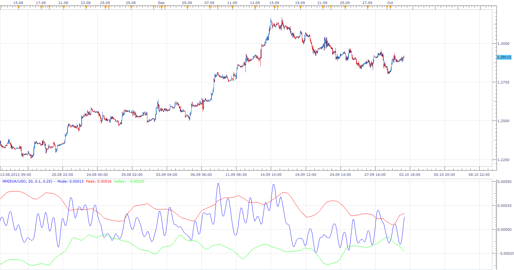

# Market Mode (MM)

> Source: https://fxcodebase.com/code/viewtopic.php?f=17&t=24002  
> Forum: 17 · Topic 24002 · 5 post(s)

---

## Market Mode (MM)

**Apprentice** · Tue Oct 02, 2012 5:00 am

This indicator is used to determine whether the market is in a trending or a cyclical mode.

 [MM.lua](files/41252/MM.lua)

---

## Re: Market Mode (MM)

**Apprentice** · Tue Oct 02, 2012 6:19 am

For Market Mode Rainbow Chart, Market Mode Indicator must be installed.

 [Market Mode Rainbow Chart.lua](files/41258/Market%20Mode%20Rainbow%20Chart.lua)

---

## Re: Market Mode (MM)

**Alexander.Gettinger** · Mon Oct 27, 2014 10:52 am

MQL4 version of Market Mode oscillator: [viewtopic.php?f=38&t=61386](https://fxcodebase.com/code/viewtopic.php?f=38&t=61386).

---

## Re: Market Mode (MM)

**Apprentice** · Thu Nov 06, 2014 4:44 am

Performance and presentation update.

---

## Re: Market Mode (MM)

**Apprentice** · Mon Feb 05, 2018 11:12 am

The indicator was revised and updated.
