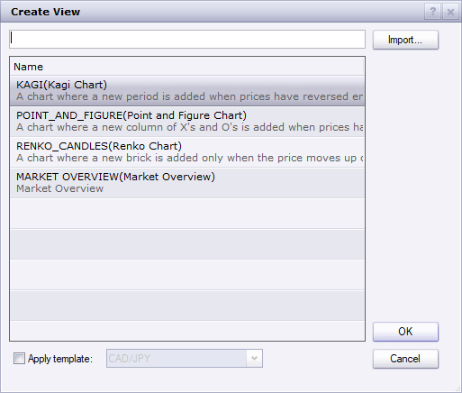
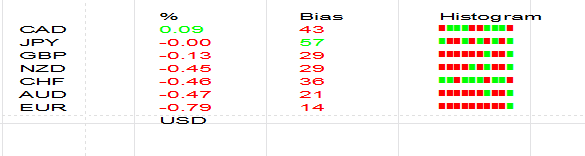

# Market Overview View

> Source: https://fxcodebase.com/code/viewtopic.php?f=17&t=69959  
> Forum: 17 · Topic 69959 · 4 post(s)

---

## Market Overview View

**Apprentice** · Wed Jun 03, 2020 5:31 pm

[Market Overview.lua](files/134573/Market%20Overview.lua)

 

 

I started working on a new dashboard.
I will add new things with time.
If you have any suggestions post them below.

The attachment **1.png** is no longer available

Bias.lua
[viewtopic.php?f=17&t=69960](https://fxcodebase.com/code/viewtopic.php?f=17&t=69960)

For now, we have
1) percentage change for some or all pairs.
2) Bias (Simple correlation metric)
3) Histogram option

---

## Re: Market Overview View

**Apprentice** · Fri Jun 12, 2020 8:53 am

 

 [Market Overview Chart.lua](files/134900/Market%20Overview%20Chart.lua)

---

## Re: Market Overview View

**Apprentice** · Sat Jun 13, 2020 8:21 pm

 

 

 [Correlation Overview.lua](files/134917/Correlation%20Overview.lua)

---

## Re: Market Overview View

**Apprentice** · Sat Oct 01, 2022 5:43 am

The correlation Overview was updated.
