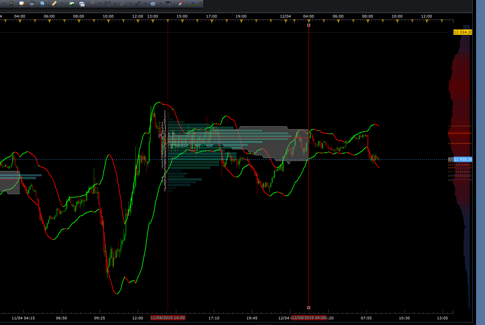

# Market Profile

> Source: https://fxcodebase.com/code/viewtopic.php?f=17&t=2640  
> Forum: 17 · Topic 2640 · 99 post(s)

---

## Market Profile

**Apprentice** · Tue Nov 09, 2010 5:52 pm

**Note
If you use the instruments with a value from several hundred to several thousand.
Use larger Box Size.
Otherwise the calculation may take some time**

To quote Warren Buffett and a "Price is what you pay. Value is what you get."
Market Profile can be helpful in determining fair value for each trading period.

Market Profile provides a completely different view on the market.
In following days I'll add a few more useful features and offer a detailed explanation.

To have learned this concept we need at least a week.

Every day the market again, establishes a value area, the fair value of securities.
It represents a balance (equilibrium) point where an equal number of buyers and sellers.
Prices never remain within this region, constantly is in motion.
Market Profile records this activity for traders to interpret.

Market Profile is based on the normal distribution curve, 70% of the value is within one standard deviation.

Time Price Opportunities (TPOs), are represented by letters and numbers.
Each letter represents one trading period.
upper case letters from A to Z, then lower case from a to z and and numbers from 1to 9,
A represents the first trading period.

POC = Point of Control
Price at which most TPO segments appear on the Market Profile char.
Price with the highest activity.

VA = Value Area (I must add this functionality)
The price range that contains 70% of the TPO profile.
Value Area is the price that was accepted by most market participants.

TPO = Time Price Opportunity
Letters (TPO) represents the price at the time at which it traded.
 A, B, C, D, E, F, G, H, I, J, K, L, M, N - each letter represents one trading period.

 Selling Tail - Minimum of 2 TPO's at the top of the profile.
 Buying Tail - Minimum of 2 TPO's at the bottom of the profile

Every time when the price falls below fair market value for the considered period,
occurs opportunity to open the Long position and vice versa.

The decision on entry into the position should not be made solely based on observation of market profile.

 [Market Profile.lua](files/5962/Market%20Profile.lua)

 [Market Profile New.lua](files/5962/Market%20Profile%20New.lua)

 [VPOC.lua](files/5962/VPOC.lua)

 

Make sure to re-install VPOC for use with MTF MCP POC View.

 [MTF MCP POC View.lua](files/5962/MTF%20MCP%20POC%20View.lua)

MT4/MQ4 version of VPOC.lua
[viewtopic.php?f=38&t=66947](https://fxcodebase.com/code/viewtopic.php?f=38&t=66947)

---

## Re: Market Profile

**patick** · Wed Nov 10, 2010 1:49 am

Beautiful work, Apprentice!

---

## Re: Market Profile

**coldrecs** · Wed Nov 10, 2010 10:40 am

Excelent! I was long waiting for this indicator. Thank you!
Also waiting for eventual developments on this.

I know this indicator from MT4 and NinjaTrader. I hoped someone would bring it here also

---

## Re: Market Profile

**patick** · Thu Nov 11, 2010 2:00 am

I know this is a work in process, but when you transition from a previous day to a new one, the formatting and histogram are off. Looks like it might be taking into account the previous day’s data when doing its calculations?

---

## Re: Market Profile

**Apprentice** · Thu Nov 11, 2010 1:11 pm

Minor Update,
And, thanks to everyone.

---

## Re: Market Profile

**alpha_bravo** · Fri Mar 18, 2011 3:55 pm

Man this great, very nice, something i did not think possible on marketscope. Does anyone here actually use it to trade with...anyone get any results with FX?

---

## Re: Market Profile

**Jaywalker** · Fri Apr 08, 2011 5:03 am

Hi

Great indicator

Any idea when indicator will be updated to show value area levels ( VAH and VAL) ?

Regards

---

## Re: Market Profile

**wilson2** · Mon May 30, 2011 7:38 am

hello Apprentice and thank you for your great job!

i tried this indicator on SP500 and it works fine.

But it doesn't work with FRA40 and GER30.

Do you know why?

---

## Re: Market Profile

**Apprentice** · Mon May 30, 2011 11:47 am

Strange.
To be honest I do not know why.

I'll ask someone with more experience.

---

## Re: Market Profile

**Apprentice** · Mon May 30, 2011 12:23 pm

This is a temporary fix
While I do not offer anything better.

---

## Re: Market Profile

**wilson2** · Mon May 30, 2011 2:17 pm

OK!
now it can work with FRA40.

Thanks a lot.

Best regards

---

## Re: Market Profile

**dlouisbriggs** · Mon May 30, 2011 3:15 pm

The current market profile histogram only utilizes the current price data that appears on the screen. One has the choice to zoom out (and lose graphic detail) or limit the histogram to a smaller sampling. Would it be possible to create an option that would allow the user to designate the period of time for the histogram, independent of the zoom level of the currently displayed data? Thank you for a great indicator.

---

## Re: Market Profile

**emjay-short** · Fri Jul 08, 2011 9:31 pm

> **dlouisbriggs wrote:**
> The current market profile histogram only utilizes the current price data that appears on the screen. One has the choice to zoom out (and lose graphic detail) or limit the histogram to a smaller sampling. Would it be possible to create an option that would allow the user to designate the period of time for the histogram, independent of the zoom level of the currently displayed data? Thank you for a great indicator.

Indeed. This indicator does use a lot of CPU and I can only use it for one chart at a time. I did read about it in two books briefly, but not in detail how it is used specifically. Well Google did help me to make more sense and get a glimpse how to read it (Volume @Price Level).

> **MARKET PROFILE QUICKLY GIVES THE TRADER A VIEW OF HOW THE MARKET IS DEVELOPING, WHAT PRICES ARE BEING ACCEPTED BY THE MARKET AND WHAT PRICES ARE BEING REJECTED.**

> **Market Profile is a tool for organizing time and price data, graphically representing how volume builds at various prices over time.** When we see most trades occurring within a relatively narrow range of prices, we know that the market is in balance. Price will probe the edges of this balance area--called the value area--as markets constantly update their estimates of value. If prices higher or lower than value cannot facilitate trade (i.e., if higher prices don't attract buyers or lower prices don't attract sellers), we will tend to trade back into the value area. If these probes to the edges of the value region do facilitate expanded trade, we will break free of the value area in a trending move. That trend will continue until sufficient sellers or buyers perceive value in the new prices and take the other side of the trade, beginning the process of forming a new region of balance.
>
> My specific best practice is to be aware of value areas at one level larger than the timeframe you are trading. Very often, a breakout at a shorter time frame occurs within the context of a longer-term market bracket. Knowing where value is located on the longer timeframe helps you identify price targets for the shorter-term move. (via [http://traderfeed.blogspot.com/2007/02/market-profile-best-practice-in-trading.html](https://traderfeed.blogspot.com/2007/02/market-profile-best-practice-in-trading.html))

**Things I found via Google (one short evening).**

- http://www.cmegroup.com/education/interactive/marketprofile/handbook.pdf
- www.cmegroup.com/education/interactive/marketprofile/
- http://www.trading-naked.com/library/market-profile-softwarereview07.pdf
- http://www.earnforex.com/forex-e-books/forex-market/Market_Profile_Basics.pdf
- http://www.sidewaysmarkets.com/2010/08/market-profile-day-trading-entry-rules.html
- Webinars about Market Profile: [http://www.traderkingdom.com/market-pro ... d-webinars](http://www.traderkingdom.com/market-profile-archived-webinars)
- And there are a dozen or so YouTube videos about Market Profile. Some more useful than the other.
- BOOK. Mind over Markets by James F. Dalton, Eric T. Jones, Rober B. Dalton - that whole book is about Market Profile, how to interpret it and use it.
- BOOK. Markets in Profile: Profiting from the Auction Process by James Dalton, Robert Bevan Dalton, Eric T. Jones. This is a newer book (2007) also about MP.
- BOOK. Steidlmayer on Markets: A New Approach to Trading - is about how to read the market, read the market with MP.
- A trader uses MP and tries to explain his thinking (over 1 month) [http://www.elitetrader.com/vb/showthrea ... genumber=1](http://www.elitetrader.com/vb/showthread.php?s=5a1efc26f0ab8e8dd31456d24c3b5628&threadid=63202&perpage=6&pagenumber=1)
- Another Trader on MP [http://www.elitetrader.com/vb/showthrea ... eadid=9727](http://www.elitetrader.com/vb/showthread.php?s=&threadid=9727)
- I've attached one Screenshot with some annotations after I dabbled over the many charts this evening and got a first clue how to use MP. Really looking forward to read more about MP and eventually using it every day.

**Suggested Options to Optimize MP for Usability:**

- Option to show or don't show current days Market Profile as it always just develops for today ... And in all the analysis I read - they did not use the current day. They always use the last days Market Profile to anticipate today's Price behavior. Thus we don't need today's Market Profile as it develops.
- Option to show only the last X days of your choosing. Like you would with an RSI/SMA choose your period for calculation. Calculating and showing only the last 5 or 10 days should take off the edge of CPU&RAM usage.
- Option to show on today's day yesterdays VAH&L (Value Area High, Value Area Low), 1 standard deviation line above VAH and 1 standard deviation line below VAL, POC (Price of Control). Just like you see/use Pivots (CP,S1,R1,S2,R2). See Pic Attachment.

Thanks in advance @Apprentice for putting this on the development cue.
And I hope my contributions were useful enough for all the other readers.

---

## Re: Market Profile

**Apprentice** · Sat Jul 09, 2011 3:45 am

Show Only Last Period Option Added.
This is only a quick fix.
Until I will have time to do a major update.

---

## Re: Market Profile

**FHusseini** · Thu Jul 21, 2011 7:49 pm

Apprentice, you are doing a great job on this.

We need to see a major update on this indicator which I hope will be soon and in-line with the suggested options from emjay-short.

Good luck!!!

---

## Indicator Update - Market Profile

**dspurr624** · Sun Aug 07, 2011 7:06 am

Apprentice,

Kudos to you for your work on this indicator ; Ideally it would be nice to see:

1. VAL / VAH for each of the profiles.

2. It would be nice to have an option to turn on or turn off the text at the top of the profiles. For me, personally - that information in not as important in my decision making process. I'm more interested in the VAL/VAH for each of the profiles. these are the levels that other traders watch.

3. It would also be great if we could show a daily profile or a weekly profile and a monthly profile. In other words, the ability to show each day by themselves on intraday charts - The ability to show 10 days, 30 days, 100 days..... (combined in one large profile) on the daily or weekly or monthly charts. This is important as it allows us to see longer term price development.

I appreciate all you work on this and know that it's probably a ton of work. I do some programming in Thinkscript and know that when you make a small change it's hours of work. Thanks again

DS

---

## Re: Market Profile

**bomberone3** · Fri Oct 28, 2011 6:46 am

Dear Apprentice,
could you explain how to use the indicator for real trading?
Have you got any ideas to built trading strategy?

Also i write before, could you code any indicator of market delta software for trading station?
See fulcrum trader video that explains how to use them.
My best

---

## Re: Market Profile

**Apprentice** · Fri Oct 28, 2011 8:30 am

Although this is not the main purpose of this forum.
I'll try to answer you.

First, in my trading I do not use indicators.

Market profile tells you where the POC is.
Point of Control is the price for which participants agree that it is appropriate.
Basic idea of any trade is Buy Low, Sell High.

Buy below the POC, Sell above the POC.
Close at POC,or , Lower for Short Trade, Higher for Long Trade.
This is a simplified strategy.

Be sure to read this article.

 [Market_Profile_Basics.pdf](files/17034/Market_Profile_Basics.pdf)

Or post on my blog, where I outlined some basic patterns.
[http://themarketcycle.blogspot.com/2010 ... zorci.html](https://themarketcycle.blogspot.com/2010/03/market-profile-uzorci.html)
Here can you find other resources on this topic.

---

## Re: Market Profile

**bomberone3** · Fri Oct 28, 2011 2:44 pm

Thanks Apprentice.
You are great !

Just a thing I am confusing market profile and Volume profile, what are the difference and what is
the more profitable the trading technique of the two?
My best.

---

## Re: Market Profile

**Apprentice** · Fri Oct 28, 2011 3:34 pm

I've never heard of Volume profile.
As far as I see it from the web reference they are synonymous.

---

## Re: Market Profile

**bomberone3** · Fri Oct 28, 2011 4:23 pm

I just read this reply about Volume Profile
[viewtopic.php?f=17&t=2349&p=17046#p16980](https://fxcodebase.com/code/viewtopic.php?f=17&t=2349&p=17046#p16980)

---

## Re: Market Profile

**Apprentice** · Fri Oct 28, 2011 5:55 pm

Trey are one and the same as it is noted there!

---

## Re: Market Profile

**bomberone3** · Mon Oct 31, 2011 4:48 pm

OK.
What will you add in the next version of market profile indicator?
I ask if is it possible add a market profile pattern recognition.
I read the link that you suggest and I understand any basic patterns.
I think that a eye beginner like me find difficult to understand what kind of pattern is.
Good trading.
Bomberone

---

## Re: Market Profile

**pipstrader** · Mon Dec 19, 2011 6:50 am

Great job, Thanks for the same. Is it possible to plot composite market profile say 3 days, weekly, monthly to detect the breakout from balace area? It will be great for me. Thanks

---

## Re: Market Profile

**mastersly** · Fri Jul 13, 2012 6:32 am

hi mario,

I had a question as to the market profile.

nor do you work out?

in your setting on the chart it looks like after a long time. I can adjust my settings to only 30 min or 1 h. I'm wrong because what?

lg lars

---

## Re: Market Profile

**Roberto** · Fri Jul 20, 2012 9:43 am

Hi Apprentice. Im having a problem with this indicator, as soon as i put it onto a chart it makes trade station run very slow, but only on the charts that have the market profile indicator on them. The other problem is as soon as i put it onto a gold chart the whole platform freezes and crashes, but its fine with other pairs, just very slow like i said. It is definitely not my hardware because i have a pretty good hardware. Any suggestions or solution for me??
Thank you, Roberto.

---

## Re: Market Profile

**lbikhope** · Mon Aug 06, 2012 11:58 am

Hi it is possible MARKET PROFILE ON WEEKLY CHARTS??
Please Thhx

---

## Re: Market Profile

**Roberto** · Tue Aug 14, 2012 4:36 pm

Market Profile on DAILY CHARTS will be really appreciated as well.
Thank you

---

## Re: Market Profile

**alpha_bravo** · Mon Nov 05, 2012 7:02 pm

Maybe a bell curve would be good?

---

## Re: Market Profile

**Apprentice** · Tue Nov 06, 2012 7:24 am

This would be interesting Addon.

---

## Re: Market Profile

**MrDavide79** · Fri Nov 16, 2012 11:33 am

hello,
what about new MarketProfile.lua ?

thanks

---

## Re: Market Profile

**MrDavide79** · Sat Nov 17, 2012 7:54 am

Hello,
i think that **Label on Top** create problem to visualize good
i think will be better have possibility to **change period** more then H1

thanks
Davide

---

## Re: Market Profile

**VergaraD** · Sun Nov 18, 2012 10:16 pm

Hello!!

What mean the gray points?

Thank you

Regards!!!

---

## Re: Market Profile

**Apprentice** · Mon Nov 19, 2012 3:42 am

Big Gray Dots?
POC = Point of Control
Price at which most TPO segments appear on the Market Profile char.
Also to be considered adequate price for the instruments as at that moment.
Go long if price is below POC.
Go short if price is above POC.

---

## Re: Market Profile

**MrDavide79** · Fri Nov 23, 2012 10:34 am

> **MrDavide79 wrote:**
> Hello,
> i think that **Label on Top** create problem to visualize good
> i think will be better have possibility to **change period** more then H1
>
> thanks
> Davide

Hello,
can you add the possibility to change period more than H1 ?

thanks

---

## Re: Market Profile

**Apprentice** · Sun Nov 25, 2012 5:48 am

I'll think, if and how i can implement this.

---

## Re: Market Profile

**ddrrbb** · Fri Dec 07, 2012 10:20 am

Is there a some code I can add to the existing indicator to get the last 5 (or more or less) days in 1 profile? Each day, it could show the "consolidated" profile for the last N days (instead of just the previous day).

---

## Re: Market Profile

**Apprentice** · Sat Dec 08, 2012 4:18 am

Unfortunately it is not so easy.
Someone must write a new indicator.

---

## Re: Market Profile

**gabrielvelezr** · Tue May 07, 2013 8:18 am

Hi Apprentice...Can you change this market profile indicator to show, for example the last 50 H4 bars or last 50 weekly bars?

thanks,

---

## Re: Market Profile

**Apprentice** · Wed May 08, 2013 5:45 am

Your request is added to the development list.

---

## Re: Market Profile

**TopTradr** · Thu May 16, 2013 5:06 pm

Can you please add the VAH & VAL to this indicator? They are built around the POC.

The Point of Control (POC) is the price where the most trading activity occurred during the day, as represented by the longest line of TPOs nearest to the center of the entire structure. This price is significant because it represents the fairest price to both buyers and sellers. The Value Area is important because it illustrates where 70% of the trading activity occurred during the day. The Value Area High (VAH) and Value Area Low (VAL) tell you where buyers and sellers perceive price to be away from fair value.

Taken From Frank Ochoa, Pivot Boss.

---

## Re: Market Profile

**Apprentice** · Fri May 17, 2013 5:02 am

Your request is added to the development list.

---

## Re: Market Profile

**kevinleijh** · Thu Nov 14, 2013 12:01 am

what does value area mean (eg 120.4) how to pin point the area thanks

---

## Re: Market Profile

**Apprentice** · Thu Nov 14, 2013 4:14 am

If u set Value to 50
And total number of elements is 100
50 value Will give you 50 % of total number of elements.
U will have TSO Count (100 / 50)

---

## Re: Market Profile

**kevinleijh** · Thu Nov 14, 2013 4:49 am

Thank you. Can you please update the indi to label or shade the area where 70% of the trade happens so that we can define clearly the location of value if you have time.

Thank you very much

---

## Re: Market Profile

**Apprentice** · Wed Mar 25, 2015 6:05 am

Bump Up.

---

## Re: Market Profile

**ivanutesil** · Wed Jun 17, 2015 2:07 pm

Hi,

could you please update market profile with some colores and make a possibility to change letters to lines. Also a setup where you can define exactly the number of bars to go back, because if you choose one then thats not enough and if you choose all my comp won´t ever run it. And some better visualisation of VPOC and the value area? It would be really great to do some upgrade. Thank you very much

---

## Re: Market Profile

**Apprentice** · Fri Jun 19, 2015 4:50 am

Will try to find time for this next week.
Note, you can use Dots instead of letters.

---

## Re: Market Profile

**gezisLV** · Wed Oct 19, 2016 4:11 pm

Why it''s not creating profile starting from midnight when US closes and Sydney opens and new daily candle starts?

---

## Re: Market Profile

**Apprentice** · Thu Oct 20, 2016 3:54 am

Your request is added to the development list, Under Id Number 3657
 If someone is interested to do this task, please contact me.

---

## Re: Market Profile

**Apprentice** · Mon Feb 05, 2018 9:16 am

The Indicator was revised and updated.

---

## Re: Market Profile

**papynou34** · Thu Jan 31, 2019 8:52 am

Hello Is it possible to add a line VAL and VAH and to be able to fill between them?
Like on the pictures coming from an other market profile.

---

## Re: Market Profile

**Apprentice** · Fri Feb 01, 2019 7:13 am

Your request is added to the development list under Id Number 4451

---

## Re: Market Profile

**Apprentice** · Mon Feb 04, 2019 9:03 am

Added.

---

## Re: Market Profile

**papynou34** · Thu Feb 07, 2019 9:47 pm

Thanks for the great job you did.
Would it be possible to add a multiplier to the TPO in order to increase the lenght on the diagram?
Thanks in advance.

---

## Re: Market Profile

**mastersly** · Fri Feb 08, 2019 8:30 am

> **Apprentice wrote:**
> The Indicator was revised and updated.

ich finde leider nicht den anhang des neuen indicators zum downloaden

---

## Re: Market Profile

**Apprentice** · Mon Feb 11, 2019 4:45 am

You can find it here.
[viewtopic.php?f=17&t=2640](https://fxcodebase.com/code/viewtopic.php?f=17&t=2640)
Market Profile New.lua

---

## Re: Market Profile

**Apprentice** · Mon Feb 11, 2019 4:56 am

papynou34 try this version.

 [Market Profile New.lua](files/123823/Market%20Profile%20New.lua)

Note, the original version is intended for, will give the best results on the H1 time frame

---

## Re: Market Profile

**papynou34** · Thu Feb 14, 2019 5:54 am

Hello,
Thanks Apprentice,
Is it possible to have a customizable Coeff?

As update, is it possible to have market profile based upom Wekk and Month?

Thanks a lot in advance

---

## Re: Market Profile

**Apprentice** · Thu Feb 14, 2019 9:14 am

Your request is added to the development list under Id Number 4474

---

## Re: Market Profile

**Apprentice** · Sat Feb 16, 2019 4:05 am

Try this version.

 [Market Profile New.lua](files/123941/Market%20Profile%20New.lua)

---

## Re: Market Profile

**papynou34** · Fri Feb 22, 2019 9:17 am

Hello Apprentice,

I did some modifications to have Daily, Weekly, monthly and yearly profile.
I also tried to set a better color for profile.
Now i need to be able tu put a start time and end time for trading hour. For example, for Europe starts at 8h and ends at 22h.

---

## Re: Market Profile

**papynou34** · Mon Mar 11, 2019 7:38 am

Hello all,
Is it possible to have a started time and ended time for the profile?
Thanks in advance.

---

## Re: Market Profile

**Apprentice** · Tue Mar 12, 2019 11:42 am

Your request is added to the development list under Id Number 4533

---

## Re: Market Profile

**papynou34** · Tue Apr 02, 2019 1:31 pm

Hello,
Do you have some news about the item 4533?
Thanks a lot.

---

## Re: Market Profile

**Apprentice** · Fri Apr 05, 2019 3:10 pm

Try this version.

 [marketP4.lua](files/125587/marketP4.lua)

---

## Re: Market Profile

**papynou34** · Fri Apr 12, 2019 3:47 am

 

Hello,
I tried the version you proposed.
There is a gap of 6H betwwen the time precised un the setting and the time shown on chart.

---

## Re: Market Profile

**Apprentice** · Fri Apr 12, 2019 4:36 am

Your request is added to the development list under Id Number 4588

---

## Re: Market Profile

**Apprentice** · Sat Apr 13, 2019 7:25 am

Try this version.

 [marketP4.lua](files/125706/marketP4.lua)

---

## Re: Market Profile

**papynou34** · Sat Apr 13, 2019 12:21 pm

Hello Apprentice,
Thanks a lot for the new profile.
Now, the starting time is ok but we don't have the profile for the last day.
For example, on the attached picture, we have profile for 04/11 but not for 04/12.
The ending time is also missing.
Have a nice week-end.

---

## Re: Market Profile

**papynou34** · Sun Apr 14, 2019 5:58 am

Hello,
I don't know if it is the right way to do it, but I have fixed the bug by adding :
ts_date = ts_date +1 ; in the fonction FixStartTime.

---

## Re: Market Profile

**Apprentice** · Sun Apr 14, 2019 6:04 am

Your request is added to the development list under Id Number 4592

---

## Re: Market Profile

**Apprentice** · Mon Apr 15, 2019 5:28 am

[marketP4.lua](files/125758/marketP4.lua)

Try this version.

---

## Re: Market Profile

**papynou34** · Fri May 17, 2019 8:04 am

Thanks a lot. It works well.
Is it possible to add and ending time?

---

## Re: Market Profile

**Apprentice** · Sun May 19, 2019 4:16 am

Your request is added to the development list under Id Number 4665

---

## Re: Market Profile

**Apprentice** · Tue May 21, 2019 9:13 am

[marketP4.lua](files/126458/marketP4.lua)

Try this version.

---

## Re: Market Profile

**fekasng** · Fri May 24, 2019 12:21 am

please I need help to compile this in mt4.this is the process i went but it not showing to insert from custom. .....{ file ..==data folder==mql4===indicator then paste or in Template..or do i need to change the extension from .lua ...to ex4 ..please could you guide me please .do i need to both market profile new.lua and vpoa.lua in the same chart...thanks for your kindness

---

## Re: Market Profile

**Apprentice** · Sat May 25, 2019 3:01 am

Your request is added to the development list under Id Number 4675

---

## Re: Market Profile

**Apprentice** · Thu Jun 06, 2019 5:41 am

Try this version.
[viewtopic.php?f=38&t=68541](https://fxcodebase.com/code/viewtopic.php?f=38&t=68541)

---

## Re: Market Profile

**Tecet79** · Fri Jan 31, 2020 6:26 am

Hi,

Thank you for your work.

Could you please add to MP option to select period from when profile is calculated for example last 5 days?

Thank you

---

## Re: Market Profile

**Apprentice** · Sun Feb 02, 2020 6:54 am

Your request is added to the development list.
Development reference 616.

---

## Re: Market Profile

**Apprentice** · Mon Feb 03, 2020 6:52 am

Try this version.

 [Market Profile.lua](files/131051/Market%20Profile.lua)

---

## Re: Market Profile

**SANTOSH** · Tue Apr 07, 2020 1:02 am

Dear Apprentice ,
Can you avail in this the following -
1. Highlight initial balance .
2. Highlight initial balance high.
3. Highlight initial balance low.

The IB is the Range established from the first two TPOs of a Market Profile. These two TPOs are usually the first hour of trading and as such the IB is usually the area from the Low to the High from the first hour.

---

## Re: Market Profile

**Apprentice** · Tue Apr 07, 2020 4:38 am

Make Market Profile or balance?
How should we code this information?

---

## Re: Market Profile

**SANTOSH** · Tue Apr 07, 2020 8:48 am

Hope this figure makes it clear .

---

## Re: Market Profile

**SANTOSH** · Wed Apr 08, 2020 7:09 am

Initial balance is a term in market profile which is the distance between high and lows of two first TPOs,

As the present code only highlight value area , my concern is to highlight the initial balance too.

Hope we are clear !

---

## Re: Market Profile

**Apprentice** · Thu Apr 09, 2020 5:04 am

Your request is added to the development list.
Development reference 1031.

---

## Re: Market Profile

**Apprentice** · Fri May 08, 2020 6:06 am

[Market Profile.lua](files/133731/Market%20Profile.lua)

Try this version.

---

## Re: Market Profile

**SANTOSH** · Fri May 08, 2020 10:41 am

> **Apprentice wrote:**
>
>
> Market Profile.lua
>
>
> Try this version.

Working as requested.
Nice work Mario.

---

## Re: Market Profile

**SANTOSH** · Tue Jun 22, 2021 9:58 pm

Dear Apprentice,
Market profile tells you where the POC is.
So, can u make it MTF MCP for POC ?

Regards,
Santosh.

---

## Re: Market Profile

**Apprentice** · Fri Jun 25, 2021 4:56 am

Your request is added to the development list.
Development reference 594.

---

## Re: Market Profile

**Apprentice** · Tue Jul 06, 2021 3:42 am

MTF MCP POC View.lua added to the first post of this topic.

---

## Re: Market Profile

**AnCapFX** · Sat Sep 11, 2021 2:37 am

> **SANTOSH wrote:**
>
>
> > **Apprentice wrote:**
> >
> >
> > Market Profile.lua
> >
> >
> > Try this version.
>
>
>
>
> Working as requested.
> Nice work Mario.

Hi, I noticed your .MQ4 version of this does not include this new update with IB (Initial Balance) added. Can you please update the .MQ4 version to add this? Thank you for all your hard work!

---

## Re: Market Profile

**Apprentice** · Mon Sep 13, 2021 11:53 am

Your request is added to the development list.
Development reference 824.

---

## Re: Market Profile

**Apprentice** · Tue Sep 14, 2021 10:32 am

I don't understand what MQ4 indicator you are talking about.

---

## Re: Market Profile

**Tomaszo** · Mon Nov 28, 2022 3:29 pm

You did realy good job with this one. Could you add 2 more function? First one to choose how many days it should look back and show MP and the second add function that box size is based not on pips but on % of the day. For example if high-low of the day is 100 pips and if we choose 10% then each box size is 10 pip.

---

## Re: Market Profile

**Apprentice** · Thu Dec 01, 2022 6:23 am

We have added your request to the development list.
Development reference 791.

---

## Re: Market Profile

**Tomaszo** · Thu Apr 13, 2023 12:20 am

Any update?

---

## Re: Market Profile

**Apprentice** · Tue Oct 24, 2023 3:28 am

Try this version.
[https://fxcodebase.com/code/viewtopic.php?f=17&t=74278](https://fxcodebase.com/code/viewtopic.php?f=17&t=74278)
