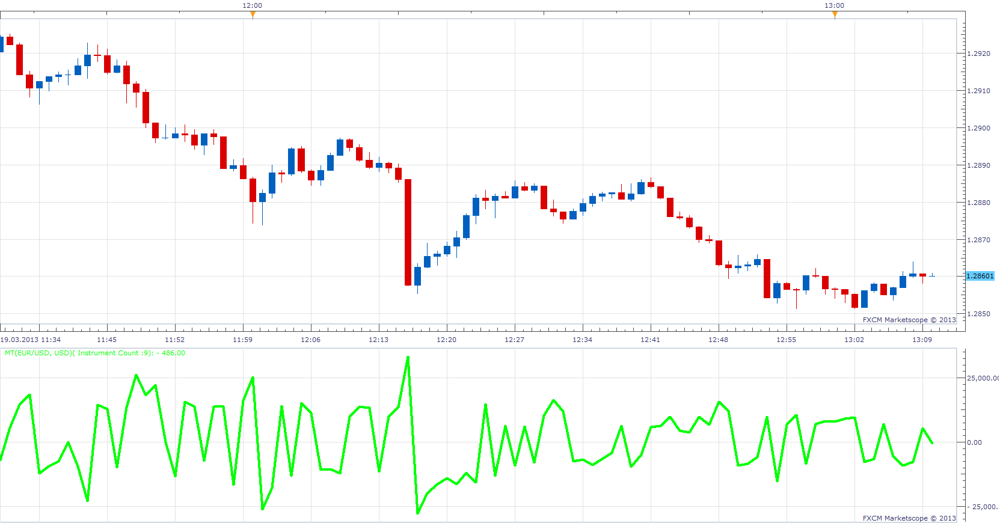
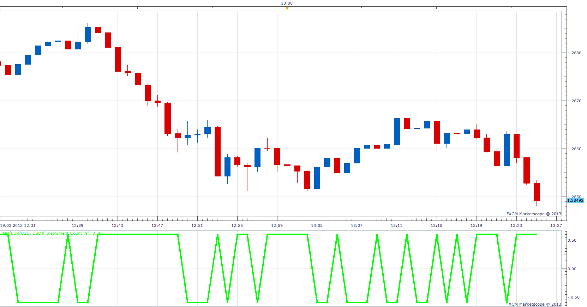
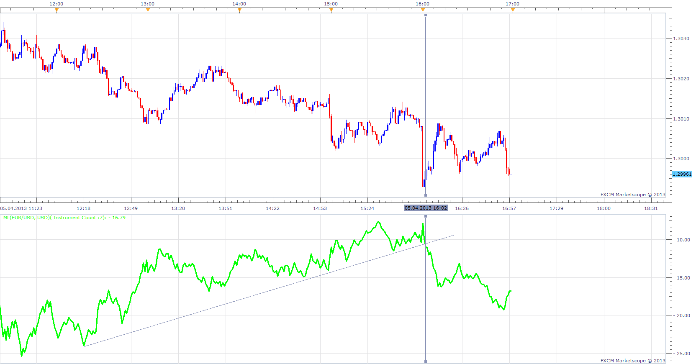

# MARKET THRUST

> Source: https://fxcodebase.com/code/viewtopic.php?f=17&t=33541  
> Forum: 17 · Topic 33541 · 4 post(s)

---

## MARKET THRUST

**Apprentice** · Tue Mar 19, 2013 1:38 pm

As described in the article, Market Thrust by Tushar S. Chande.
MT= ((AI*AV)- (DI*DV))/Scaling

AI = # Advancing issues
AV = Advancing volume
DI = # Declining issues
DV = Declining volume

 [MT.lua](files/56909/MT.lua)

The indicator was revised and updated

---

## THRUST OSCILLATOR

**Apprentice** · Tue Mar 19, 2013 1:44 pm

MO = (AI*AV-DI*DV)/ (AI*AV+DI*DV)

 [TO.lua](files/56910/TO.lua)

---

## MARKET THRUST LINE

**Apprentice** · Sat Apr 06, 2013 7:54 am

MT-line is thecumulative value of market thrust and provides the equivalent of a volume-based advance-decline line.
MARKET TRUST LINE = MARKET THRUST[-1] +MARKET THRUST

 [ML.lua](files/58056/ML.lua)

---

## Re: MARKET THRUST

**Apprentice** · Wed May 10, 2017 5:23 am

Indicator was revised and updated.
